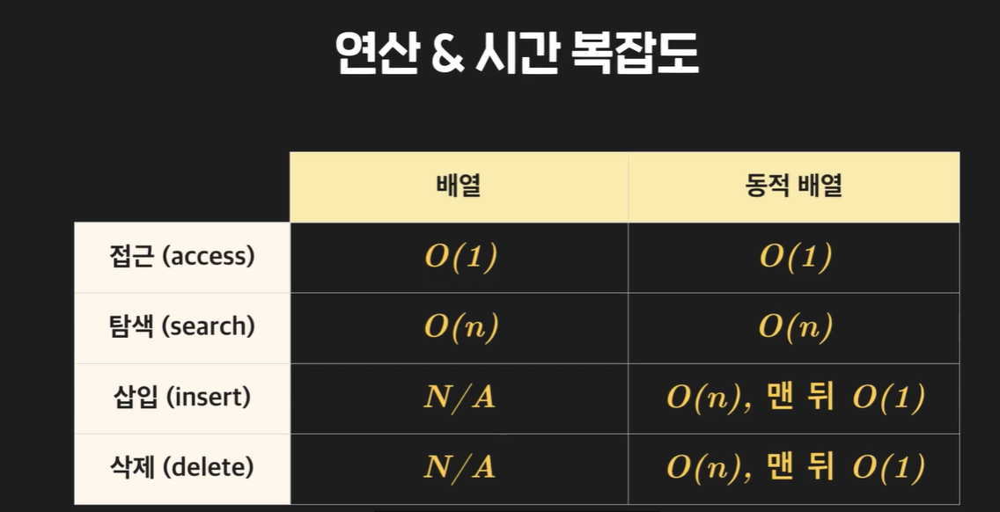

# 배열

* 파이썬엔 왜 배열이라는 개념을 안 쓸까?

배열이란 (c언어 기준) 한 타입의 데이터들을 담는 리스트로, 길이가 정해져있다. 배열을 선언하여 메모리에 먼저 필요한 양의 공간을 비워 그 안에 값들을 넣는다.

그런데 파이썬은 직접 메모리 공간에 값을 넣는 게 아니라, 값의 레퍼런스만 넣는 것이다!!

즉, 데이터 타입들이 모두 달라도 메모리에 차곡차곡 원소의 레퍼런스들을 넣어두기만 하면 되니까 길이도 가변적이고 데이터 타입도 다양한 것.

* 배열은...
인덱스로 램에 바로 접근하기 때문에 배열 인덱스를 이용한 데이터 접근은 O(1) 이다.

### 배열 탐색
배열에서 접근은 O(1)이지만, 값을 탐색하는 것은 모든 원소를 하나씩 봐야 하니 O(n)이다.

### 정적 배열
정적 배열은 크기가 고정되어있다. (보통 배열들은 다 정적 배열이다.)

### 동적 배열
동적 배열은 크기가 바뀔 수 있다. 동적 배열은 정적 배열을 이용해 만들었다!!

그렇다면 컴퓨터는 배열이 꽉 찼는데 원소를 집어넣으려면 어떻게 빈 자리를 만드는 걸까?
1. 더 큰 메모리 공간을 확보하기 위해 기존 배열보다 두 배로 큰 배열을 만든다.
2. 기존 원소들을 다 복사해서 붙여넣는다.
3. 새로 추가할 값을 뒤에 붙여넣는다. 

**파이썬 리스트가 바로 이 동적 배열이다!!** 

동적 배열은 정적 배열과 달리 가변적이라 값을 추가하거나 삭제하는 연산이 있다.
* append 추가 연산: 동적 배열의 특성 상 O(n)

### 분할 상환 분석
동적 배열 append 연산은 최악의 경우 O(n)이지만, 보통은 메모리가 꽉 차있지 않으니 O(1) 인 경우가 훨씬 많다.

이렇게 최악의 경우만 따지기엔 비합리적인 경우 분할상환분석으로 평균적인 시간 복잡도를 계산하는 것이다. 

### 동적 배열 삽입, 삭제, 크기 줄이기
* 원소의 자리를 하나씩 밀어내면서 삽입해야 하므로 O(n)
* 삭제할 땐 원소의 자리를 하나씩 당겨와야 하므로 O(n)

