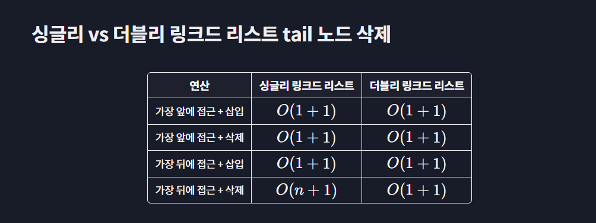

# 링크드 리스트

- 각 노드를 순서대로 나열하는 자료구조로, 노드들은 앞 뒤 노드와 연결되어 있으며 노드를 추가하는 게 자유롭다.

- 노드에는 2가지 속성을 넣는데, 하나는 데이터 속성, 다른 하나는 next라는 속성이다.
  - 이 next 속성에 해당 노드 다음 순서의 노드를 가리키는 포인터를 저장한다.
  - 이 때 맨 처음에 있는 노드를 head 노드라 한다.
  - 맨 뒤에 있는 노드를 tail node 라고 한다.

**배열과 달리 노드는 메모리 곳곳에 흩어져있다!**

```python
class Node:
    def __init__(self, data):
        self.data =data
        self.next = None
    def __str__(self):
        return "self.data"

# 노드 생성
head_node = Node(2)
node1 = Node(4)
node2 = Node(6)
node3 = Node(8)
tail_node = Node(10)

# 노드 연결하기
head_node.next = node1
node1.next = node2
node2.next = node3
node3.next = tail_node

iterator = head_node
while itertor is not None:
    print(iterator)
    iterator = iterator.next
```

## 1. 연산

0. 초기화, str 메소드
1. 추가 연산
2. 접근, 탐색 연산 : O(n)
3. 삽입 연산 : O(n)
4. 삭제 연산 : O(n)

- 맨 앞이나 뒤에서 삽입 삭제 : O(1)

```python
class Node:
    def __init__(self, data):
        self.data = data
        self.next = None
    def __str__(self):
        res_str = f"{iterat}"
        return self.data

class LinkedList:
    # 링크드리스트 초기화 하기.
    def __init__(self):
        self.head = None
        self.tail = None

    def __str__(self):
        # str 메소드는 리스트 내 모든 노드를 출력한다.
        res_str = ""
        iterator = self.head
        while iterator is not None:
            res_str += f"{iterator.data} -> "
            iterator = iterator.next
        return res_str

    # 추가하기
    def append(self, data);
        new_node = Node(data)
        if self.head is None:
            self.haed = new_node
            self.tail = new_node
        else:
            self.tail.next = new_node
            self.tail = new_node

    # 특정 인덱스에 접근하기.
    def find_node_at(self, index):
        iterator = self.head
        for i in range(index):
            iterator = iterator.next
        return iterator

    # 주어진 노드 뒤에 삽입하기.
    def insert_after(self, previous_node, data):
        new_node = Node(data)
        if previous_node == self.tail:
            self.tail.next = new_node
            self.tail = new_node
        else:
            new_node.next = previous_node.next
            previous_node.next = new_node

    # 주어진 노드 뒤 노드를 삭제
    def delete_after(self, previous_node):
        data = previous_node.next.data
        if previous_node.next is self.tail:
            previous_node.next = None
            self.tail = previous_node
        else:
            previous_node.next = previous_node.next.next
        return data


my_list = LinkedList()
my_list.append(2)
my_list.append(3)
my_list.append(5)
my_list.append(8)
my_list.insert_after(find_node_at(2), 7)
print(my_list)
print(finde_node_at(3).data)
find_node_at(3).data = 17 # 데이터 수정하기.
delete_after(1)
```

<br>

## 2. 더블리 링크드 리스트

- 더블리 링크드 리스트는 속성으로 data, next, prev를 가진다.
  - next는 자기 뒤의 노드
  - prev는 자기 앞의 노드

1. 접근, 탐색 연산: O(n)
2. 삽입 삭제 연산: O(n)
3. head, tail 삽입 삭제: O(1)

```python
class Noe:
    def __init__(self, data):
        self.data = data
        self.next = None
        self.prev = None

class DoublyLinkedList:
    def __init__(self):
        self.head = None
        self.tail = None

    # 접근, 탐색, __str__ 메소드는 싱글리와 동일하다.
    def find_node_at(self, index):
        iterator = self.head
        for _ in range(index):
            iterator = iterator.next
        return iterator
    def find_node_with_data(self, data):
        iterator = self.head
        while iterator is not None:
            if iterator.data == data:
                return iterator
            iterator = iterator.next
        return None
    def __str__(self):
        res_str = "|"
        iterator = self.head
        while iterator is not None:
            res_str += " {} |".format(iterator.data)
            iterator = iterator.next
        return res_str


    # 추가 연산
    def append(self, data):
        new_node = Node(data)
        if self.head is None:
            self.head = new_node
            self.tail = new_node
        else:
            self.tail.next = new_node
            new_node.prev = self.tail
            self.tail = new_node

    # 특정 노드 뒤에 삽입하기
    def insert_after(self, previous_node, data):
        new_node = Node(data)
        if self.tail is previous_node:
            self.tail.next = new_node
            new_node.prev = self.tail
            self.tail = new_node
        else:
            new_node.prev = previous_node
            new_node.next = previous_node.next
            previous_node.next.prev = new_node
            previous_node.next = new_node

    # 특정 노드 삭제하기
    def node_to_delete(self, node):
        data = node.data
        if (node is self.head) and (node is self.tail):
            # node가 1개 뿐이면
            self.head = self.tail = None
        elif node is self.head:
            # 노드가 head라면
            self.head = node.next
            self.head.prev = None
        elif node is self.tail:
            # 노드가 tail이라면
            self.tail = node.prev
            self.tail.next = None
        else:
            # 노드가 중간에 있다면
            node.prev.next = node.next
            node.next.prev = node.prev
        return data


```

<br>

## 4. 비교하기

- 싱글은 자기 뒤에 있는 다음 노드에만 접근 가능.
- 더블은 자기 앞에 있는 노드에도 접근 가능.

싱글은 next, data 로 O(2n) 공간을 차지한다면 더블은 O(3n) 공간을 차지한다. Big o 공간 복잡도는 같지만 최대한 효율적으로 사용할 경우 싱글이 낫다.



다 비슷한데, 이제 tail 접근 삭제는 더블리 링크가 더 낫다.
