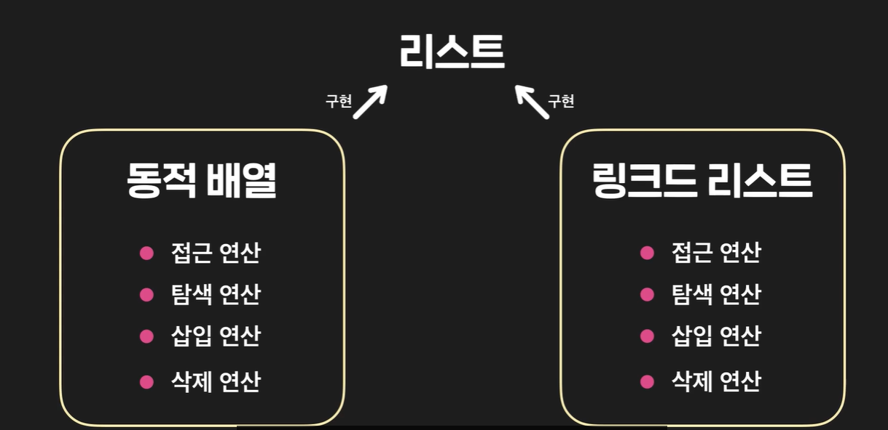
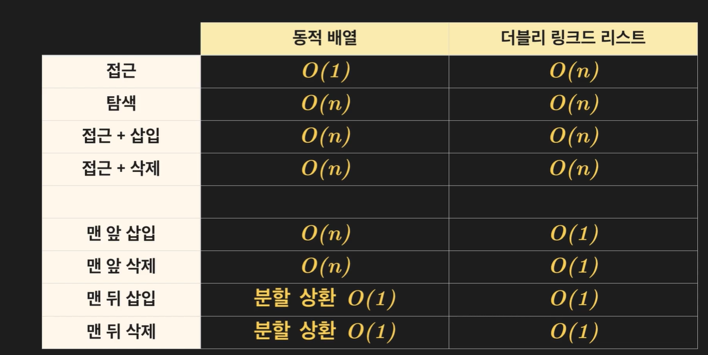
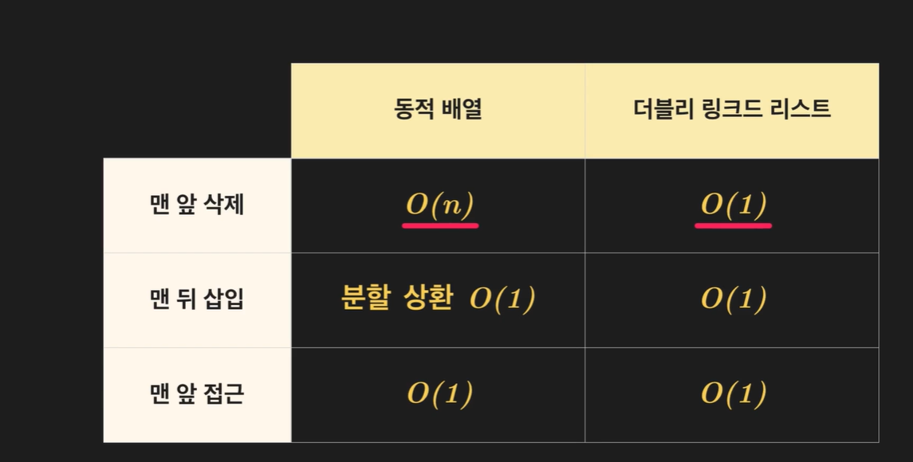
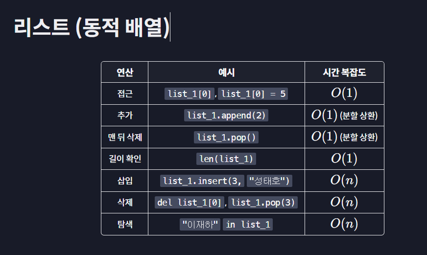
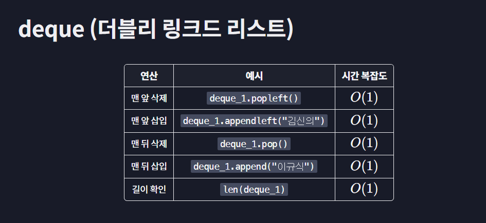
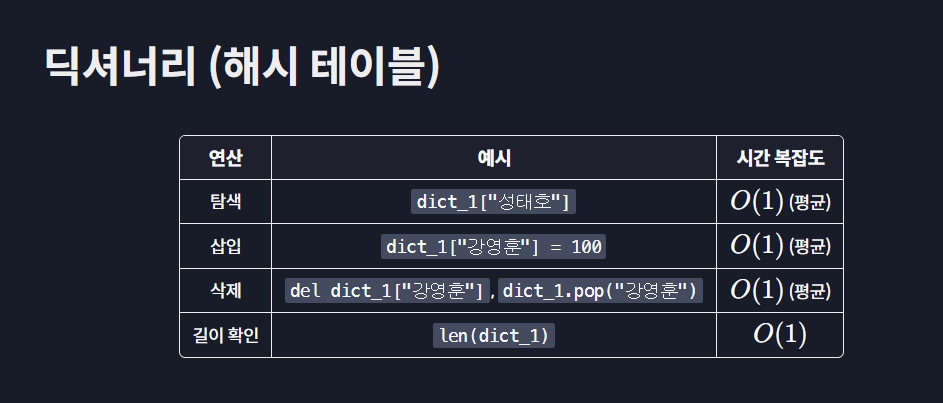
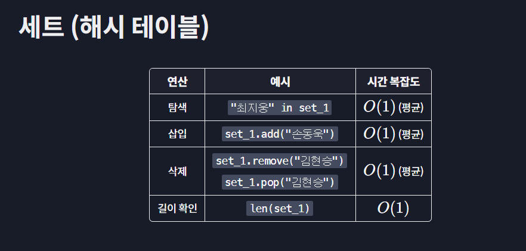

# 추상 자료형

리스트, 큐, 스택, 딕셔너리, 세트 위주로.

### 기능과 구현이란?

예를 들어 삽입 연산 insert operation에 대해 이 연산의 기능과 구현은 무엇인가? 용어를 제대로 정리해보자.

- 기능: 연산이 무엇을 하는지를 뜻함. 삽입 연산의 기능은, 순서 데이터에서 원하는 위치에 데이터를 저장하게 해주는 것이다.
- 구현: 연산의 기능을 어떻게 하는지를 뜻함. 삽입 연산의 구현은 동적배열에선 인덱스 뒤의 자료들을 한 칸씩 밀어 삽입하고 링크드 리스트에선 노드들의 next prev 를 수정해 삽입한다. 즉, 구현은 자료형, 데이터 구조에 따라 다 달라진다!!

**추상화란 구현은 몰라도 기능을 알면 프로그래밍을 할 수 있게 해주는 개념이다.**

추상화를 하면 개발자끼리 협력하기 쉽고, 개발하기도 쉬워진다.

### 추상 자료형이란?

- abstract data type
- 자료 구조를 추상화한 것을 추상 자료형이라 한다.
- 데이터를 저장하고 사용할 때 삽입, 삭제 탐색 기능만 생각하며 이걸 어떻게 구현할지는 생각하지 않는 것이다.
- 즉, 파이썬에선 미리 개발자들이 만들어둔 추상 자료형들이 있으며 우리는 그것을 가져와 미리 만들어진 메소드를 사용하면 되는 것이다.

## 추상 자료형과 자료구조

- 추상 자료형의 예시로는 리스트가 있다.

리스트는 데이터 간 순서관계를 유지하며 접근, 탐색 삽입, 삭제를 돕는 자료형이다. 이 때 우리는 list.add나 list.remove 메소드의 구현은 생각하지 않고, 추상화된 메소드를 쉽게 사용한다.

- 동적 배열은 자료 구조의 예시이다.

리스트처럼 데이터 간 순서관계를 유지하며 연속적으로 저장하는 자료 구조이다. 그리고 이 동적 배열에서 접근, 탐색, 삽입 연산은 우리가 구현해야 한다!

**즉, 추상 자료형은 그냥 기능만 나열해놓은 것이라면 자료 구조는 구체적으로 구현까지 포함된 내용이다.**

여기서 동적 배열은 리스트의 모든 연산을 갖고 있는 자료 구조이다. (동적 배열에서도 리스트처럼 삽입, 삭제, 탐색, 접근 연산을 구현할 수 있기 때문.) 따라서 **리스트를 동적 배열로 구현할 수 있다** 라고도 표현한다!!

링크드 리스트도 연산을 다 구현할 수 있기 때문에, **연결 리스트로도 리스트를 구현할 수 있다!!**



즉, 리스트라는 추상 자료형은 동적배열이라는 자료 구조로도 구현할 수 있고, 링크드 리스트라는 자료 구조로도 구현할 수 있다.

## 그렇다면 우리가 코드를 구상할 때는...

1. 먼저 기능을 생각한다. 데이터를 순서대로 저장하고, 저장한 데이터를 바꾸고 싶다는 기능을 생각하자!
2. 이 기능이 있는 추상 자료형을 생각하자. 아!! 리스트를 사용해야겠다!! 라고 말이다..

<br>

## 1. 리스트

- 리스트는 데이터 간 순서를 유지해주는 대표적인 추상 자료형이다.
- 탐색, 접근, 삽입, 삭제 연산이 기본적으로 있다.

```python
# 파이썬 리스트 생성
my_list = []

# 삽입
my_list.insert(0, 'a')
my_list.insert(1, 'b')
my_list.insert(2, 'c')

# 접근
print(my_list[1])

# 수정
my_list[1] = 'd'

# in을 이용한 탐색
print('a' in my_list)

# 삭제
del my_llist[1]
```

리스트를 구현할 수 있는 자료 구조는 동적 배열과, 연결 리스트가 있다. 이 둘 중 어떤 걸 사용할까?

- 동적 배열은 접근을 많이 할 때
- 연결 리스트는 데이터 앞 뒤로 많이 삭제하거나 추가할 때이다.
  

**파이썬 리스트는 기본적으로 동적 배열 구현이다. 즉, 리스트를 사용할 때 동적 배열의 시간 복잡도를 생각하면 된다!!**

<br>

## 2. 큐

- 큐는 데이터 간 순서를 약속하는 FIFO 추상 자료형이다.
- 맨 뒤 데이터 추가하기, 맨 앞 데이터 삭제하기, 맨 앞 데이터 접근하기 연산이 있다.
- deque 를 불러와서 활용할 수 있다. deque는 정확히 말하자면 맨 앞뒤 데이터를 넣고 삭제할 수 있는 자료형이지만, 큐니까 맨 앞 데이터 삭제만 해준다!

```python
// doubly ended queue
from collections import deque
queue = deque()

# 맨 끝 데이터 삽입
queue.append("a")
queue.append("b")
queue.append("c")

# 맨 앞 데이터 접근
print(queue[0])

# 맨 앞 데이터 삭제
# popleft 는 삭제한 데이터를 리턴해준다.
print(queue.popleft())
```

큐를 구현하려면 동적배열이나 연결리스트를 쓴다.

- 큐를 더블리 링크드 리스트로 구현하면 시간 복잡도가 O(1)이다.
- 파이썬 deque 도 내부적으로 더블리 링크드 리스트로 구현되어있다!
  

<br>

## 3. 스택

- 데이터간 순서를 약속하는 FILO 추상 자료형이다.
- 맨 뒤 데이터 추가, 맨 뒤 데이터 삭제 및 접근 연산이 있다.
- deque를 사용해 스택을 만들 수 있다. 맨 뒤에만 삭제, 삽입 연산을 하면 된다.

```python
from collections import deque

stack = deque()

# 맨 끝 데이터 추가
stack.append('a')
stack.append('b')
stack.append('c')

# 맨 끝 데이터 접근
print(stack[-1])

# 맨 끝 데이터 빼기
stack.pop()
```

스택도 동적 배열과 링크드 리스트로 구현이 가능하다.

- 파이썬은 더블리 링크드 리스트로 구현되어있다
- 따라서 삽입, 삭제, 접근 연산이 O(1)이다!

<br>

## 4. 딕셔너리

- map이라고도 불린다.
- 데이터 간 순서 관계를 약속하지 않는다!!
- key로 value를 찾을 수도 있고, value를 삭제할 수도 있다.
- key value 쌍 삽입, key를 이용한 데이터 탐색, 삭제 연산이 있다.

```python
my_dict = {}

# 데이터 삽입
my_dict['A'] = 90
my_dict['B'] = 80
my_dict['C'] = 70

# 한 키에는 하나의 value만 저장할 수 있고, 다른 value 넣으려 하면 덮어쓰인다.
my_dict['A'] = 60

# value 찾기
print(my_dict['A'])

# 삭제하기
my_dict.pop('A')
```

파이썬에선 딕셔너리는 해시 테이블로 구현되어있다!!

- 그래서 삽입, key를 이용한 탐색, 삭제는 평균적으로 O(1) 시간복잡도를 가진다.

<br>

## 5. 세트

- 데이터 간 순서 관계 약속하지 않는다.
- 삽입, 탐색, 삭제 연산이 가능하고 중복 데이터를 허용하지 않는다!
- 삽입, 삭제, 탐색 연산만 가능하면 되므로 구현이 편리하다.

```python
my_set = set()

# 삽입
my_set.add("a")
my_set.add("b")
my_set.add("c")
my_set.add("a") # 중복 무시

# 데이터 탐색
print("a" in my_set)

# 데이터 삭제
my_set.remove("a")
```

보통 세트는 해시 테이블로 구현이 된다.

- 해시테이블에서 key, value를 같이 저장하지 않고 value만 저장하는 것이다!!
- 그래서 삽입, 삭제, 탐색 연산이 평균적으로 O(1)이 걸린다.
- 순서 신경 안 쓰고 단순히 삽입, 삭제 연산만 하려면 set을 잘 쓸 수 있다.

<br>

## 6. 파이썬 자료형 시간복잡도 총정리

정리하자면!!

순서가 중요하지 않을 때엔 딕셔너리와 세트를 사용해 삽입 삭제 탐색 연산을 하는 게 좋다.

- key value 둘 다 저장 시 딕셔너리,
- value만 저장 시 set (단, 중복 불가능.)

만약 중복이 가능해야 하고 순서가 중요하다면 리스트, 큐, 스택을 쓰자.

예를 들어 어떤 값 안에서 a 값을 찾으려면, 리스트도 가능하지만 리스트보단 set이 더 빠를 것이다.

1. 리스트(동적 배열)
   

2. 스택, 큐 (deque 사용 더블리 linked list)
   

3. 딕셔너리 (해시테이블)
   

4. 세트 (해시 테이블)
   
   <br>
