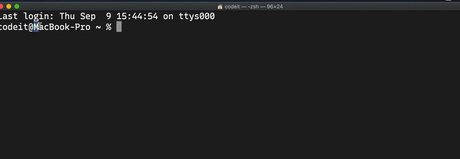

# ☕ 유닉스 커맨드 ☕
#### Week2 unix git 기초 / Topic 1 실용적 유닉스 커맨드 / 1. 유닉스 커맨드

>목차 
>>[1. 유닉스란?](#1-유닉스란)<br>
[2. 터미널](#2-터미널)<br>
[3. 커맨드 기본 형태](#3-커맨드-기본-형태)<br>
[4. 커맨드 매뉴얼](#4-커맨드-매뉴얼)<br>
[5. 커맨드 꿀팁](#5-커맨드-꿀팁)<br>

<br><br>

## 1. 유닉스란?
컴퓨터에게 명령어를 내릴 때 이 명령어를 command 라고 한다.

* command를 통해 컴퓨터를 사용하는 방식을 Command Line Interface라고 함.
* 보통 우리가 쓰는 건 graphical user interface로 GUI 이다.

유닉스란 1970년대 개발된 운영체제로, sw를 개발하고 실행할 수 있는 편리한 플랫폼이다. 쉽게 수정할 수 있고 다른 컴퓨터에 이식성도 좋아서 다른 사람들이 유닉스를 기반으로 다양한 os를 개발했다.

윈도우를 제외한 모든 os는 거의 유닉스 체제. 윈도우는 자체개발한 윈도우 os를 사용.

**유닉스 운영체제에서 쓰이는 컴퓨터 명령어를 유닉스 커맨드라 한다!!**

### history...
유닉스 쓰려면 당시 사용료를 냈어야 했는데, 이걸 반대하는 사람들이 sw를 더 자유롭게 공유해야 한다고 주장했다.

이에 따라 자유 소프트웨어 재단이 유닉스와 비슷한 os를 만들어 무료로 배포했는데, 이게 바로 GNU 이다!!

그리고 GNU 운영체제 내부 커널이라는 핵심부분을 Linux라고 이름지었다.

### 유닉스의 표준?
리눅스나 리눅스의 변형 os 등등 모두 유닉스의 표준을 거의 다 만족한다. 유닉스에는 POSIX라는 표준이 있는데, 이 인증을 공식으로 받으면 unix-certified가 되고 인증을 받지 않았지만 기능은 거의 비슷하면 unix-like os라고 불린다. 


## 2. 터미널
커맨드를 입력하고 아웃풋을 출력하는 프로그램을 터미널이라 한다.

터미널에서 커맨드를 쓰면, shell이라는 프로그램이 커맨드를 해석해준다. 



터미널을 열었을 때 맨 처음 뜨는

```사용자 아이디 @ ~ % ```

이걸 프롬프트라고 한다. 현재 디렉토리 위치, 사용자 정보를 나타낸다. 


## 3. 커맨드 기본 형태
명령어를 써보자

* 이렇게 쓰면 달력이 출력될 것이다.
```
 cal
 ```

* 명령어에는 인자 argument를 넘겨줄 수 있다. 어느 대상에 커맨드를 실행할지 정해주는 것이다.
```
cal 10 2020
```
이렇게 10월 2020년 달력을 출력할 수 있다. 인자는 보통 순서를 바꾸면 안된다.

* 명령어에 옵션을 줘서 커맨드 실행 방식을 바꿀 수 있다.
```
cal 10 2020 -j
```
옵션은 순서가 바뀌어도 보통은 상관없다. 옵션은 여러개 붙여서 써도 된다. 


## 4. 커맨드 매뉴얼
만약 어떤 커맨드에 대해 검색해보려면 man 커맨드를 쓰자.
```
man cal
```
 이렇게 하면 cal 명령어가 무엇인지, 줄 수 있는 인자와 옵션은 무엇이 있는지 등등 매뉴얼이 출력된다. 

아래와 같이 매뉴얼이 출력되었다고 하자.
```
cal [-hjy] [-A number] [-B number] [month] [year]
```
대괄호 안에 있는 것들은 써도 되고 안 써도 되는 옵션들이다. 


## 5. 커맨드 꿀팁
- ctrl + a : 커서가 맨 앞으로 감.
- ctrl + e : 커서가 맨 뒤로 감.
- alt + 왼쪽 화살표: 이전 단어로 커서 이동
- alt + 오른쪽 화살표: 다음 단어로 커서 이동
- ctrl + c : 뭐 타이핑하거나 설치 도중에 멈추고 싹다 지울 때.
- clear 커맨드 : 화면을 깨끗하게 치움.
- tab : 커맨드 이름이나 옵션, 폴더 이름 자동완성. 