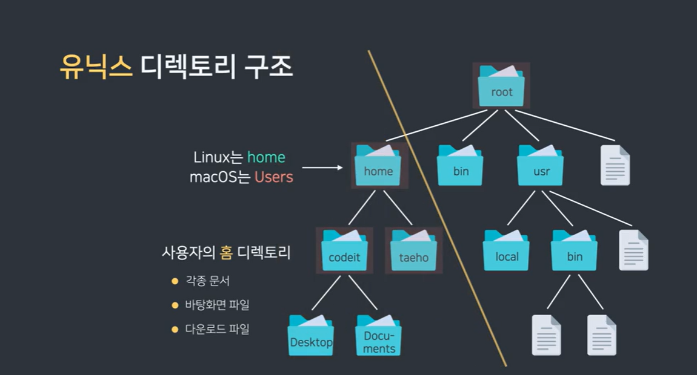

# 🍮 폴더와 파일 🍮
#### Week2 unix git 기초 / Topic 1 실용적 유닉스 커맨드 / 2. 폴더와 파일.

>목차 
>>[1. 유닉스 폴더 구조와 파일 경로](#1-유닉스-폴더-구조와-파일-경로)<br>
[2. pwd, cd, ls](#2-pwd-cd-ls)<br>
[3. 절대 경로, 상대 경로](#3-절대-경로-상대-경로)<br>
[4. ls의 옵션](#4-ls의-옵션)<br>
[5. mkdir, touch](#5-mkdir-touch)<br>
[6. vim](#6-vim)<br>
[7. cat, less, head, tail](#7-cat-less-head-tail)<br>
[8. mv](#8-mv)<br>
[9. cp](#9-cp)<br>
[10. rm](#10-rm)<br>


<br><br>

## 1. 유닉스 폴더 구조와 파일 경로
유닉스에서 폴더를 **디렉토리** 라고 한다!!

유닉스 디렉토리 구조: 거꾸로 된 트리. 맨 최상단에 root 디렉토리가 있고, 거기서 가지를 뻗어나가 하위 디렉토리를 둔다.

root 디렉토리 하위에는 사용자 계정마다 각 사용자의 home 디렉토리들과, 공용 디렉토리파일들이 있다.



파일 경로 표시하는 법.
1. 루트 디렉토리는 / 이다
2. 홈 디렉토리는 ~ (절대경로) 이다.

<br>

## 2. pwd, cd, ls
현재 위치한 디렉토리를 워킹 디렉토리라 한다.

1. 내가 어디 디렉토리에 있는지, 현재 워킹 디렉토리의 위치를 알기 위해선 pwd 커맨드를 쓰자!! pwd는 print working directory의 줄임말이다. 
```cmd
pwd
```

2. 다른 디렉토리로 이동하려면 cd [ 디렉토리경로 ] 명령어를 쓰자. 
```cmd
cd /
cd ~
cd ../

// cd 뒤에 아무 인자도 안 주면 홈 디렉토리로 이동
cd

// cd - 입력하면 이전에 있었던 디렉토리로 이동.
cd -
```

3. ls 는 디렉토리 안에 뭐가 있는지 보여준다.
```cmd
// 인자 없이 ls를 쓰면 숨겨진 파일 빼고 다 보여준다.
ls

// ls 경로명 을 쓰면 해당 경로의 파일들을 보여준다. 
ls ../
```

<br>

## 3. 절대 경로, 상대 경로
**절대 경로**: 루트 디렉토리를 기준으로 어떤 파일이나 디렉토리를 고유한 경로로 나타낸 것. 경로가 길어질수록 불편하니 상대경로를 써보자! 

**상대 경로**: 워킹 디렉토리 기준으로 경로를 나타내는 것.

1. ./ 은 현재 디렉토리
2. ../ 는 부모 디렉토리


주의할 점!!! 파일이나 디렉토리 이름에 공백이 있으면 쌍따옴표로 묶어줘야 함. 근데 그냥 **언더바로 공백을 표시하는 습관을 들이자**

<br>

## 4. ls의 옵션
ls에 여러 옵션을 줘서 더 자세히 볼 수 있다.

```cmd
// 숨겨진 파일도 모두 보여주게 함.
ls -a

// 파일인지 디렉토리인지도 나타내준다.
ls -l

// 커맨드는 섞어쓸 수 있다.
ls -al
```
l 옵션으로 자세한 정보를 볼 때에, 각 파일이 디렉토리인지 파일인지, 어떤 권한이 부여됐는지, 파일의 소유자와 그룹이 어디인지, 용량은 어느 정도인지, 마지막 수정 날짜는 언제인지 등... 나타난다!

<br>


## 5. mkdir, touch

디렉토리를 만들 때엔 mkdir 명령어를 사용하자.
```cmd
mkdir myfolder

// 폴더 여러 개 만들기.
mkdir myfolder1 myfolder2
```

파일을 생성할 때엔 touch 명령어. touch는 파일 수정 명령어지만, 파일이 없다면 새로 만들어주기 때문에 생성 명령어로 자주 쓰인다!
```cmd
// 파일 여러 개 만들기.
touch mytext1.txt mytext2.txt

// 경로로 파일 생성 위치를 지정해줄 수도 있다.
touch myfolder1/mytext3.txt 
```

<br>

## 6. vim
GUI 환경에선 파일 내용을 작성할 때 메모장, vs 코드 등 여러 환경을 쓰지만, CLU에선 가장 유명한 게 Vim 이다. 
```cmd
// 인자 없이 vim 만 치면 파일 새로 생성
vim

// myfile 수정하기
vim myfile.txt
```

vim에는 4가지 모드가 있는데, 
1. 일반모드 (esc)
2. 입력모드 (i)
3. 비주얼모드 (v)
4. 명령모드 (:)

**모든 모드는 일반모드를 거쳐야 한다.** 입력모드에서 명령모드로 가려면 esc > : 를 눌러야 한다

* 텍스트 복붙은 비주얼 모드로 가자. v로 간다음

```cmd
//글자단위 복사
v

//줄 단위 복사
V

// v, V로 글자 선택 후 y를 누르면 복사됨
y

// 잘라내기는
d

//원하는 위치에 p를 누르면 붙여넣기
p
```
근데 v 모드로 갈 필요 없이 그냥 일반 모드에서 yy, dd, p로 할 수도 있다,...


* : 키로 명령 모드로 가면 w로 파일을 저장하고 q로 파일을 끌 수 있다.
```cmd
// 일반모드에서 바로 파일 저장하고 끄기.
:wq

// 파일 저장하지 않고 끄기.
:q!
```

## 7. cat, less, head, tail
vim 으로도 파일을 확인할 수 있지만 간단하게 확인하려면 다음 명령어를 쓰자.

1. cat
```cmd
// cat 명령어로 파일 내용을 볼 수 있다.
cat 파일이름

// cat에 인자 여러 개를 주면 파일을 이어붙인다.
cat 파일1 파일2
```

2. less
```cmd
//cat은 파일 모두 출력, less는 파일을 페이지 단위로 출력. 
less 파일이름
```

3. head, tail
```cmd
// 파일 맨 처음 10줄 보여주기
head 파일이름

// 파일 맨 처음 5줄 보여주기
head -n 5 파일이름
```
<br>

## 8. mv
mv 는 파일과 디렉토리를 옮기거나, 이름을 수정할 때 쓴다.
```cmd
// 경로2가 존재하다면, 경로1은 경로2로 이동
mv 경로1 경로2

//경로2가 없다면 경로1의 이름이 경로2로 바뀜.
mv 경로1 경로2

//파일2 이름이 이미 존재하면 덮어쓰기함.
mv 파일1 파일2
```

그래서 실수로 파일을 덮어써버릴 수 있음. 그래서 i 옵션으로 확인하자!!

```cmd
// i 옵션은 사용자에게 파일 덮어쓸 건지 확인시켜준다.
mv -i file1.txt file2.txt
```

<br>

## 9. cp
파일이나 디렉토리를 복사할 때 cp 명령어를 쓰자.
```cmd
// 파일1이 파일2로 복사된다. 
cp 파일1 파일2


// 파일1을 경로2로 복사해 다른 폴더에 넣는다. 근데 얘도 덮어쓰기 될 수 있어서 i 옵션 주자.
cp -i 파일1 경로2

// 디렉토리는 r 옵션을 줘야 복사 가능.
cp -r 디렉토리이름 복사본디렉토리이름
```

<br>

## 10. rm
파일과 디렉토리 삭제할 때엔 rm 커맨드.
```cmd
// 파일 여러 개 삭제도 가능.
rm file1.txt file2.txt file3.txt

//폴더 삭제하려면 r 옵션
rm -r myfolder

// f 옵션 주면 아묻따 그냥 바로 삭제. 
rm -rf myfolder

```