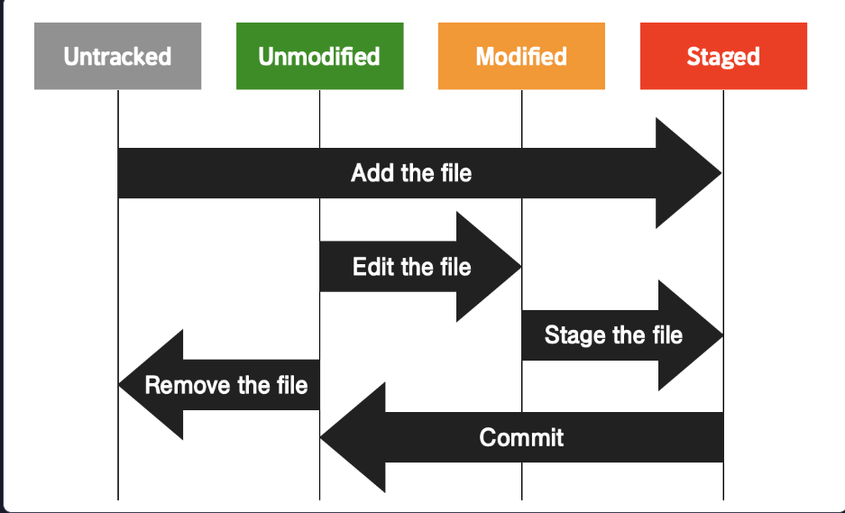

# 🍇 깃 써보기 🍇
#### Week2 unix git 기초 / Topic 2 깃 / 2. 깃 써보기

>목차 
>>[1. 레포지토리와 커밋](#1-레포지토리와-커밋)<br>
[2. 레포지토리](#2-레포지토리)<br>
[3. 커밋](#3-커밋)<br>
[4. git의 3가지 작업 영역](#4-git의-3가지-작업-영역)<br>
[5. git이 보는 파일의 4가지 상태](#5-git이-보는-파일의-4가지-상태)<br>
[6. git add 취소하기](#6-git-add-취소하기)<br>
[7. git 커맨드를 찾아볼 때엔](#7-git-커맨드를-찾아볼-때엔)<br>


<br><br>

## 0. 깃 명령어 요약

* git init

현재 디렉토리를 Git이 관리하는 프로젝트 디렉토리(=working directory)로 설정하고 그 안에 레포지토리(.git 디렉토리) 생성

* git config user.name 'codeit' 
* git config user.email 'teacher@codeit.kr'

현재 사용자의 아이디, 이메일 정보 설정.


* git add [파일 이름 혹은 디렉토리 이름]

수정사항이 있는 특정 파일을 staging area에 올리기

* git reset [파일 이름]

staging area에 올렸던 파일 다시 내리기

* git status

Git이 현재 인식하고 있는 프로젝트 관련 내용들 출력(문제 상황이 발생했을 때 현재 상태를 파악하기 위해 활용하면 좋음)

* git commit -m "커밋 메시지"

현재 staging area에 있는 것들 커밋으로 남기기

* git help [커맨드 이름]

사용법이 궁금한 Git 커맨드의 공식 메뉴얼 내용 출력


## 1. 레포지토리와 커밋

* 레포지토리:
프로젝트 디렉토리(프로젝트 관련 문서들을 모두 담는 디렉토리)의 버전을 git으로 관리한다면, 원하는 시점마다 버전을 남겨서 snap shot처럼 기록으로 남길 수가 있다. **이 각각의 버전들을 저장하는 장소를 레포지토리라고 한다.** 즉, 레포지토리엔 처음 모습부터 최근모습까지 시간별로 버전들이 저장되어있다.

git과 프로젝터 디렉토리를 연결하면 디렉토리에 자동으로 .git 폴더가 생성되는데, 이 폴더가 바로 레포지토리!!

즉!! .git 디렉토리, 레포지토리는 프로젝트의 변화 과정이 담긴 저장소다.

<br>

* 커밋:

프로젝트 디렉토리의 현 모습을 하나의 버전을 남길 때를 커밋한다고 한다. 레포지토리에 버전을 남기는 행위를 커밋한다고 하고, 레포지토리에 저장된 각 기록을 커밋이라고도 한다!

이 커밋을 보고 과거의 프로젝트 모습도 볼 수 있다 >> 이렇게 버전관리를 하는 것!! 

정리하자면, **커밋은 프로젝트 디렉토리의 특정 모습을 하나의 버전으로 남기는 행위 또는 그 결과물, 그리고 레포지토리는 커밋이 저장되는 곳** 이다.

<br>

## 2. 레포지토리
레포지토리 만드는 법:
1. 먼저 프로젝트 디렉토리를 만든다.
2. 프로젝트 디렉토리 내부에 index.html 등 여러 파일들을 만든다.
3. 프로젝트 디렉토리에 git bash를 열고, 
```git
// 4. git init 명령어를 써서 비어있는 레포지토리를 만든다. 이렇게 하면 .git 디렉토리가 생긴다.
git init
```

<br>

## 3. 커밋
커밋하는 법:
1. 프로젝트 파일에서 작업을 한다.
```git
// 2. 맨 처음 커밋하는 거라면, 이게 누가 쓴 코드인지 표시하기 위해 이메일과 로그인 정보를 써야 함.
git config user.name "hongjw"
git config user.email "hongjw030@naver.com"

// 3. 깃이 각 파일들을 tracking 할 수 있게 각 파일들을 커밋에 포함되게끔 지정해야 한다. add 되지 않은 파일들은 untracked 상태이다.
git add .

// 4. 커밋한다.
git commit -m "create README.md"
```

<br>

## 4. git의 3가지 작업 영역
git 내부에는 3가지 영역이 있다.

1. working directory(=working tree)

작업을 하는 프로젝트 디렉토리.


2. staging area(=index)

git add 를 통해 커밋에 반영되도록 지정해준 파일들이 존재하는 영역. **이 영역에 있는 파일들만 커밋에 반영된다!**

3. repository

커밋이 저장되는 영역.

#### 즉, working directory에서 작업을 하면 그 파일들을 git add를 통해 staging area에 올려주고, 커밋해서 staging area에 있는 파일들의 모습을 스냅샷처럼 기록해 repository에 저장하는 것이다!!

왜 굳이 staging area를 둬서 working directory에서 바로 레포지토리로 이동시키지 않는 걸까?
* 특정 파일은 최신 모습을 다음 커밋에 반영하고 싶지 않을 수도 있다!! 즉, 선별적으로 내가 원하는 파일만 커밋에 반영하며 세밀한 버전관리를 하게끔 하는 것임.


<br>

## 5. git이 보는 파일의 4가지 상태

git으로 관리되는 파일은 크게 두가지 상태로 나뉜다. 

**untracked / tracked**

그리고 tracked 파일은 3가지 상태로 나뉜다. 

**staged / unmodified / modified**

즉, 
```
untracked            tracked
                /        |      \
            staged unmodified modified

```
이렇게 4가지 상태로 분류된다!!

1. untracked

git에 의해 변동사항이 전혀 추적되지 않은 상태. git add를 한번도 하지 않은 파일.

2. tracked

git에 의해 변동사항이 추적되는 상태.

    (1) staged
    파일이 수정되고 staging area에 올라온 상태. 막 git add 한 직후의 상태.
    
    (2) unmodified
    최신 커밋과 비교했을 때 현재 파일이 전혀 바뀐 게 없는 상태. git commit 한 직후의 상태.

    (3) modified
    최신 커밋과 비교했을 때 현재 파일에 뭔가 바뀐 게 있는 상태. 



<br>

## 6. git add 취소하기

파일을 수정하고 git add를 해서 이미 staging area에 올려버렸는데 뭔가 수정한 게 맘에 안들어서 취소하려면? git reset을 쓰자.

```git
git reset 파일이름
```
staging area에 파일을 내려버렸다해도 변경 기록은 여전히 워킹 디렉토리에 남아있다. 그럼 이제 다시 내 파일로 가서 수정한 내용을 싹 지우면 된다.

**커밋을 취소하는 게 아님!!!**

**즉, 아직 commit 하지 않고 그냥 staging area에 올라간 상태에선 git reset 파일이름 을 통해 area에서 끌어내려서 파일을 고쳐라!!**


<br>

## 7. git 커맨드를 찾아볼 때엔
help 명령어를 쓰자.
```git
// add 명령어에 대해 사용법을 알고 싶다면 이렇게 쓴다.
git help add
```

