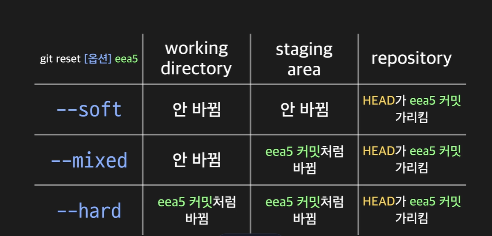

# 🍮 커밋 다루기 🍮
#### Week2 unix git 기초 / Topic 2 깃 / 4. 커밋 다루기

>목차 
>>[1. 커밋 히스토리](#1-커밋-히스토리)<br>
[2. 최신 커밋 수정하기](#2-최신-커밋-수정하기)<br>
[3. 커밋 생성, 메세지 작성 가이드라인](#3-커밋-생성-메세지-작성-가이드라인)<br>
[4. alias 설정하기](#4-alias-설정하기)<br>
[5. 두 카밋 간의 차이 보기](#5-두-카밋-간의-차이-보기)<br>
[6. HEAD의 의미](#6-head의-의미)<br>
[7. git reset 하기](#7-head가-이전-커밋-가리키게-하기)<br>
[8. git reset 옵션](#8-git-reset-옵션)<br>
[9. HEAD 기준으로 git reset 하기](#9-head-기준으로-git-reset-하기)<br>
[10. 커밋에 tag 달기](#10-커밋에-tag-달기)<br>


<br><br>

## 0. 깃 명령어 요약

* git log

커밋 히스토리를 출력

* git log --pretty=oneline

--pretty 옵션을 사용하면 커밋 히스토리를 다양한 방식으로 출력할 수 있습니다. --pretty 옵션에 oneline이라는 값을 주면 커밋 하나당 한 줄씩 출력해줍니다.

* git show [커밋 아이디]

특정 커밋에서 어떤 변경사항이 있었는지 확인

* git commit --amend

최신 커밋을 다시 수정.

* git config alias.[별명] [커맨드]

길이가 긴 커맨드에 별명을 붙여서 이후로 별명으로 해당 커맨드를 실행할 수 있도록 설정

* git diff [커밋 A의 아이디] [커밋 B의 아이디]

두 커밋 간의 차이 비교

* git reset [옵션] [커밋 아이디]

옵션에 따라 하는 작업이 달라짐(옵션을 생략하면 --mixed 옵션이 적용됨)

(1) HEAD가 특정 커밋을 가리키도록 이동시킴(--soft는 여기까지 수행)

(2) staging area도 특정 커밋처럼 리셋(--mixed는 여기까지 수행)

(3) working directory도 특정 커밋처럼 리셋(--hard는 여기까지 수행)

그리고 이때 커밋 아이디 대신 HEAD의 위치를 기준으로 한 표기법(예 : HEAD^, HEAD~3)을 사용해도 됨

* git tag [태그 이름] [커밋 아이디]

특정 커밋에 태그를 붙임


<br>

## 1. 커밋 히스토리

이때껏 한 커밋을 **커밋 히스토리** 라고 한다. 히스토리를 보고 내 프로젝트의 변화를 볼 수 있다!!
```git
// 내가 한 커밋과 autor, 날짜, 메세지와 커밋 아이디(=커밋 해시)를 보여줌. 
git log

// 커밋 히스토리 좀 더 이쁘게 보기.
git log --pretty=oneline

// 하나의 커밋에서 각 파일이 어떻게 변했는지 알려면
git show 커밋아이디
```


<br>

## 2. 최신 커밋 수정하기
커밋 했는데 좀 잘못한 거 같다면? 그냥 다시 커밋해도 되지만, 불필요한 커밋이 생김. 그래서 그냥 최신 커밋을 수정하는 기능을 쓰자!!
```git
// 일단 내가 고칠 부분 다 고쳐두고 다음 명령어를 쓰면 최신 커밋에 해당 커밋이 덮어쓰기된다! 
git commit --amend
```


<br>

## 3. 커밋 생성, 메세지 작성 가이드라인
커밋에는 3가지 정보가 들어있다.
1. 커밋한 사용자 아이디
2. 커밋 날짜와 시간
3. 커밋 메세지

커밋 메세지는 어떻게 쓸까?
1. 제목과 설명 사이에 한 줄 엔터치기
2. 제목 처음은 알파벳 대문자로, 온점 붙이지 말고, 명령조로.
3. 상세 설명에는 왜 커밋을 했고 어떤 문제가 있는지.


**커밋할 때엔 하나만 수정해서 커밋하자!** 최대한 작은 단위의 변화를 기준으로 커밋하자. 여러 개 고치고 한번에 커밋하면 오류 파트를 쉽게 찾기도 힘들고 세심한 버전관리가 힘들다. 


<br>

## 4. alias 설정하기
config 명령어를 통해 alias를 설정할 수도 있다.

```git
git config alias.history 'log -- pretty=oneline'
```


<br>

## 5. 두 카밋 간의 차이 보기
a커밋과 b커밋간의 파일들 차이를 보기 위해서는
1. git history로 커밋 아이디들을 알아내고
2. git diff a b 를 쓰자.
```git
// 좀더 오래된 커밋의 아이디를 먼저 쓰자. 
git diff 좀더오래된버전커밋아이디 좀더최신커밋아이디
```


<br>

## 6. HEAD의 의미
HEAD는 어떠한 커밋 하나를 가리키는 포인터다. 보통은 가장 최근에 한 커밋을 가리키며, **커밋할 때마다 그 새로운 커밋을 가리킨다.**

**워킹 디렉토리 내부는 HEAD가 가리키는 버전을 보여준다.**

즉, HEAD가 이전 버전을 가리키면 워킹 디렉토리도 이전 버전을 보여준다.

<br>

## 7. HEAD가 이전 커밋 가리키게 하기

git reset 명령어는 head를 다른 커밋으로 옮겨준다.

```git
// 이 명령어로 내가 최신 커밋들 없애고 다시 과거 커밋으로 돌아가 작업한다.
git reset --hard 가고싶은커밋아이디
```


<br>

## 8. git reset 옵션

git reset 파일이름 은 파일이 staging area에 내려가게 해준다.
git reset은 head가 과거의 커밋을 가리키게 해준다. 

git reset에는 옵션이 3개 있다. 만약 git reset --옵션 커밋이름a 을 썼을 때

1. hard
* 레포지토리에서 head는 a 커밋을 가리킨다. (이후 커밋들은 안 사라지고 레포지토리에 남아있긴 함.)
* staging area에 올려진 파일들도 a커밋처럼 모습이 바뀐다.
* 워킹 디렉토리에서도 a 커밋 모습이 보여진다. (즉, 이후 수정한 코드 모두 사라짐.)


2. mixed
* 레포지토리에서 head는 a 커밋을 가리킨다. (이후 커밋들은 안 사라지고 레포지토리에 남아있긴 함.)
* staging area에 올려진 파일들도 a커밋처럼 모습이 바뀐다.
* 워킹 디렉토리에서는 그냥 최신 코드 모습 그대로 보여줌


3. soft
* 레포지토리에서 head는 a 커밋을 가리킨다. (이후 커밋들은 안 사라지고 레포지토리에 남아있긴 함.)
* staging area에 올려진 파일들은 안 바뀜.
* 워킹 디렉토리에서는 그냥 최신 코드 모습 그대로 보여줌




잠깐 정리!!

그냥 커밋한 직후에 아 뭔가 아쉬운데? >> git commit --amend

계속 커밋해왔는데 하 습 다 지우고 싶은데? >> git reset --hard(옵션은 내가 선택해서 쓰기) 커밋아이디

<br>

## 9. HEAD 기준으로 git reset 하기
HEAD를 기준으로 커밋을 표현할 수 있다. 복잡하게 계속 커밋 아이디 쓰지 않아도 됨.

```git
// head 바로 이전 커밋.
git reset --hard HEAD^

// head가 가리키는 커밋보다 2단계 전 커밋. 최신이 6번 커밋이라면 head~2는 4번을 가리킨다. 
git reset --hard HEAD~2 
```


<br>

## 10. 커밋에 tag 달기
커밋 중에서도 중요한 버전들이 있는데 그런 커밋에는 커밋 메세지 뿐만 아니라 커밋 태그도 달아준다. 
```git
// 태그 달기
git tag 태그이름 커밋아이디

// 태그 뭐 있는지 보기
git tag

// 태그가 무슨 커밋아이디를 가리키는지 보기
git show 태그이름

```
이렇게 달아준 태그 이름도 하나의 포인터기 때문에, 이걸로 명령어를 쓸 수 있다.

```git
git diff 태그이름1 태그이름2
```


<br>
