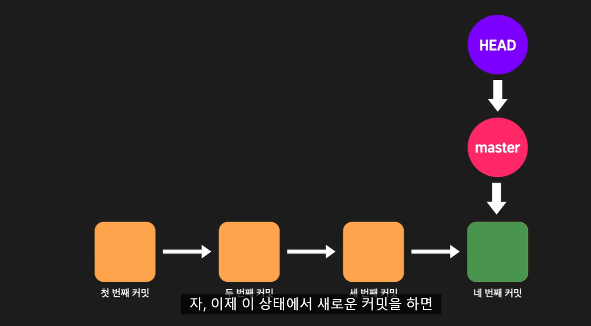
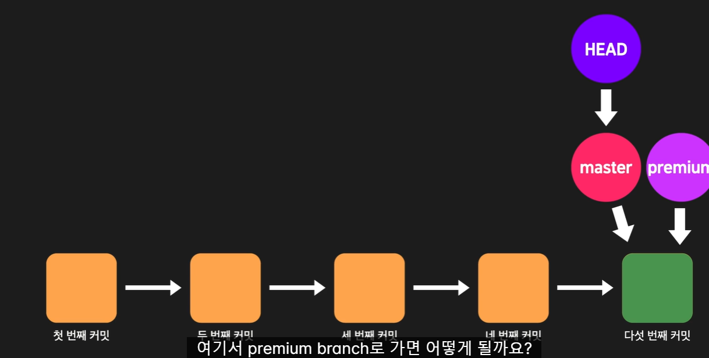
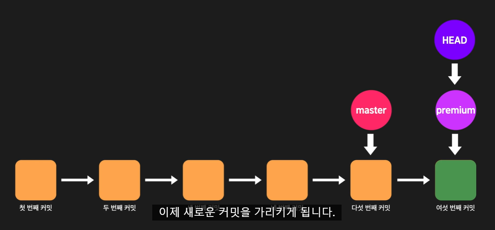
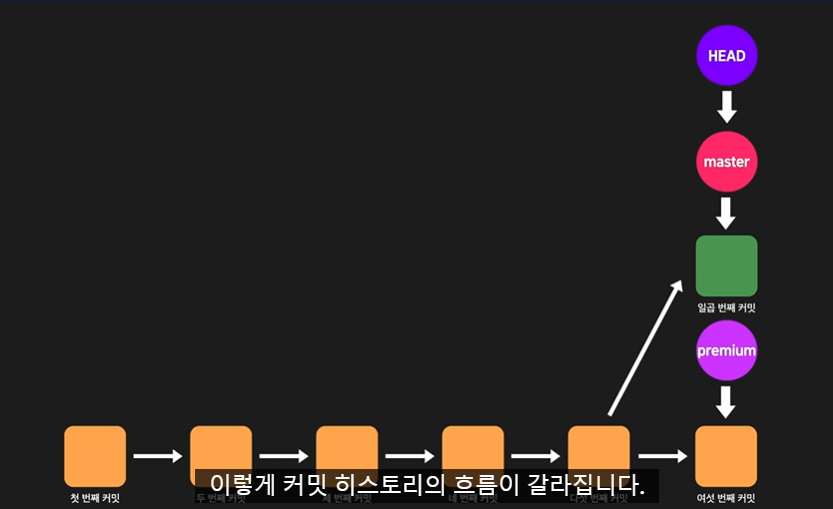
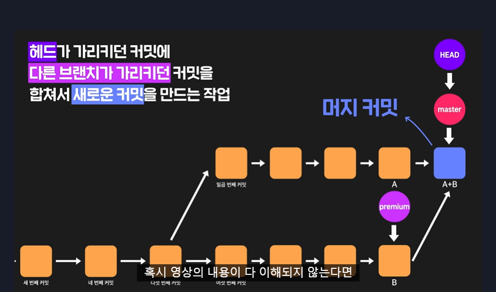
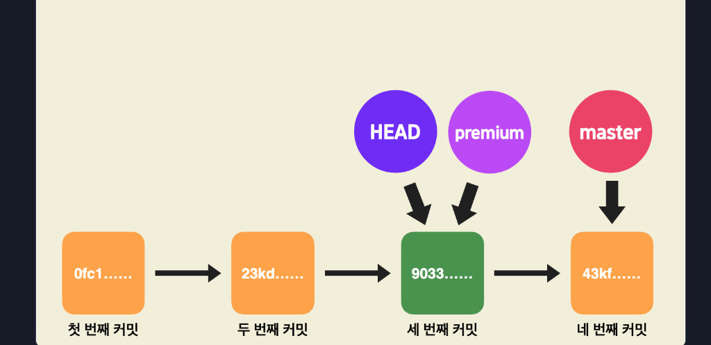
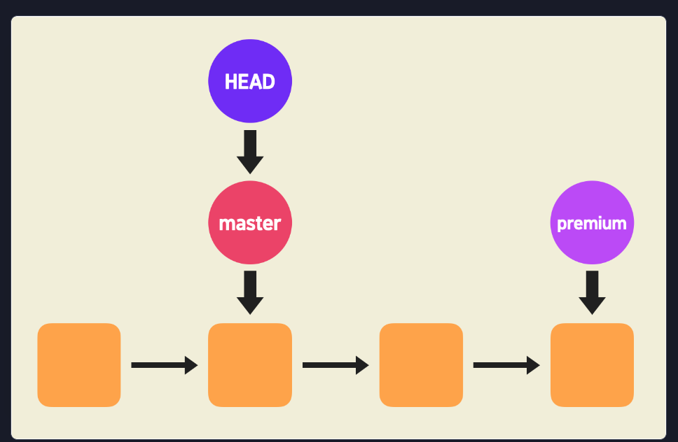
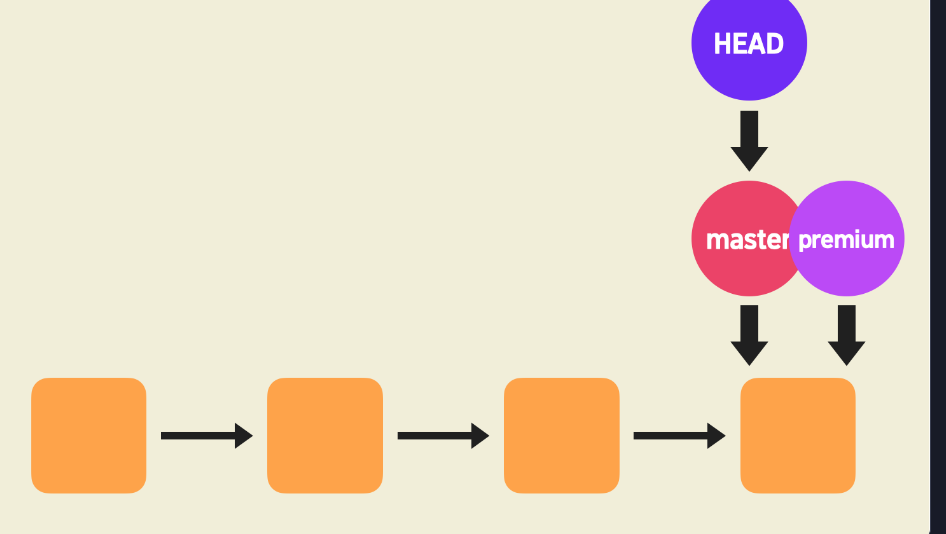

# 🥭 브랜치 다루기 🥭
#### Week2 unix git 기초 / Topic 2 깃 / 5. 브랜치 다루기

>목차 
>>[1. 브랜치](#1-브랜치)<br>
[2. 브랜치 머지](#2-브랜치-머지)<br>
[3. conflict](#3-conflict)<br>
[4. 리모트 레포지토리에서의 브랜치](#4-리모트-레포지토리에서의-브랜치)<br>
[5. 한 리모트 레포지토리에 브랜치 여러 개 push하기](#5-한-리모트-레포지토리에-브랜치-여러-개-push하기)<br>
[6. HEAD와 브랜치의 관계](#6-head와-브랜치의-관계)<br>
[7. git reset](#7-git-reset)<br>
[8. git reset과 git checkout](#8-git-reset과-git-checkout)<br>
[9. 머지 종류](#9-머지-종류)<br>


<br><br>

## 0. 깃 명령어 요약

* git branch [새 브랜치 이름]

새로운 브랜치를 생성

* git checkout -b [새 브랜치 이름]

새로운 브랜치를 생성하고 그 브랜치로 바로 이동

* git branch -d [기존 브랜치 이름]

브랜치 삭제

* git checkout [기존 브랜치 이름]

그 브랜치로 이동

* git merge [기존 브랜치 이름]

현재 브랜치에 다른 브랜치를 머지


* git merge --abort

머지를 하다가 conflict가 발생했을 때, 일단은 머지 작업을 취소하고 이전 상태로 돌아감


<br>

## 1. 브랜치
브랜치란? 맨 처음한 커밋인 root 커밋에서 여러 흐름으로 갈라질 수 있다.

하나의 프로그램을 만들 때, 유료, 무료, 프리미엄 버전 등등 여러 개가 있듯, 한 프로젝트에 여러 브랜치로 각 프로그램 버전 플로우를 관리하는 것이다.

**기본적으로 우리는 master 브랜치 위에서만 작업한다.** master은 레포지토리를 만들고 커밋을 하면 자동으로 생기는 브랜치이다. 

내가 새로운 브랜치를 만들고 싶다면?
```git
git branch 브랜치이름
```
그다음 내가 그 브랜치로 가서 작업해야 하니까
```git
git checkout 브랜치이름
```
이제 이 브랜치 위에서 작업하면 master 브랜치에는 적용이 안된다. 

**만약 브랜치 새로 만드는 동시에 그 브랜치로 가서 작업하려면!!**
```git
git checkout -b 새로운브랜치이름
```

내가 만든 브랜치가 뭐가 있는지 모두 보려면
```git
git branch
```

브랜치 삭제하려면
```git
git branch -d 브랜치이름
```

<br>

## 2. 브랜치 머지
만약 a 기능이 A 브랜치말고 마스터 브랜치나 B 브랜치에도 있어야 한다면? 브랜치 머지를 하자.

```git
// 현재  나는 A 브랜치에 있는데 이 기능을 B에도 넣으려면? 
git checkout B
git merge A
```
명심하자!! A에 있는 기능을 끌어오려면 B로 먼저 가서 A 꺼를 뺏어오듯 가져와야함.

예를 들어 내가 무료 버전에서 작업했는데 무료 기능이 다 유료에도 있어야 한다면?
```git
git checkout premium
git merge free
```
유료 브랜치로 가서 무료 코드 가져오기

<br>

## 3. conflict
머지를 하다 충돌 생길 수도 있음. 그럼 그냥 충돌이 생긴 파일을 수정하면 된다. (수정 안 하고 그대로 주석만 지워서 commit하여 반영할 수도 있다!) **수정 후 git add 하고 커밋하면 된다!!**


머지 자체를 취소하려면 
```git
git merge --abort
```

여러 파일에서 충돌이 난다면? 그럼 그냥 각 파일 모두 수정하면 된다.


<br>

## 4. 리모트 레포지토리에서의 브랜치
맨 처음 우리가 로컬 레포지토리에서 리모트 레포지토리와 연결할 때
```git
// 새로운 리모트 레포지토리를 origin이라는 이름으로 지정하겠다.
git remote add origin "깃 주소"
```
를 썼었다. 여기서 remote 명령어는 원격 저장소에 뭔가를 하겠다는 명령어.

```git
// 로컬 레포지토리 master 브랜치의 모든 커밋을 origin이라는 리모트 레포지토리로 보낸다. 
git push -u origin master
```
만약 origin 리모트 레포지토리에 master 브랜치가 없다면 master 브랜치를 새로 생성하고 push한다.

여기서 -u 옵션은 --set-upstream과 같은 말임!!

**이 u 옵션은 로컬 레포의 master 브랜치가 origin에 있는 master 브랜치를 추적하도록 설정한다.**

* 여기서 tracking이란? 로컬 레포의 한 브랜치가 리모트 레포의 한 브랜치와 연결된 상태.
* 이 때 리모트 레포지토리에 A2 브랜치, 이와 tracking connection을 맺은 게 로컬 레포지토리의 A 브랜치라면 A2 를 A 브랜치의 upstream branch라 한다. 

만약 upstream branch가 없다면
```git
git push origin master 
```
이런식으로 계속 어느 리모트에 어느 브랜치를 집어넣을지 적어야 한다!!


**정리하자면 로컬 레포지토리의 master 브랜치와ㅏ 리모트 레포지토리의 master 브랜치는 이름은 같지만 엄연히 다른 브랜치다.**

git history를 통해 리모트 레포지토리에 있는 master 브랜치를 알 수 있음. 이걸로 내가 어디까지 push했는지 확인할 수 있다. 
<br>

## 5. 한 리모트 레포지토리에 브랜치 여러 개 push하기
앞에서 origin 리모트 레포지토리에 master 브랜치를 푸시했다.

그다음 premium 이라는 브랜치도 푸시하려면?

```git
// 1. 먼저 프리미엄 브랜치로 가서
git checkout premium

// 2. origin 리모트 레포에 premium이라는 새 브랜치 만들면서 거기에 push 해주자.
git push -u origin premium
```


<br>

## 6. HEAD와 브랜치의 관계
* HEAD는 어떤 커밋을 가리키는 포인터.
* branch는 어떤 커밋을 가리키는 포인터.

각 커밋은 linked list처럼 연결되어있어서, 내가 한 커밋에 있어도 그 이전 커밋을 추적할 수 있다.



브랜치는 하나의 커밋을 직접적으로 가리키는 포인터고, head는 그 브랜치를 가리켜 커밋을 간접적으로 가리킨다. 

만약 내가 새 커밋을 한다면 브랜치는 자동으로 새 커밋을 가리키고, head는 브랜치를 가리키니 head도 결국 새 커밋을 가리키게 된다. 

여기서 내가 branch를 새로 만든다면, 그 새 branch 포인터도 새 커밋을 가리키게 된다.



위의 사진에서 git checkout premium을 쓰면 head가 이제 premium 브랜치를 가리키는 것이다.

checkout 하고 premium 브랜치에서 작업하다가 새 커밋을 하면? 아래 사진처럼 premium은 새 커밋을 가리키고, head도 자동으로 그 커밋을 가리킨다. 그치만 master 브랜치 포인터는 그대로다!!


내가 여기서 다시 git checkout master을 하고, master에서 새 커밋을 한다면 premium 브랜치의 흐름과는 완전히 다른 흐름으로 진행된다. 아래 사진처럼 갈라진 것을 분기한다고 말한다.



그리고 내가 master에 위치한 채로 premium을 합치려면? git merge premium 을 하자. 이러면 premium 브랜치가 가리키는 커밋a와 master가 가리키는 커밋b를 합쳐 새로운 커밋c가 탄생해 master 브랜치 b커밋 이후에 c 커밋이 붙는다. **이 때 합쳐졌다 해서 a, b 커밋이 사라지는 건 아니다!!**



<br>

## 7. git reset
git reset a커밋아이디 를 한다면, master 포인터가 a커밋을 가리키게 된다. 그치만 head 포인터는 여전히 master을 가리킨다. 

즉, head는 여전히 같은 브랜치를 가리키고

head가 가리키는 브랜치가 다른 특정 커밋을 가리키게 된다.

이 때문에 결국 head가 간접적으로 가리키던 커밋도 바뀌는 것이다.

**중요!! 과거 커밋으로 돌아간대도 이후 커밋이 싹 사라지는 게 아니다. 아이디 알고 있으면 이후 커밋으로 git reset 명령어 써서 넘어갈 수 있다!!**


<br>

## 8. git reset과 git checkout
* git reset은 브랜치가 가리키는 커밋을 바꾸고 head는 그대로 같은 브랜치를 가리킨다.

* git checkout은 브랜치 포인터는 놔두고 head를 아예 다른 브랜치로 옮긴다. 그래서 
```git
git checkout 커밋아이디
```
이렇게 써도 된다. 

근데 이렇게 브랜치가 아니라 커밋 그 자체를 가리키는 head를 detached head라고 한다. 이렇게 브랜치 말고 커밋 가리키게 하는 이유는

**특정 과거 커밋에서 새로운 브랜치 만들고 싶어졌을 때.**

이다!! 근데 
```git
git checkout aaaa
git branch premium
```
이걸 써서 브랜치를 새로 만들면 아래 사진처럼 된다.


따라서 git checkout premium 으로 브랜치 이동을 하고 새 커밋을 해야 함!!!

**정리하자면 git checkout 은 head만 이동시키고, git reset은 브랜치 자체를 이동시킨다.**

git checkout master 이 명령어는
1. master 브랜치로 이동해라
2. head가 master 브랜치를 가리키도록 해라
3. head가 master 브랜치가 가리키는 커밋을 간접적으로 가리키게 해라
4. working directory도 head가 가리키는 커밋 모습으로 바뀐다. 

<br>

## 9. 머지 종류

만약 커밋 플로우가 선형상태라면?

이 상태로 git merge premium을 하면 그냥 이렇게 된다.

이렇게 새로운 커밋이 생기지 않고 단지 브랜치가 이동하는 merge를 fast forward 머지라고 한다.

보통 우리가 하는 merge는 3 way merge로, 브랜치가 갈라져서 flow가 선형이 아닐 때이다.

A 브랜치와 B 브랜치를 merge 할 때, 각자 a 파일이 있는데 이걸 B에서만 수정했다면 B의 것이 반영된다. **merge는 수정된 것을 기준으로 덮어쓰기 때문!!**
만약 A, B 둘다 수정했다면 conflict가 발생한다.


<br>
