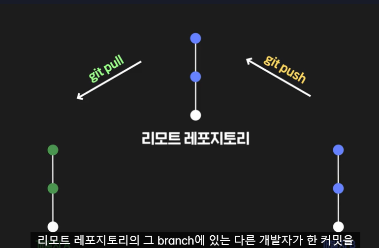
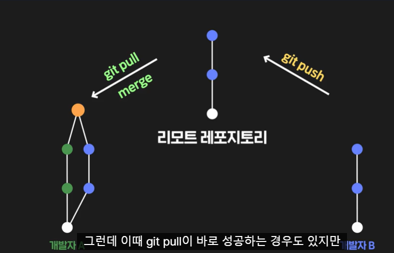
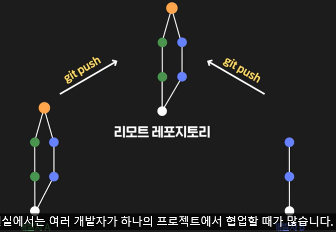

# 🍛 깃 협업하기 🍛
#### Week2 unix git 기초 / Topic 2 깃 / 6. 깃 협업하기

>목차 
>>[1. git pull해야 하는 상황](#1-git-pull해야-하는-상황)<br>
[2. git fetch](#2-git-fetch)<br>
[3. 코드 작성자 알아보기](#3-코드-작성자-알아보기)<br>
[4. 이미 remote repository에 올라간 커밋 취소하기](#4-이미-remote-repository에-올라간-커밋-취소하기)<br>
[5. 여러 커밋 취소하기](#5-여러-커밋-취소하기)<br>


<br><br>

## 0. 깃 명령어 요약
* git fetch

로컬 레포지토리에서 현재 HEAD가 가리키는 브랜치의 업스트림(upstream) 브랜치로부터 최신 커밋들을 가져옴(가져오기만 한다는 점에서, 가져와서 머지까지 하는 git pull과는 차이가 있음)

* git blame

특정 파일의 내용 한줄한줄이 어떤 커밋에 의해 생긴 것인지 출력

* git revert

특정 커밋에서 이루어진 작업을 되돌리는(취소하는) 커밋을 새로 생성


<br>

## 1. git pull해야 하는 상황

**git pull은 사실 remote 레포지토리의 브랜치를 내 로컬 레포지토리의 브랜치에 merge하는 명령어다!!**

원래 리모트 레포지토리에 A B 커밋이 있다고 치자.

내가 내 로컬에서 작업을 해서 master 브랜치에 
A B C 커밋이 생성되었다고 하자.

근데 다른 협업 개발자가 지 꺼를 개발해서 내 remote 레포지토리의 master 브랜치에 A B D 커밋을 저장했다.

* 이 상태에서 git push를 할 경우: C와 D 커밋이 충돌남.
* git pull을 먼저 해줘야 하는데 git pull하면 C와 D 커밋이 merge되면서 E(C+D) 커밋이 생기는데, 이 과정에서 충돌날 수 있음. 따라서 내 파일 수정하고 커밋해주자. 

이렇게 git pull 하고 충돌을 고친 후 merge 진행한 다음, git push를 하면 된다. 

아래 사진 참고.







<br>

## 2. git fetch
git pull은 리모트 레포지토리의 모든 커밋들을 가져와서 내 레포지토리 브랜치와 merge하는 작업이다.

**git fetch는 merge 빼고 가져오는 단계까지만 수행한다!!**

merge를 좀 조심해야 할 경우 내용을 먼저 확인해본다음 머지하기 위해 fetch 명령어를 사용한다.

```git
// 1. 일단 리모트 레포의 커밋을 가져와서 본다.
git fetch

// 2. fetch하면 origin/premium 이런 식으로 리모트레포 브랜치 이름이 뜬다. 그럼 내 premium과 origin/premium을 비교해보자
git diff premium origin/premium
```
위처럼 코드 비교해보고 리모트 브랜치의 코드가 잘못됐다면??
1. 해당 코드 개발한 개발자한테 고치고 다시 올려달라고 한다.
2. 내가 알아서 merge해서 고치고 pull한다.

만약 2번, 내가 알아서 고치려면
```git
// 1. 일단 origin/premium 브랜치 내용을 끌어온다.
git merge origin/premium

// 2. 고치고 다시 커밋한다
git add. 
git commit -m ""

// 3. 다시 푸시한다
git push
```

<br>

## 3. 코드 작성자 알아보기
한 프로젝트는 여러명이 코드를 작성한다.

```git
//git blame 파일명
git blame index.html

// git show로도 누가 커밋을 한 건지 볼 수도 있다.
git show 커밋아이디
```


<br>

## 4. 이미 remote repository에 올라간 커밋 취소하기

### 이미 remote 레포지토리에 커밋push까지 했는데, 수정 사항을 싹 없애고 이전 버전으로 돌아가고 싶다면?


git reset 커밋아이디를 통해 돌아갈 수도 있지만, reset 명령어를 쓰면 내가 다시 코드를 수정하고 git add git commit을 해야 해서 번거롭다.

 git revert 명령어는 이전 커밋 상태로 돌아가서 새로 그대로 또 커밋을 해준다!!

```git
git revert 커밋아이디
```

 A B C 커밋을 했을 때
 
 * git revert를 쓰면  A B C B 가 된다.
 * git reset을 쓰면 A B 가 된다.

**git reset은 아예 과거 그 자체로 돌아가기때문에, 리모트 레포지토리에 이미 push해버려서 A B C가 있다면 reset을 하고 pull 하려 할 때 에러가 난다.**

**리모트 레포지토리에 커밋기록 자체가 사라지는 건 아니다!!**
push로 커밋을 올리면 그걸 취소할 수는 없기에 꼭 신중하게 push 하자. 

<br>

## 5. 여러 커밋 취소하기 
여러 개를 revert할 수 있다.
```git
// 1. git history로 커밋 아이디 따낸다.
git history

// 2. 1, 2, 3커밋 내용 취소하려면 1..4 라고 적어야 함!!
git revert 1..4

```


<br>

