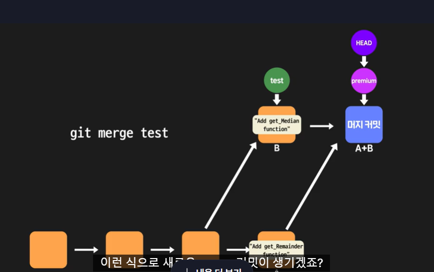
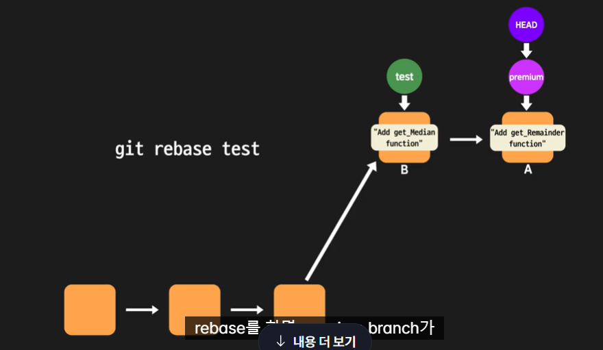

# 🍦 깃 활용하기 🍦
#### Week2 unix git 기초 / Topic 2 깃 / 7. 깃 활용하기

>목차 
>>[1. git reset하고 돌아오기](#1-git-reset하고-돌아오기)<br>
[2. 커밋 히스토리 보기](#2-커밋-히스토리-보기)<br>
[3. git merge](#3-git-rebase)<br>
[4. 작업 내용 임시 저장하기](#4-작업-내용-임시-저장하기)<br>
[5. 잘못된 브랜치에서 작업할 때](#5-잘못된-브랜치에서-작업할-때)<br>
[6. git cherry-pick](#6-git-cherry-pick)<br>
[7. merge](#7-잘못-커밋했을-때-새로-커밋하기)<br>
[8. git이 무시하는 파일들](#8-git이-무시하는-파일들)<br>

<br><br>

## 0. 깃 명령어 총정리
### Git 써보기
* git init

현재 디렉토리를 Git이 관리하는 프로젝트 디렉토리(=working directory)로 설정하고 그 안에 레포지토리(.git 디렉토리) 생성

* git config user.name 'codeit'

현재 사용자의 아이디를 'codeit'으로 설정(커밋할 때 필요한 정보)

* git add [파일 이름]

수정사항이 있는 특정 파일을 staging area에 올리기

* git add [디렉토리명]

해당 디렉토리 내에서 수정사항이 있는 모든 파일들을 staging area에 올리기

* git reset [파일 이름]

staging area에 올렸던 파일 다시 내리기

* git status

Git이 현재 인식하고 있는 프로젝트 관련 내용들 출력(문제 상황이 발생했을 때 현재 상태를 파악하기 위해 활용하면 좋음)

* git commit -m "커밋 메시지" 

현재 staging area에 있는 것들 커밋으로 남기기

* git help [커맨드 이름]

사용법이 궁금한 Git 커맨드의 공식 메뉴얼 내용 출력

### GitHub 시작하기

* git push -u(또는 --set-upstream) origin master

로컬 레포지토리의 내용을 처음으로 리모트 레포지토리에 올릴 때 사용합니다.

* git push

위의 커맨드를 한번 실행하고 난 후에는 git push라고만 쳐도 로컬 레포지토리의 내용을 리모트 레포지토리에 올릴 수 있습니다.

* git pull

바로 위의 위에 있는 커맨드를 한번 실행하고 난 후에는 git pull이라고만 쳐도 리모트 레포지토리의 내용을 로컬 레포지토리로 가져옵니다.

* git clone [프로젝트의 GitHub 상 주소]

GitHub에 있는 프로젝트를 내 컴퓨터로 가져오기

### Git에서 커밋 다루기

* git log

커밋 히스토리를 출력

* git log --pretty=oneline

--pretty 옵션을 사용하면 커밋 히스토리를 다양한 방식으로 출력할 수 있습니다. --pretty 옵션에 oneline이라는 값을 주면 커밋 하나당 한 줄씩 출력해줍니다.

* git show [커밋 아이디]

특정 커밋에서 어떤 변경사항이 있었는지 확인

* git commit --amend

최신 커밋을 다시 수정해서 새로운 커밋으로 만듦

* git config alias.[별명] [커맨드]

길이가 긴 커맨드에 별명을 붙여서 이후로는 별명으로도 해당 커맨드를 실행할 수 있게 설정

* git diff [커밋 A의 아이디] [커밋 B의 아이디]

두 커밋 간의 차이 비교

* git reset [옵션] [커밋 아이디]

옵션에 따라 하는 작업이 달라짐(옵션을 생략하면 --mixed 옵션이 적용됨)

(1) HEAD가 특정 커밋을 가리키도록 이동시킴(--soft는 여기까지 수행)

(2) staging area도 특정 커밋처럼 리셋(--mixed는 여기까지 수행)

(3) working directory도 특정 커밋처럼 리셋(--hard는 여기까지 수행)

그리고 이때 커밋 아이디 대신 HEAD의 위치를 기준으로 한 표기법(예 : HEAD^, HEAD~3)을 사용해도 됨

* git tag [태그 이름] [커밋 아이디]

특정 커밋에 태그를 붙임

### Git에서 브랜치 사용하기
* git branch [새 브랜치 이름]

새로운 브랜치를 생성

* git checkout -b [새 브랜치 이름]

새로운 브랜치를 생성하고 그 브랜치로 바로 이동

* git branch -d [기존 브랜치 이름]

브랜치 삭제

* git checkout [기존 브랜치 이름]

그 브랜치로 이동

* git merge [기존 브랜치 이름]

현재 브랜치에 다른 브랜치를 머지

* git merge --abort

머지를 하다가 conflict가 발생했을 때, 일단은 머지 작업을 취소하고 이전 상태로 돌아감


### Git 실전 I
* git fetch

로컬 레포지토리에서 현재 HEAD가 가리키는 브랜치의 업스트림(upstream) 브랜치로부터 최신 커밋들을 가져옴(가져오기만 한다는 점에서, 가져와서 머지까지 하는 git pull과는 차이가 있음)

* git blame

특정 파일의 내용 한줄한줄이 어떤 커밋에 의해 생긴 것인지 출력

* git revert

특정 커밋에서 이루어진 작업을 되돌리는(취소하는) 커밋을 새로 생성

* git reflog

HEAD가 그동안 가리켜왔던 커밋들의 기록을 출력

* git log --all --graph

모든 브랜치의 커밋 히스토리를, 커밋 간의 관계가 잘 드러나도록 그래프 형식으로 출력

* git rebase [브랜치 이름]

A, B 브랜치가 있는 상태에서 지금 HEAD가 A 브랜치를 가리킬 때, git rebase B를 실행하면 A, B 브랜치가 분기하는 시작점이 된 공통 커밋 이후로부터 존재하는 A 브랜치 상의 커밋들이 그대로 B 브랜치의 최신 커밋 이후로 이어붙여짐(git merge와 같은 효과를 가지지만 커밋 히스토리가 한 줄로 깔끔하게 된다는 차이점이 있음)

* git stash

현재 작업 내용을 스택 영역에 저장

* git stash apply [커밋 아이디]

스택 영역에 저장된 가장 최근의(혹은 특정) 작업 내용을 working directory에 적용

* git stash drop [커밋 아이디]

스택 영역에 저장된 가장 최근의(혹은 특정) 작업 내용을 스택에서 삭제

* git stash pop [커밋 아이디]

스택 영역에 저장된 가장 최근의(혹은 특정) 작업 내용을 working directory에 적용하면서 스택에서 삭제

* git cherry-pick [커밋 아이디]

특정 커밋의 내용을 현재 커밋에 반영

### ! 그 밖에 알아야할 사실

(1) git commit이라고만 쓰고 실행하면 커밋 메시지를 입력할 수 있는 텍스트 에디터 창이 뜹니다. 거기서 커밋 메시지를 입력하고 저장하고 나면 커밋이 이루어집니다.

(2) git push와 git pull은 그 작업 단위가 브랜치입니다. 예를 들어, master 브랜치에서 git push를 하면 master 브랜치의 내용만 리모트 레포지토리의 master 브랜치로 전송되지, premium 브랜치의 내용이 전송되는 것은 아닙니다.(git push에 --all이라는 옵션을 주면 모든 브랜치의 내용을 전송할 수 있기는 합니다.)


<br>

## 1. git reset하고 돌아오기
git reset을 해도 레포지토리에 저장된 커밋들은 항상 보관되어있음. 즉, 아이디만 알고 있다면 git reset으로 다시 돌아올 수 있다!!

git reset 이후 커밋 아이디 아는 방법:
```git
git reflog
```
이걸로 모든 커밋의 아이디 뽑아내서 돌아갈 수 있다.

<br>

## 2. 커밋 히스토리 보기
```git
// 1. 그냥 내가 있는 브랜치 기록만 보여줌.
git history

// 2. 모든 브랜치 기록 보여줌.
git history --all

// 3. 모든 브랜치 기록을 그래프로 잘 보여준다.
git history --a --graph

```


<br>

## 3. git rebase
git merge 랑 비슷하게 두 브랜치를 합치는 것임.

내가 지금 premium 브랜치에 있는데 test 브랜치 기능을 싹 가져오려면?

1. git merge test, 충돌 해결, git add, git commit 한다.

2. git rebase test, 충돌해결, git add, git rebase --continue

이렇게 rebase를 하면 새로운 머지 커밋이 생기는 게 아니라, premium 브랜치 커밋에다가 test 커밋을 합쳐서 그 커밋 그대로 test 브랜치 옆에 붙여준다.

**즉, rebase는 새로운 커밋을 만드는 게 아니라 기존 커밋A에 A+B를 덮어씀. 이렇게 rebase로 만들면 커밋 히스토리가 더 깔끔해짐**

머지한 경우


리베이스 한 경우



**머지와 리베이스 둘다 결과적으론 같다** 두 브랜치를 합쳤다는 정보가 꼭 히스토리에 남아야 한다면 merge, 히스토리를 깔끔하게 유지하고 싶다면 rebase를 쓰자.

<br>

## 4. 작업 내용 임시 저장하기
내가 A 브랜치에서 작업하다가 작업 내용을 커밋하지 않고 임시 저장한 후 B 브랜치로 가려면?

git stash로 스택에 임시로 수정 내용 보내면 working directory도 다시 최근 커밋상태로 되돌아가지만 stack에 다 저장되어있으니 걱정 말자.

```git
// 1. A 브랜치에서 작업한 후 A 브랜치에서...
git stach

// 2. B 브랜치로 이동한다
git checkout B

// 3. B 브랜치에서 작업하고 커밋한 후 다시 A 브랜치로 가자.
git checkout A

// 4. 스택에 있던 내용을 다시 가져오자 apply 쓰면 워킹디렉토리가 다시 내 수정본 상태로 돌아온다. 
git stash apply 스택아이디
git stash apply (아이디 안쓰면 가장 최신꺼)

// 5. 이제 작업하고 커밋하면 된다!
```

```git
// 스택에 임시저장한 내용 뭐가 있는지 보려면
git stach list

// 스택에서 적용한 내용 삭제하려면
git stash drop 스택아이디
git stash drop (아이디 안 쓰면 가장 최신꺼.)

// 스택에서 꺼내는 동시에 스택에서 삭제하려면
git stash pop 
```


<br>

## 5. 잘못된 브랜치에서 작업할 때
```git
// 1. git stash로 작업내용 저장하고
git stash

// 2. 정확한 브랜치로 이동해서
git checkout 브랜치이름

// 3. 스택에서 작업내용 꺼내서 제대로 커밋. 
git stash apply 스택아이디
```

apply 할 때도 충돌이 일어날 수 있다!! 그냥 고치면 된다. 

<br>

## 6. git cherry-pick

만약 test 브랜치에서 A 파일을 version1 과 version2를 만들어 커밋했는데 version1 커밋만 가져와서 premium 브랜치에 합치고 싶다면?

```git
// 1. history로 version1 커밋 아이디 알아내기
git history

// 2. premium 브랜치로 이동
git checkout premium

// 3. 원하는 커밋만 쏙 빼먹어서 premium에 적용
git cherri-pick 커밋아이디
```
이 때도 충돌이 생길 수 있는데 그냥 고치면 된다. 


<br>

## 7. 잘못 커밋했을 때 새로 커밋하기
1. git reset soft를 통해 워킹 디렉토리의 내용은 남기고, 레포지토리만 이전 커밋으로 돌아가게 한다.
```git
git reset --soft 돌아가고싶은커밋아이디
```
이 후 내가 원하는대로 수정하고 git add, git commit을 하자.

**스페이스바나 오타 등 자잘한 수정을 할 때 git reset --soft, mixed를 통해 고치자!!**


2. 만약 직전 커밋만 수정하고 싶다면 git commit --amend 를 하자.

<br>

## 8. git이 무시하는 파일들
.gitignore 파일은 워킹 디렉토리에 있지만 존재하지 않는 것처럼 git이 인식을 피해야 하는 파일 목록이 적힌 파일이다.

버전관리 하면 용량만 오히려 더 차지하고 가독성 떨어지고 버전관리할 가치가 없는 파일들이다. 

<br>
