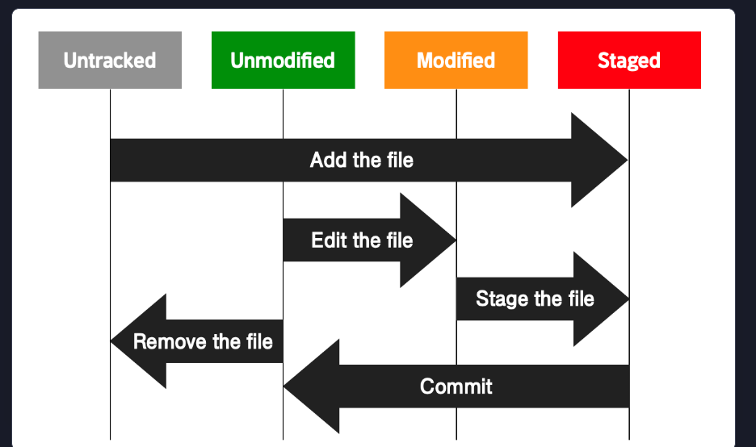

# 🍖 깃 협업 🍖
#### Week2 unix git 기초 / Topic 3 개발 협업 / 1. 깃 협업

  

## 1. git의 구조와 파일 상태

* git 구조: working directory + staging area + repository

* 파일 상태: untracked, tracked(staged, modified, unmodified)

## 2. 커밋
작업 내용의 스냅샷, 스냅샷을 찍는 행위. 깃에서 관리하는 가장 작은 단위의 버전.

## 3. 브랜치
독립적으로 작업을 진행하고 그 결과를 저장할 수 있는 개별적인 흐름. 다만 브랜치는 특정 커밋을 가리키는 포인터로, 브랜치가 특정 버전을 가리키고 있지만 그 버전 자체는 아님. **브랜치는 단지 버전을 가리키는 포인터**

## 4. 로컬 저장소, 원격 저장소.
git push, git pull을 통해 저장소에 백업하고 저장소 내용을 가져온다. 이를 통해 다른 이와 협업할 수 있다. 원격 저장소에 내 로컬 레포지토리를 백업하기 위해 원격 저장소 내에 브랜치를 만들어 내 로컬 브랜치와 연결해야 한다. **즉, git push 명령어는 브랜치 단위로 push해주는 거지 레포지토리 전체를 push하는 게 아니다!!**

git fetch 명령어로 내용을 볼 수도 있다.

## 5. 깃의 작업 흐름
1. git pull
2. git checkout -b new_branch
3. git add .
4. git commit -m "feat: 기능 추가"
5. git push

이 때 2번에서 new_branch 이름은 add_page 이런 식으로 기능적으로 짓자.

## 6. 깃의 기능
1. organization으로 팀 맺기
2. Issues 로 프로젝트 관련 토론하기.
3. Pull Requests 로 다른 사용자에게 내 코드 검토하고 merge해달라고 요청하기. 
4. code reviews 로 코드 리뷰하고 피드백 주고받기.