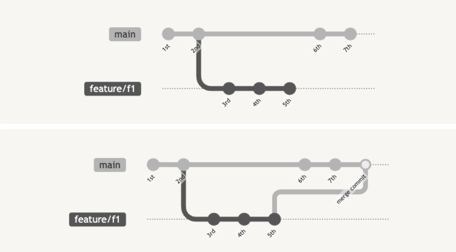
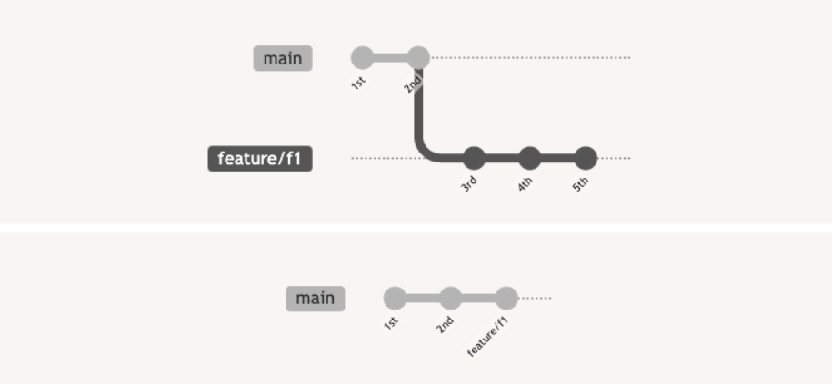
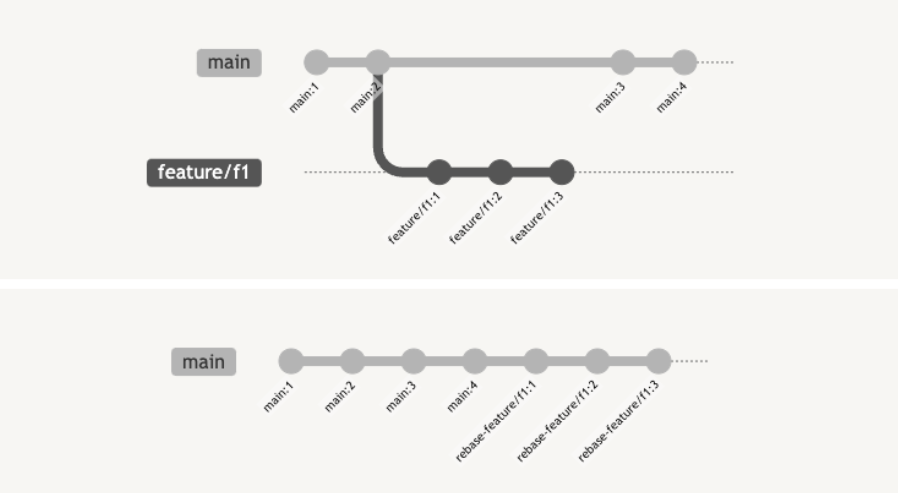

# 🍱 PR 🍱
#### Week2 unix git 기초 / Topic 3 개발 협업 / 2. PR

>목차 
>>[1. PR](#1-pr)<br>
[2. PR merge](#2-pr-merge)<br>
[3. fork](#3-fork)<br>
[4. PR 충돌 최소화하기](#4-pr-충돌-최소화하기)<br>
[5. 좋은 PR이란](#5-좋은-pr이란)<br>

<br><br>


## 1. PR

내 코드를 그냥 한 번에 원격 저장소에 merge 하는 게 아니라, PR을 보내서 남이 내 코드를 확인하고 merge하게 할 수 있다.

PR은 기록으로 남기 때문에 머지 이후에도 되돌릴 수 있어 버전관리에 좋고, 코드 품질이 개선되고 문서화하기 좋다.

Pr 하는 법.
```git
// 1. 내가 합류한 프로젝트 clone해오기
git clone url

// 2. 내가 작업할 브랜치 생성하기
git checkout -b my-test-branch

// 3. 코드 수정하고 커밋하고 푸시하기
git push origin 

// 4. 사이트에 가서 PR 버튼 누르고 create pull request하기!!
```


* PR의 상태 3가지
1. open: 아직 pr 검토 완료 안 되었거나, 추가 작업이 필요함. 이 상태에선 커밋을 추가하거나 토론 진행할 수 있음.
2. merged: 기본브랜치로 내 브랜치가 merged된 상태. 이는 closed 상태임.
3. closed: pr 거부되었거나, 더이상 유효하지 않은 pr. merged도 closed된 상태긴 한데 여기서 closed는 거부된 pr을 일컬음. 
<br>

## 2. PR merge
이제 pr 보낸 걸 메인 브랜치에 merge 하려면? 3가지 방법이 있다.

1. merge commit 만들며 합치기
* 이때까지 내가 한 merge. 두 브랜치의 커밋 모두 유지하면서 새 merge 커밋을 만들어 붙임. 히스토리를 모두 기록 가능하고 커밋의 커밋 아이디가 바뀌지 않아 좋지만, 커밋 히스토리가 복잡해질 수 있음. 


2. squash and merge하기
* 한 브랜치 내 모든 커밋이 하나로 합쳐져서 main 브랜치에 하나의 커밋만 붙음. 히스토리가 간단하고 의미를 이해하기 쉬우며, pr 각각에 중요한 내용만 압축되지만 상세 이력을 잃어버리고 여러 명이서 하나의 브랜치를 사용한다면 큰 에러가 발생할 수도 있다. 


3. rebase and merge하기
* main 브랜치에 내 브랜치 연달아서 일렬로 이어붙인다. 히스토리가 깨끗해서 좋지만 squash처럼 여럿이서 한 브랜치를 사용하면 에러날 수도 있음. 


<br>

## 3. fork
fork는 정확히 말하면 git 기능이 아니라 github가 제공하는 기능이다.

fork란 원격 git repository를 내 repository로 복사해온다. 구글 문서 사본 만들듯이, 남의 원격 레포를 복사해서 내 레포로 가져오는 것이다.

이렇게 만든 내 레포는 원래의 레포와 완전히 분리되어 내 맘대로 고칠 수 있다.

* 직접 브랜치로 PR 만드는 경우: 원본 저장소에 직접 접근하기 때문에 편하고 효율적임.
* fork로 Pr 만드는 경우: 오픈소스 같이 규모가 엄청 클 때, 단일 브랜치만으로 작업이 충분하지 않을 때, 개발자가 실수해도 좀 더 부담이 적게.

fork PR하는 법
1. 일단 원하는 프로젝트 코드잇 프로젝트를 내 계정으로 fork
2. 내 저장소로 이동해서 내 로컬에 프로젝트 디렉토리 만들고 거기에 변경 사항 저장할 브랜치를 생성.
3. 변경 사항 커밋하고 푸시한다
4. 내 저장소 와서 new pull request 버튼 누른다.
5. 내 변경 사항을 보낼 원본 저장소와 브랜치 선택하기. (코드잇 원본 저장소, part1-홍재원)
6. PR 작성하고 제출하기. 

### 즉!!

그냥 git clone 하고 push하면 바로 원본 레포지토리로 push됨

fork 해서 내 사본 만들고 git clone 하고 push 하면 내 사본으로 push되고 그걸 원본 소유자가 merge함. 

<br>


## 4. PR 충돌 최소화하기

작은 규모의 PR을 만들기

파일을 작게 만들기

동료와 많이 소통하기

위의 방법들은 다 단점들도 있으니 적절히 하는 게 좋다.

<br>

## 5. 좋은 PR이란
PR에는

Fix: 메인 페이지에서 탈퇴했다 다시 가입했을 때 로그인 버튼 색이 빨간색으로 변경되는 문제 해결

이런 식으로 적는 게 좋다. 

그리고 PR은 하나당 하나의 문제를 해결해야 하고, 커밋을 통해 논리적 그룹을 만들어야 하며, PR 하나는 하루에 끝날 수 있는 크기여야 함. 
<br>

