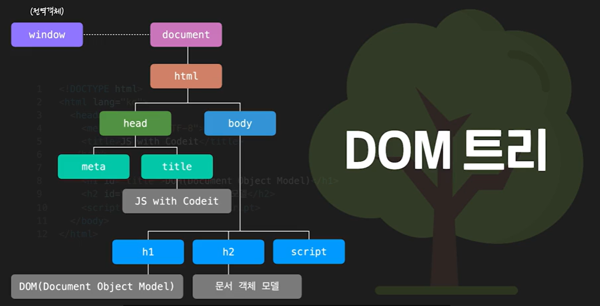

# 🥖 브라우저 🥖
#### Week4 인터렉티브 자바스크립트 / Topic 1 인터렉티브 자바스크립트 / 2. 브라우저

>목차 
>>
1. 브라우저
2. DOC
3. console.dir
4. DOC 트리
5. 요소 노드 프로퍼티
6. inner, outer html
7. 요소 노드 추가하기
8. 요소 노드 삭제, 이동
9. html 속성 다루기
10. 스타일 다루기
11. 비표준 속성 다루기


<br><br>

## 1. 브라우저
우리가 사용하는 웹 브라우저 자체를 다루려면 윈도우라는 객체로 다룰 수 있다.

```js
// 예를 들어 화면의 크기를 출력하려면
console.log(window.innerWidth);

// 새 창 열기
window.open();
```

윈도우 객체 안에는 우리가 사용한 console이나 document 객체도 들어있다.

즉, 이 윈도우 객체는 js에서 최상위 객체인 것이다. 이 윈도우 안에 모든 객체들이 속해있다!! 

그래서 윈도우는 js 어디서든 접근할 수 있는, 전역 객체(global object) 이다.

그래서 사실 console.log를 쓰려면 엄밀히 따지면 window.console.log 겠지만 어차피 모든 객체는 window 하위 객체이므로, 그냥 떼서 써도 괜찮다!! 

<br>

## 2. DOM
DOM : document object model, 문서 객체 모델.

브라우저 안에 나타나는 content 부분을 웹 페이지라곧도 부르지만, 웹 문서라고도 부른다.

**여기서 웹 문서부분을 객체로 표현한 게 DOM 이다**

이 웹문서의 최상위 객체는 document이다. 그래서 document 객체로 웹페이지에 이것저것 기능을 넣을 수 있다. 

즉!! DOM 객체를 통해 html 내부 태그들을 객체처럼 자유롭게 다뤄 함수를 주든가 스타일을 바꾸든가 할 수 있다!!

<br>

## 3. console.dir
* console.log
    * 전달받은 인자의 값 위주로 출력.
    * 여러 개 출력 가능. console.log(str, num, arr);
    * DOM 객체를 출력할 때 html 형태로 출력.


* console.dir
    * 전달받은 인자의 속성 위주로 출력
    * 여러 인자 줘도 맨 처음만 출력. console.dir(str, num, arr);
    * DOM 객체 출력 시 객체 형태로 출력.

<br>


## 4. DOC 트리
객체들은 최상위 객체인 window에서 뻗어나와 계층 구조를 이룬다. 이게 나무같이 생겼다고 해서 DOM tree라고 한다!!


tree로 연결된 각 객체를 node라고 하고, 각각 부모노드, 자식노드, 형제노드로 파악할 수 있다.


노드 타입에는 12가지가 있는데
1. 태그를 표현하는 노드는 요소 노드.
2. 문자열을 표현하는 노드는 텍스트 노드.
3. 코멘트 노드
4. 문서노드 ..

여러 노드 타입이 있지만 요즘엔 크게 요소 노드와 텍스트노드 이 두 개만 사용함.

일반적으로 요소 노드의 자식 노드로 텍스트 노드가 있으며, 텍스트 노드는 자식 노드를 가질 수 없어서 leaf 노드라고도 불린다.

```html
<body>
    <div>가나다</div>
</body>
```
위의 코드에서 부모 요소노드 div와 그 자식 텍스트 노드 가나다.

<br>

DOM의 노드들을 원하는 대로 선택해서 수정하고 고칠 수 있어야 한다. 그러기 위해 노드에 어떻게 접근할지 알아야 한다!

**요소 노드로 이동하기**
```html
<!DOCTYPE html>
<html lang="ko">
<head>
  <meta charset="UTF-8">
  <title>JS with Codeit</title>
</head>
<body>
  <div id="content">
    <h2 id="title-1">Cat-1</h1>
    <ul id="list-1">
      <li>Ragdoll</li>
      <li>British Shorthair</li>
      <li>Scottish Fold</li>
      <li>Bengal</li>
      <li>Siamese</li>
      <li>Maine Coon</li>
      <li>American Shorthair</li>
      <li>Russian Blue</li>
    </ul>
    <h2 id="title-2">Cat-2</h1>
    <ul id="list-2">
      <li>Sphynx</li>
      <li>Munchkin</li>
      <li>Persian</li>
      <li>Norwegian Forset</li>
      <li>Turkish Angora</li>
      <li>Bombay</li>
      <li>Selkirk Rex</li>
      <li>Munchkin</li>
    </ul>
  </div>
  <script src="index.js"></script>
</body>
</html>
```
```js
// console.log 하면 내용 자체가 출력됨.
// <div class=content>... </div>
const tags = document.querySelector('#content');
console.log(tag);

// content의 자식 요소인 title1, list1, title2,list2가 선택되어 html collection 형태로 주어진다. 
console.log(tags.children);
console.log(tags.children[1]);
console.log(tags.lastElementChild);

// 부모 요소에 접근하기
// div의 부모인 body 출력
console.log(tags.parentElement);

// 형제 요소 접근
console.log(tags.previousElementSibling);
console.log(tags.nextElementSibling);

// 연결해서 쓸 수도 있다.
console.log(tags.parentElement.previousElementSibling);
```

**요소 노드 말고 텍스트 노드에도 접근하기**
```js
node.childNodes();
node.firstChild();
node.parentNode();
node.previousSibling();
node.nextSibling();
```
근데 텍스트 노드엔 접근을 잘 안해서 그냥 요소 노드 접근법을 더 공부해두자.

DOM tree에서는 enter로 태그 사이에 줄 띄어쓰기를 했을 때조차 텍스트 노드라고 인식하기 때문에 내가 원치 않은 텍스트노드에 접근할 수도 있기 때문이다. 


<br>

#### 요소 노드 이동 프로퍼티 정리하자면


<br>

## 5. 요소 노드 프로퍼티
DOM 요소 노드에는 다양한 프로퍼티가 있다.

```js
const tags = document.querySelector('#list-1');
// 1. tags의 내부 요소 출력
console.log(tags.innerHTML);
// tags의 내부 요소 재할당
tags.innerHTML = '<li>Exotic</li>'
tags.innerHTML += '<li>Ragdoll</li>'


// 2. tags 태그를 포함한 전체 요소 출력
console.log(tags.outerHTML);
// inner은 해당 태그 내부만 교체되지만 outer은 아예 새 태그로 재배치됨.
tags.outerHTML = '<div></div>'

// 3. textcontent은 inner과 비슷하긴 한데 inner과 달리 내부 태그들은 안 가져오고 텍스트만 가져온다. 
console.log(tags.textContent);
//얘도 수정은 가능한데 모든 글을 텍스트 취급해서 태그 넣어도 그냥 텍스트처럼 넣어진다.
tags.textContent('hello');
```


<br>

#### 요소 노드 프로퍼티 정리하기!!

```js
// 이동
element.children;
element.children[1];
element.parentElement;
element.previousElementSibling;
element.nextElementSilbing;

// 내용
element.innerHTML();
element.outerHTML();
element.textContent();

```

<br>

## 7. 요소 노드 추가하기

앞에서 배운 inner, outerHTML 프로퍼티는 잘못하면 기존 값을 덮어쓰기 때문에 위험하다.

따라서 아예 덮어쓰기 말고 요소 노드를 생성하고 내가 원하는 위치에 추가하려면 다음 방법을 쓰자.

```js
const tomorrow = document.querySelector('#day');

// 1. 요소 노드를 만들기.
const first = document.createElement('li');

// 2. 요소 노드 내부에 내용 넣기. innerHTML, textContent 등..
first.textContent = "처음";

// 3. 요소 노드 추가하기
tomorrow.prepend(first);
tomorrow.append(first);
tomorrow.before(first);
tomorrow.after(first);

// 요소 뿐만 아니라 텍스트도 추가된다.
tomorrow.append("hello");

// 요소를 여러 개 추가할 수 있다.
tomorrow.append("hi", "hello", first);
```

요소노드를 추가하는 4가지 커맨드
* prepend: 태그 내부 맨 처음에 추가
* append: 태그 내부 맨 끝에 추가
* before: 태그 형제 앞에 추가.
* after: 태그 형제 뒤에 추가.


<br>

## 8. 요소 노드 삭제, 이동
노드 삭제하기
```js
tomorrow.remove();
tomorrow.children[2].remove();
```

노드 이동시키기.
```js
today.append(tomorrow.children[1]);
tomorrow.children[1].after(today.children[1]);
```


<br>

## 9. html 속성 다루기
DOM은 html 문서를 객체로 표현한 것이다!!

즉, 웹 브라우저는 html 문서를 해석해 DOM 객체를 만들고 그걸 보여준다. 

**이 때 html 태그들이 가지고 있는 각 속성들 src, class, id 등등은 요소노드의 프로퍼티이다.**

보통 요소 노드의 프로퍼티는 각 태그 속성과 이름이 같지만, 가끔 꼭 요소 노드의 프로퍼티로 생성되지 않는 놈들도 있다.

예를 들어, 
```html
<a href="" class="a-class"></a>
```
```js
const tag = document.querySelector('.a-class');
console.log(tag.href);
// href 프로퍼티는 없으니 undefined 출력됨. 
```
a 태그에서 href 속성은 html 표준 속성이 아니라 a 요소 노드의 프로퍼티에는 href가 추가되지 않는다!! 이런 속성을 비표준 속성이라 하는데, 이렇게 프로퍼티에 직접 접근하는 방식으로는 비표준 속성에 접근할 수 없다.

**그치만 getAttribute 메소드를 써서 비표준, 표준 모두에 접근할 수도 있다!**
```js
// 속성 값 알아내기
console.log(tag.getAttribute('href'));
console.log(tag.getAttribute('class'));

// 속성 추가하기. 이미 있는 속성이라면 값이 수정된다. 
tag.setAttribute('class', 'a2-tag');
tag.setAttribute('href', 'https....');

// 속성 제거하기.
tag.removeAttribute('class');
tag.removeAttribute('href');

```
주의하자!! 속성 이름은 대소문자를 구분하지 않기 때문에, 
```js
tag.removeAttribute('href');
tag.removeAttribute('HREF');
tag.removeAttribute('hrEf');
// 모두 작동!!
```


그리고 
```js
console.log(mytag);
console.log(mytag.className);
```
여기서 태그의 클래스 명을 호출할 땐 element.class가 아니라 element.className 이라고 한다. 

<br>


## 10. 스타일 다루기
아래와 같은 코드가 있을 때, 스타일 추가하기.
```html
<body>
  <div>
    <h1 class="title">오늘 할 일</h1>
		<ol id="today" class="list today">
			<li class="item">자바스크립트 공부</li>
			<li class="item">고양이 화장실 청소</li>
			<li class="item">고양이 장난감 쇼핑</li>
		</ol>
		<h1 class="title">내일 할 일</h1>
		<ol id="tomorrow" class="list tomorrow">
			<li class="item">자바스크립트 공부</li>
			<li class="item">뮤지컬 공연 예매</li>
			<li class="item">유튜브 시청</li>
		</ol>
  </div>
  <script src="index.js"></script>
</body>
```

1. style 프로퍼티를 통해 스타일을 다룰 수 있다.
```js
const today = document.querySelector('#today');
const tomorrow = document.querySelector('#tomorrow');

// 단, 프로퍼티 속성 이름에 하이픈이 있어선 안되고 카멜체로 다 바꾸자!
today.children[0].style.textDecoration = 'line-through';
today.children[0].style.backgroundColor = '#ffffff';
```

2. 태그의 클래스를 변경하자. style 프로퍼티를 사용하면 코드 복잡해지고 번거롭다. 

대신 element class name을 활용하는 경우. 이 경우 className이 아예 새로 덮어씌워져서 문제 생길 수 있다.
```js
today.children[1].className = 'Done';
// 그리고 css 파일에 Done이라는 클래스의  style을 넣어서 할 수 있다.
```

3. classList 프로퍼티를 활용하자. class의 속성값들을 유사 배열로 관리하는 방법. 여러 메소드도 활용 가능!!
```js
const tag = tomorrow.children[1];

// 새 클래스 추가하기
tag.classList.add('new-class');
// 클래스 여러개 추가
tag.classList.add('new', 'new2');
// 클래스명 중복되면 하나만 적용
tag.classList.add('new', 'new');

// 클래스명 삭제
tag.classList.remove('done');
tag.classList.remove('done', 'new');

// 클래스명 있으면 제거하고 없으면 추가하기.
tag.classList.toggle('done');
// 여러 클래스 이름 줄 수는 없다.
// tag.classList.toggle('done', 'new'); 이건 작동 안함.

// toggle에 true 값 주면 add 기능만 함.
tag.classList.toggle('done', true);
//false는 remove 기능만.
tag.classList.toggle('done', false);

```

<br>

예시.

```js
const main = document.querySelector('.main');
main.style.boxSizing = 'border-box';

```


## 11. 비표준 속성 다루기

비표준 속성을 어디다 써먹을까?

1. css 선택자로 활용하기.
```html
<!-- b 태그의 field 속성은 비표준이다. -->
<b field="title"></b></p>
```
```js
const fields = document.querySelectorAll('[field]');
console.log(fields);
```

2. 어느 태그에 값을 넣을지 태그 구분할 때 활용하기.
```js
const fields = document.querySelectorAll('[field]');
const task = {
  title: '코드 에디터 개발',
  manager: 'CastleRing, Raccoon Lee',
  status: '',
};

for (let tag of fields) {
  const field = tag.getAttribute('field');
  tag.textContent = task[field];
}
```

3. 스타일, 데이터 변경에 활용.

getAttribute, setAttribute 메소드로 이벤트 발생 시 실시간으로 데이터 변경하거나 스타일 변경할 수 있음.

때문에 class보다 setAttribute로 비표준 속성을 변경하는 게 스타일 다루기 더 편할 수도 있다!!
```js
const btns = document.querySelectorAll('.btn');
for (let btn of btns) {
  const status = btn.getAttribute('status');
  btn.onclick = function () {
    fields[2].textContent = status;
    fields[2].setAttribute('status', status);
  };
}
```

* 단, 이 비표준 속성이 나중에 js가 발전하면서 표준이 되어버리면 코드 에러가 날 수 있다. 그래서 비표준 속성을 사용하기 위해 약속된 방식이 있는데, 바로 data-* 속성이다.

data- 로 시작하는 속성은 모두 dataset 이라는 프로퍼티에 저장됨!!

그래서 data-status 라는 속성이 있다면 element.dataset.status 라는 프로퍼티에 값을 가져올 수 있다는 것.


* 참고 팁...

대괄호에 속성 이름을 적으면 그 속성 이름을 가진 태그를 선택할 수 있고, 속성값까지 써서 해당 태그들을 선택할 수 있다.

```html
<button class="btn" status="대기중">대기중</button>
<button class="btn" status="진행중">진행중</button>
<button class="btn" status="완료">완료</button>
```

```css
[status] {
  padding: 5px 10px;
}

[status="대기중"] {
  background-color: #FF6767;
  color: #FFFFFF;
}

[status="진행중"] {
  background-color: #5f62ff;
  color: #FFFFFF;
}

[status="완료"] {
  background-color: #07c456;
  color: #FFFFFF;
}
```

<br>


**비표준 속성은 그냥 내가 다양하게 상황으로 고려해서 쓰면 된다.**