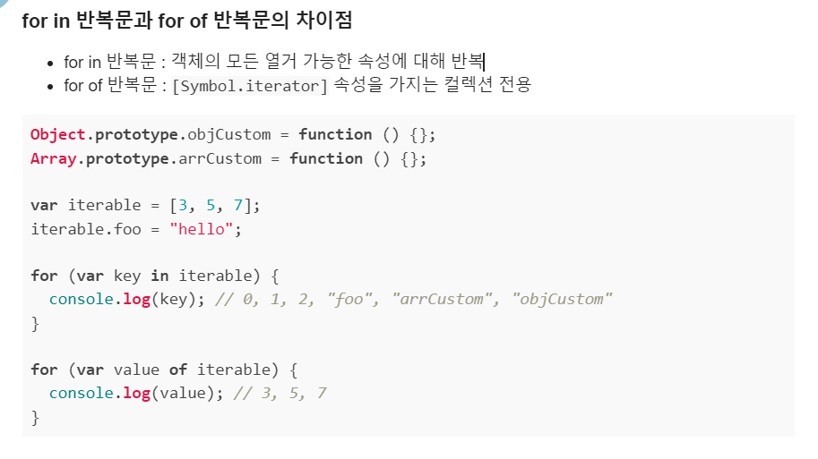

# 🍳 이벤트 🍳
#### Week4 인터렉티브 자바스크립트 / Topic 1 인터렉티브 자바스크립트 / 3. 이벤트

>목차 
>>[1. 이벤트 핸들러 등록하기](#1-이벤트-핸들러-등록하기)<br>
[2. 이벤트 종류](#2-이벤트-종류)<br>
[3. 이벤트 객체](#3-이벤트-객체)<br>
[4. 이벤트 버블링](#4-이벤트-버블링)<br>
[5. 캡쳐링](#5-캡쳐링)<br>
[6. 이벤트 위임](#6-이벤트-위임)<br>
[7. 브라우저 기본 동작](#7-브라우저-기본-동작)<br>

<br><br>


## 0. 코드 실습
```html
<!DOCTYPE html>
<html lang="ko">
<head>
  <meta charset="UTF-8">
  <title>오늘 할 일</title>
  <link rel="stylesheet" href="style.css">
</head>
<body>
  <div class="main">
    <h2 class="title">오늘 할 일</h2>
    <ul id="to-do-list" class="to-do-list">
      <li>자바스크립트 공부하기</li>
      <li>고양이 화장실 청소하기</li>
      <li>고양이 장난감 쇼핑하기</li>
    </ul>
  </div>
  <script src="index.js"></script>
</body>
</html>
```
```js
const toDoList = document.querySelector('#to-do-list');
const items = toDoList.children;

function updateToDo(event) {
    event.target.classList.toggle('done');
}

for (let item of items){
    item.addEventListener('click', updateToDo);
}
```


<br>

## 1. 이벤트 핸들러 등록하기
1. DOM 태그에 접근해서 onclick 프로퍼티 활용하기.

2. html 태그에 onclick 속성 활용하기. 근데 이렇게 태그에 직접 접근하는 건 잘 사용 안함. 아예 함수 덮어쓰기 때문에 함수 여러 개 등록하기 힘들어서.

3. addEventListner 메소드 사용하기
```js
element.addEventListener(이벤트종류, 이벤트핸들러);

btn.addEventListener('click', event1);
btn.addEventListener('click', event2);

// 삭제도 할 수 있다.
// 반드시 등록했던 핸들러 이름으로 인자2를 전해줘야 함!! event에 익명 함수로 선언하면 삭제하기 힘들어지니 외부로 함수 만들어서 빼주고 이름으로 등록하고 삭제하자.
btn.removeEventListener('click', event2);
```
<br>

## 2. 이벤트 종류
* mousedown: 마우스 버튼 누르는 순간
* mouseup: 마우스 버튼 눌렀다가 떼는 순간
* click: 왼쪽 버튼 클릭한 순간
* dbclick: 왼쪽 버튼 빠르게 2번 클릭한 순간
* contextmenu: 오른쪽 버튼을 클릭한 순간
* mousemove: 마우스 움직이는 순간
* mouseover: 마우스 포인터가 요소 위로 올라온 순간
* mouseout: 마우스 포인터가 요소 밖으로 벗어나는 순간
* mouseenter: 마우스 포인터가 위로 올라온 순간 버블링이 일어나지 않으며
* mouserleave 마우스 포인터가 요소를 벗어나는 순간 버블링이 일어나지 않으며.

* keydown: 키보드 버튼을 누르는 순간
* keypress: 키보드 버튼 누르는 순간(단, a, 5 등 출력키에서만 동작하고 shift esc 키는 안됨.)
* keyup: 키보드 버튼을 눌렀다 떼는 순간

* focusin: 요소에 포커스 되는 순간
* focusout: 요소로부터 포커스 빠져나가는 순간
* focus: 요소에 포커스 되는 순간 버블링이 일어나지 않으며
* blur: 요소로부터 포커스 빠져나가는 순간 버블링이 일어나지 않으며

* change: 입력된 값이 바뀌는 순간
* input: 값이 입력되는 순간
* select: 입력 양식 중 하나가 선택되는 순간
* submit: 폼이 전송되는 순간

* scroll: 스크롤바가 움직일 때

* resize: 윈도우 사이즈가 바뀔 때


<br>

## 3. 이벤트 객체
이벤트를 다룰 때엔 여러 이벤트 정보가 필요하다.

어디를 클릭했는지, 마우스 포인터 위치가 어디인지, 어떤 키를 눌렀는지 등.

**이벤트가 발생하면, 이렇게 이벤트와 관련된 다양한 정보를 담은 이벤트 객체가 자동으로 생성된다!!**

addEventListener 첫 인자로 이 이벤트 객체를 전달하는 것. 앞에서 본 'click' 이 이벤트 객체 중 하나다!
```js
const myBtn = document.querySelector('myBtn');

// 이벤트 핸들러 함수에 전달되는 1번 인자는 무조건 이벤트 객체이다!
function printEvent(event){
    console.log(event);
}

//
myBtn.addEventListener('click', printEvent);
```
각 이벤트 객체에는 많은 프로퍼티가 있는데, 주로 쓰이는 건 type과 target이다.
* type은 발생한 이벤트의 타입을 담고 있다. 클릭 이벤트가 발생했다면 "click" 이 출력됨.
* target은 이벤트가 발생한 요소를 담고 있다. (버튼에 발생했으면 버튼이 target) 즉, target에는 dom 요소가 담겨있다! 

* 주의할 점!! event는 대소문자를 구분하기에 'Click' 이라 쓰면 인식이 안되고 'click'이라고 정확히 쓰자.

* 주의하자!!  for in 말고 for of 문으로 객체에게 반복적으로 함수 부여하기.



**따라서!!**

웹 페이지에서 이벤트가 발생하면 -> 관련 정보를 담은 이벤트 객체가 자동으로 만들어지고 -> 그 이벤트 객체는 이벤트핸들러의 첫번째 파라미터로 전달된다!!

#### 이벤트 객체 프로퍼티
* 공통 프로퍼티
    * type: 이벤트 이름. click, keydown 등
    * target: 이벤트 발생한 요소. 버튼, input 등.
    * currentTarget: 이벤트 핸들러가 등록된 요소.
    * timeStamp: 이벤트 발생 시각
    * bubbles: 버블링 단계인지 아닌지 판단하는 값.

* 마우스 이벤트의 프로퍼티
    * button: 누른 마우스의 버튼 (왼쪽, 가운데 휠, 오른쪽)
    * clientX, clientY: 마우스 커서의 브라우저 내 위치
    * pageX, pageY: 마우스 커서의 문서 영역 내 위치
    * offsetX, offsetY: 마우스 커서 이벤트 발생 요소와 커서간의 위치
    * screenX, screenY: 모니터 화면에서 커서 위치
    * altKey: alt 키를 눌렀는지
    * ctrlKey: ctrl 키를 눌렀는지
    * shiftKey: shift 키를 눌렀는지
    * metaKey: meta 키를 눌렀는지(윈도우에선 윈도우키 그거)

* 키보드 이벤트의 프로퍼티
    * key: 누른 키 값
    * code: 누른 키의 물리적 위치
    * altKey: alt 키 눌렀는지
    * ctrlKey: ctrl 키 눌렀는지
    * shiftKey: shift 키 눌렀는지
    * metaKey: meta 키 눌렀는지


<br>

## 4. 이벤트 버블링
이벤트가 역 상속된다!!

자식요소에 click 이벤트가 발생하면, 부모 요소 중 click 이벤트 핸들러를 가진 놈들도 모두 동작해버린다. 윈도우 객체를 만날 때까지 이 과정이 반복되어, 결국 여러 상위 요소들까지 같이 불러버리는 것이다. 

**그렇지만 이렇게 부모, 부모의 부모... 이벤트 핸들러가 호출이 된다 해도, 각 이벤트 객체의 target 속성에는 무조건 최초 발생자 자식 요소의 값이 들어있다!!** 

덕분에 target 속성으로 이벤트 발생한 위치를 지정하는 것.

만약 직접 target 말고 그 위 부모까지 다 호출된 애들도 부르고 싶다면 currentTarget 속성을 부여하면 된다. 

만약 target에만 핸들러를 주고, 나머지는 무시하고 버블링을 멈추려면? event.stopPropagation(); 함수를 쓰자. 그치만 웬만하면 쓰지 말자.
```js
item.addEventListener('click', function(e){
  console.log(e);
  e.stopPropagation();
});
```
이벤트 버블링을 막으면 부모 요소는 그 자식 구간을 없는 취급해서 나중에 문제 생길 수도 있다.

<br>

## 5. 캡쳐링
버블링과 반대로 이벤트가 상속된다!!

근데 자주 쓰이진 않는다.

DOM 이벤트 흐름에는 3가지 단계가 있다.
1. 캡쳐링 단계: 이벤트가 하위로 전파됨
2. 타겟 단계: 이벤트가 실제 타겟 요소에 전달됨.
3. 버블링 단계: 이벤트가 상위 요소로 전파됨.

여기서 이벤트가 발생하면 맨 처음 window 객체에서부터 target 까지 전파가 일어나고, 타겟에 도달하면 타겟의 이벤트 핸들러가 동작하고, 이후 다시 window 객체로 이벤트가 전파되는 과정을 거친다!!

보통 캡쳐링 거의 활용하진 않지만 만약 쓰려면
```js
// addEventListener 의 3번째 인자에 true 값을 주자.
element.addEventListener('click', functionname, true);
```


<br>

## 6. 이벤트 위임
부모 요소 하나에 이벤트를 주면 그 자식에도 이벤트가 발생하게 하는 것을 이벤트 위임이라 한다.

to do list를 만들었는데, 거기에 할 일을 추가한다면?
1. for of 문으로 각 list에 toggle 함수를 주었다면, 이 후에 추가된 할 일에는 함수가 부여되지 않는다.
2. 그래서 부모 요소에게 이벤트를 주고, 자식에게 이벤트를 위임하게 하는 것이다. 이벤트 버블링을 활용한 것!!

```js
const list = document.querySelector('#list');

// 이렇게 하면 이후 일기쓰기 태그에는 함수 추가 안됨.
for (let item of list.children){
  item.addEventListener('click', function... );
}

// 이렇게 해야 한다!!
list.addEventListener('click', function(e){
  e.target.classList.toggle('done');
});

const li = document.createElement('li');
li.classList.add('item');
li.textContent = "일기 쓰기";
list.append(li);
```
근데 위처럼 부모 자체에 이벤트를 주면, 내가 원하는 곳이 아닌 다른 곳 부모 범위 내 어딜 선택하든 해당 이벤트가 일어나버린다.

따라서 내가 원하는 조건을 꼭!! 달아주자.
```js
list.addEventListener('click', function(){
  if(e.target.classList.contains('item')){
    e.target.classList.toggle('done');
  }
});
```

이런 이벤트 위임 방식은 이벤트에 대한 제어를 이 자식 요소에 신경쓰지 않아도 되기 때문에 코드를 훨씬 유연하게 짤 수 있다. 


<br>

## 7. 브라우저 기본 동작

브라우저가 기본적으로 동작하는 것들이 있다. a 태그를 누르면 우리가 자동으로 다른 링크로 간다든가, 글자를 드래그했을 때 하늘색으로 감싸진다든가, 마우스 오른쪽 클릭을 하면 속성탭이 뜨는 등.

그런데 이걸 우리가 막을 수도 있다.

예를 들어 우리가 마우스 오른쪽 클릭을 막아버리면 클릭해도 속성탭이 안 뜬다!!

event 객체의 preventDefault 메소드를 활용하자.

```js
const link = document.querySelector('#link');

link.addEventListener('click', function(e){
  e.preventDefault();
  alert("지금은 이동할 수 없습니다.");
});
```
```js
const checkbox = document.querySelector('#checkbox');
const input = document.querySelecotr('#input');
input.addEventListener('keydown', function(e){
  if (!checkbox.checked){
    e.preventDefault();
    alert("체크박스를 먼저 체크해주세요.");
  }
});
```

```js
// 브라우저 위 다른 곳은 다 되는데 text 요소 위에서만 마우스 불가능. 
text.addEventListener('contextmenu', function(e){
  e.preventDefault();
  alert("마우스 오른쪽 클릭은 쓸 수 없습니다.");
});

// 브라우저 전체에 마우스 우클릭 방지
document.addEventListener('contextmenu', function(e){
  e.preventDefault();
  alert("마우스 오른쪽 클릭은 쓸 수 없습니다.");
});
```
브라우저 기본 동작을 막으면 이상한 부분에서 작동 안할 수도 있으니, 잘 생각하고 넣자. 

<br>

