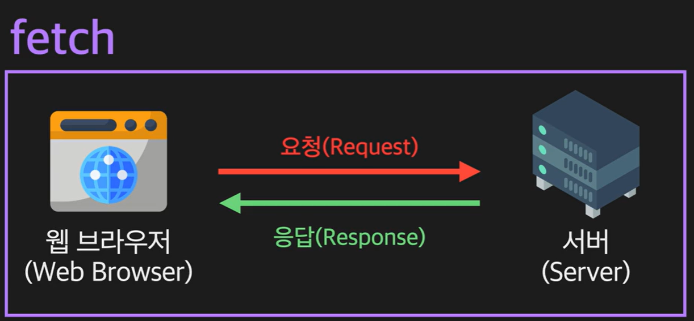
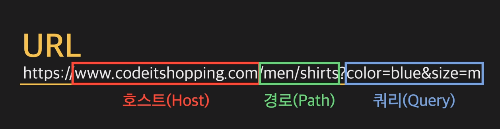

# 🧀 웹 🧀

#### Week5 모던 자바스크립트 / Topic 2 JS와 웹 / 1. 웹

> 목차
>
> > 1. fetch 함수
> > 2. response 객체
> > 3. 개발자 도구 꿀팁
> > 4. 웹이란?
> > 5. url 이란?
> > 6. http란?

<br><br>

## 1. fetch 함수

웹 브라우저와 서버가 통신하려면 어떻게 해야 할까?

직접 js 코드를 작성하고 웹 브라우저에서 실행해서 서버에 요청을 보내보자!!

아래 코드는 구글 서버에 요청을 보내고 그 응답을 받아서 콘솔 창에 출력하는 코드이다.

코드를 console 창에서 실행하면, www.google.com 홈페이지를 이루는 html과 js css 코드를 받아온다. 즉, 서버는 우리에게 코드를 보내고 웹브라우저 소프트웨어는 이걸 받아서 해석한다음 화면 상에 이쁜 페이지 형태로 출력한다는 것이다.

```js
fetch("https://www.google.com")
  .then((myresponse) => myresponse.text())
  .then((result) => {
    console.log(result);
  });
```

**우리가 서버에게 보내는 요청을 request, 서버가 우리에게 보내는 응답을 response라고 한다.**

위에서 쓴 fetch 함수는 서버로 리퀘를 보내고 리스폰스를 받는 함수이다. fetch 함수는 인자로 url을 받고, 인자로 받은 url로 리퀘스트를 보낸다!

그 후 then ... 이라는 코드에서 받아온 리스폰스를 처리한다. **return myressponse.text() ... 은 바로 실행되는 코드가 아니라 서버의 리스폰스가 온 후에야 실행되는 함수이다! 이렇게 특정 조건이 만족돼야 실행되는 함수를 콜백 함수라 한다.** 그리고 then 키워드는 이 콜백을 등록해주는 메소드이다. 서버가 보낸 response는 하나의 객체가 되어 myresponse 라는 파라미터로 넘어온다. 그다음 then은 앞서 실행된 콜백 함수의 return 값을 파라미터로 받아온다. 즉, result 인자에는 myresponse.text() 값이 들어간다는 것.

즉!!

```js
fetch(url) // 이 부분은 리퀘 보내는 함수
    .then(
        // then 내부 인자 함수는 콜백 함수
        (myresponse) => {return myresponse.text()};
    )
    // then 함수는 인자로 받은 함수를 콜백 등록해주는 함수. (response 오면 실행하라는 조건 등록!)
```

정리하자면!!

1. fetch함수가 리퀘스트를 보내 응답을 받아오는데
2. 받아온 응답은 객체 형태이다. (response 객체)
3. 받은 객체를 fetch 함수가 객체 형태로 가공해서 리턴하는데 이걸 promise 객체라 한다.
4. 그리고 promise 객체의 then 메소드 안에 프로미스 객체를 활용하는 콜백 함수를 작성한다.


<br>

## 2. 웹이란?

www 웹이란 world wide web 의 줄임말로, 전세계 연결망을 뜻한다. 이 웹페이지 않에 적혀있는 텍스트를 하이퍼 텍스트라 한다.

- 하이퍼 텍스트: 다른 텍스트에 대한 참조를 가지고 있는 텍스트. html은 이 하이퍼텍스트를 마크업하는 언어이다!

<br>

## 3. url 이란?

url이란 uniform resource locator의 줄임말로, 웹 상의 수많은 데이터 중 특정 데이터를 나타내는 문자열이다.

```
https://www.codeitshopping.com/men/shirts?color=blue&size=m
```

이런 url이 있다고 하자.

0. https는 뒤에서 배울 것.
1. www.codeitshopping.com 이 부분을 host 라고 한다. 호스트는 특정 서버를 나타내는 부분이다. 전 세계 수많은 서버 중 이 도메인 주소에 해당하는 하나의 특정 서버를 가리킨다.
2. men/shirts 이 부분은 경로 path 이다. 패스는 서버 내 데이터를 나타내기 위해 사용하는 부분이다. 이 패스가 원하는 데이터를 특정하기 위한 핵심 부분이다. 데이터를 패스로 나타내는 방법은 서버마다 다르게 설계 되어있는데, 여기서는 예시로 남성용 중 셔츠를 가리키게 한다.
3. ? 물음표 뒷부분을 쿼리 query라고 한다. url에 붙어있기도 하고 없을 때도 있다. 원하는 데이터 중 세부적인 조건이 있을 때 붙인다. 속성(color) 에 할당연산자로 속성 값(blue)를 넣어주고, 각 속성들을 &로 연결해준다. 쿼리도 서버마다 규칙이 다르다!
   

우리가 브라우저의 주소 창에 url을 입력하고 엔터를 치면...

1. 먼저 웹 브라우저는 url에서 호스트를 보고 서버를 찾는다. 이 때 이 호스트에 적힌 것을 도메인 이름이라 하는데, ip 주소같이 어려운 이름 말고 외우기 쉬운 문자열로 나타낸 것이 바로 도메인 네임이다. 이 안에서도 domain name resolution 작업을 수행해서 서버를 찾아야 함.
2. 서버를 찾은 후 브라우저는 해당 서버로 url에서 path와 쿼리 부분을 담은 request를 보낸다.
3. 서버가 request를 받고 해당 데이터를 찾아 그 결과를 response에 담아 보낸다.
4. response를 받은 브라우저가 사용자에게 해당 내용을 보여준다.

<br>

## 4. http란?

https는 url에선 스킴 scheme이라 하는 부분이다. 이 부분에는 프로토콜의 이름이 들어간다.

- 프로토콜: 통신하는 두 대상이 지켜야 할 통신 규약. 즉 https는 웹 브라우저와 서버가 서로 통신할 때 지킬 통신 규약임.

http는 hyper text transfer protocol의 줄임말로, 하이퍼텍스트와 이미지 영상 등를 주고받을 때 쓰는 프로토콜이다.

https는 http + secure로, 보안을 더한 프로토콜.

<br>

### 하나 더 기억할 것!!

우리가 url을 한 번 엔터치고 접속하면, request-response가 한 번만 일어나는 게 아니라 여러 번 발생한다.

html 문서를 받아오고, 그 내부 img src나 js src, css src 등을 받기 위해 따로 그 src에 대한 request를 보내기 때문이다!!

<br>
