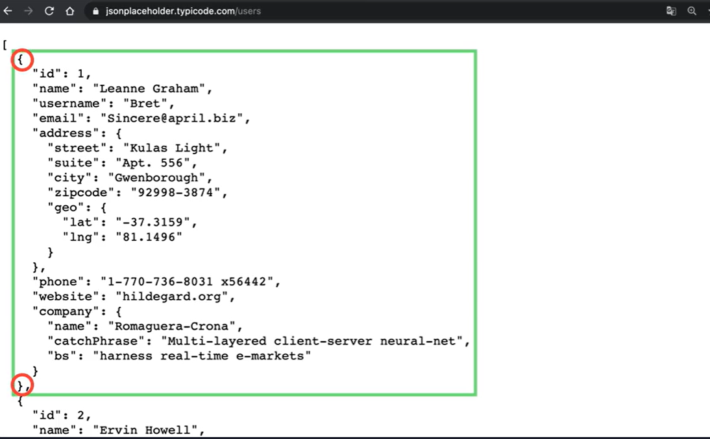
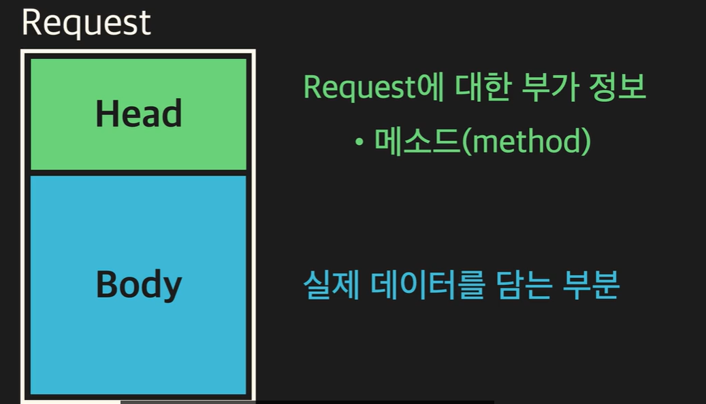
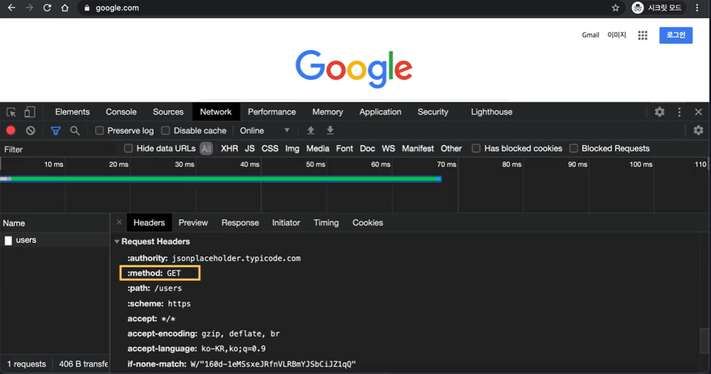
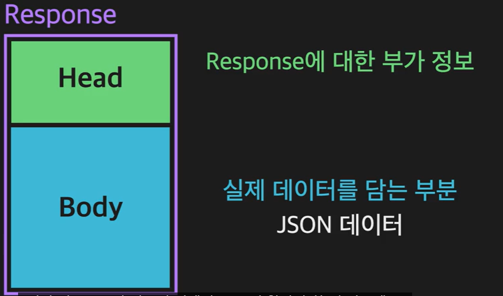
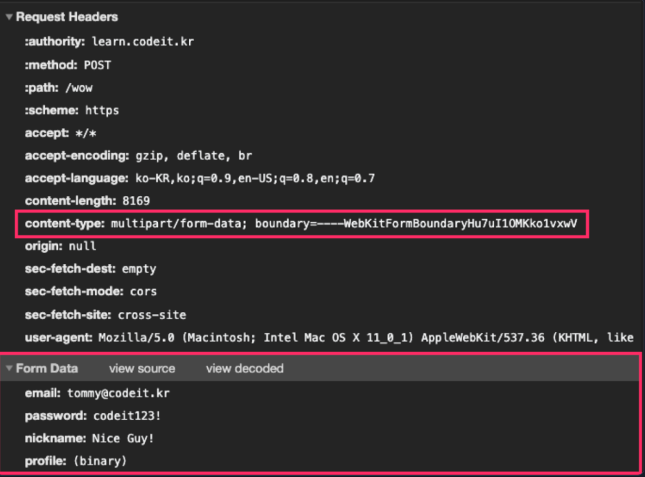
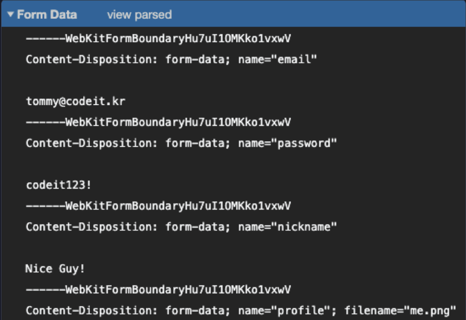

# 🥖 웹 api 🥖

#### Week5 모던 자바스크립트 / Topic 2 JS와 웹 / 2. 웹 api

> 목차
>
> > 1. json
> > 2. json 데이터를 객체로 변환하기
> > 3. 메소드의 의미
> > 4. 앞으로 사용할 url들
> > 5. request의 head와 body
> > 6. post request 보내기
> > 7. put request, delete request 보내기
> > 8. rest api
> > 9. status code
> > 10. content-type
> > 11. 그 밖의 알아야 할 내용들

<br><br>

## 1. json

서버가 보내주는 리스폰스의 종류에 대해 배워보자!

```js
// html이나 자바 스크립트가 담긴 리스폰스
fetch("https://www.google.com")
  .then((response) => {
    return response.text();
  })
  .then((result) => {
    console.log(result);
  });
```

```js
// json 포맷의 데이터가 담긴 리스폰스
fetch("https://www.jsonplaceholder.typicode.com/users")
  .then((response) => {
    return response.text();
  })
  .then((result) => {
    console.log(result);
  });
```

**json이란**

javascript ovject notation의 줄임말로, js 언어 문법을 빌려 만들어진 데이터 포맷이다. 그래서 겉보기엔 js와 상당히 유사함!!

아래 사진을 보면 중괄호 안에 프로퍼티와 그 값들이 들어있는 객체 형태 데이터가 있고, 그 객체들을 대괄호로 묶어 배열처럼 표현했다.


그렇지만 json과 js가 완전히 동일하진 않다.

### json과 js의 차이

1. json에는 프로퍼티 이름과 값을 표현하는 방식에 제한이 있다.

- 프로퍼티 네임을 반드시 큰따옴표로 감싸주자!!
- 프로퍼티 값이 문자열인 경우에도 반드시 큰따옴표를 쓰자!!
- json에서는 undefined, NaN, infinity 등의 값을 쓸 수 없다!!
- 주석을 추가할 수 없다!! json은 코드가 아니라 데이터 포맷이기 때문!!

```json
{
  "name": "Michael Kim",
  "height": 180,
  "weight": 70,
  "hobbies": ["Basketball", "Listening to music"]
}
```

<br>

### json 데이터를 객체로 변환하기

json 데이터를 받아오면, 그 데이터는 기본적으로 string 형이다. 따라서 json 데이터를 받아서 바로 객체로 변환해주는 과정을 거쳐야 한다.

```js
// 그냥 json 데이터를 받아오면...
fetch("https://www.jsonplaceholder.typicode.com/users")
  .then((response) => {
    return response.text();
  })
  .then((result) => {
    console.log(typeof result); // string이라 출력됨.
  });
```

여기서 JSON 은 json 데이터를 다루기 위해 사용되는 js의 기본 객체이다. JSON 객체의 parse 메소드를 활용하면 데이터를 객체로 변환할 수 있다.

```js
// json 데이터를 객체로 변환하면!
fetch("https://www.jsonplaceholder.typicode.com/users")
  .then((response) => {
    return response.text();
  });
  .then((result) => {
    // 객체로 변환 (배열로 반환됨.)
    const users = JSON.parse(result);

    // 실제로 객체를 활용하기.
    console.log(users.length);
    users.forEach((user)=>{
        console.log(user.name);
    });
  });
```

<br>

## 2. 메소드의 의미

우리는 보통 어떤 데이터를 조회하기 위해 request를 보냈다면, 서버에 데이터를 새로 추가해달라고 하는 request도 있다! 이렇게 request는 서버의 데이터에 관해 어떤 처리를 요구하냐에 따라 크게 4가지로 나뉜다.

1. 데이터 조회
2. 데이터 추가
3. 데이터 수정
4. 데이터 삭제

그래서 우리는 1~4 중 어떤 처리를 해달라고 요청하는지, request에 적어둔다. 그게 바로 메소드이다!!

request에 적힌 메소드에 따라 데이터를 조회할지, 추가할지, 수정할지, 삭제할지 서버가 알아내는 것이다.

**작업 / 메소드 / 서버가 진행하는 데이터 처리**

1. 데이터 조회 -> GET -> READ
2. 데이터 추가 -> POST -> CREATE
3. 데이터 수정 -> PUT -> UPDATE
4. 데이터 삭제 -> DELETE -> DELETE

이걸 CRUD 라고 줄여서 말한다.

예를 들어 데이터를 조회할 땐 GET request를 보내고, 데이터를 삭제할 땐 DELETE request를 보낸다.

<br>

## 3. request의 head와 body

reqeust 하나는 head와 body로 이루어졌다.

- head: request에 대한 부가 정보 + 메소드
- body: 실제 데이터를 담는 부분.
  

때문에 head에 get, delete 메소드가 담기면 보통 body가 없다.

#### request의 head

- 개발자 도구의 network 탭으로 가서 request와 reponse를 직접 볼 수 있다.
- method: 메소드 정보가 담김.
- path: url에서 path 부분의 정보.
- user-agent: 리퀘스트를 보낸 브라우저와 운영체제 정보.
  

참고로 http 프로토콜 버전에 따라 request의 head 표현이 살짝 다를 수 있다.

예를 들어 http/1.1 버전에선 start-line 이라는 형식을 쓰고, http/2에서는 start-line 말고 가상 헤더(pseudo header) 표현을 쓴다.

#### request의 body

- network 탭에서 request payload 라고 적힌 부분이 body 이다. request가 post나 put 일 경우 body가 보인다!

<br>

### 예시

학습용 https://learn.codeit.kr/api/members 를 가지고 예시를 연습하자.

- 예를 들어 특정 직원 정보를 조회하기, 특정 직원 정보를 수정하기, 특정 직원 정보를 삭제하기 같은 GET PUT DELETE 연산에서는 https://learn.codeit.kr/api/members/3 는 직원 3번의 정보를 특정하듯 url 끝에 고유 식별자(id 값)을 붙여야 한다.
- 만약 전체 직원 정보 조회하기, 새 직원 정보 추가하기인 GET, POST 는 id 없이 그냥 https://learn.codeit.kr/api/members 에서 작업하면 된다.

<br>

## 4. 메소드를 사용해 request 보내기

1. GET request

```js
// 전체 직원 정보 보기
fetch("https://learn.codeit.kr/api/members")
  .then((response) => {
    return response.text();
  })
  .then((result) => {
    console.log(result);
  });

// 3번 직원 정보 보기
fetch("https://learn.codeit.kr/api/members/3")
  .then((response) => {
    return response.text();
  })
  .then((result) => {
    console.log(result);
  });
```

2. POST request

- post는 body에 넣을 정보가 필요하다.
- 정보를 담은 옵션 객체를 fetch 함수 두 번째 인자로 주자.
- 옵션 객체 내부에는 methd와 body 속성이 있다.
- body 속성에선 꼭 JSON.stringify() 함수를 써주자!

```js
// 새 직원 정보
const newMember = {
  name: "Jerry",
  email: "herry@codeitmail.kr",
  department: "engineering",
};

// fetch 함수 두 번째 인자로 새 직원 정보를 담은 옵션 객체를 준다.
// fetch는 2번째 인자가 없으면 자동으로 get request를 보내게 되어있다!!
fetch("https://learn.codeit.kr/api/members", {
  method: "POST",
  body: JSON.stringify(newMember),
})
  .then((response) => {
    return response.text();
  })
  .then((result) => {
    console.log(result);
  });
```

3. PUT request

- 만약 정보를 수정하려면, 해당 멤버의 url로 fetch하여

```js
// 멤버 id 2의 department만 수정해보자.
const member = {
  name: "Alice",
  email: "alice@codeitmail.kr",
  department: "marketing", // 이놈만 값 수정. 나머지는 다 그대로 쓰자.
};

fetch("https://learn.codeit.kr/api/members/2", {
  method: "PUT",
  body: JSON.stringify(member),
})
  .then((response) => {
    return response.text();
  })
  .then((result) => {
    console.log(result);
  });
```

4. DELETE request

- 삭제하려면 삭제할 직원을 특정해야 하므로 해당 멤버의 고유 아이디로 url을 작성한다.

```js
// 삭제 메소드에는 body가 필요 없다.
fetch("https://learn.codeit.kr/api/members/2", {
  method: "DELETE",
})
  .then((response) => {
    return response.text();
  })
  .then((result) => {
    console.log(result);
  });
```

<br>

## 5. rest api

우리가 request를 보낼 때 어떤 response를 받을지는 사실 개발자들이 미리 정해두었다.

개발자들이, '프론트엔드에서 이 url로 이런 리퀘스트를 보내면 백엔드에서 이런 처리를 하고 이런 리스폰스를 보내주는 걸로 정합시다', 라고 논의한 후에 서비스 개발을 시작하기 때문이다!! 이렇게 프론트와 서버 간의 통신 내용 설계를 Web API 설계라고 한다.

### web api 설계

- api는 application programming interface의 약자로, 웹개발에서는 어떤 url에서 어떤 리퀘스트를 보냈을 때 무슨 처리를 하고 어떤 response를 보내줄지 미리 정해둔 규격이다. 즉, 프론터와 서버 간의 주고받는 메세지(request, response) 규칙.
- web api를 설계한다는 것은 서비스에서 사용될 모든 url에 대해 각 url의 예상 request와 그 request에 대한 reponse를 뭘 보낼지 내용을 정리한다는 것이다.

회사마다 이 api는 각기 다르게 설정하지만, 보통 rest api라는 기준을 준수하는 게 암묵적인 룰이다.

### rest api

- 개발자들이 web api를 설계할 때 준수하는 가이드라인이다.
- rest architecture이란 웹이 갖추어야 할 이상적인 아키텍쳐 구조를 말한다. 여기서 rest는 representational state transfer의 줄임말이다.
- rest란 상태 이전이 표현적으로 드러난다는 것. 우리가 웹 서핑을 하면 웹페이지를 옮겨다니는데, 하나의 브라우저 소프트웨어에서 페이지를 옮겨다닐 때마다 웹 상태가 매번 새롭게 표현되니 이런 표현을 쓰는 것이다.

- rest architecture이 되기 위해 6가지 기준을 충족해야 한다.
  - client server: 클라이언트와 서버를 분리해야 한다.
  - stateless: 각 리퀘스트는 독립적이기 때문에, 하나의 리퀘스트에는 항상 필요한 모든 정보가 담겨야 한다.
  - cache: 캐시를 사용해 네트워크 비용을 절감해야 한다. server가 리스폰스에 이 리스폰스를 재활용해도 되는지 여부를 담아 client에게 보내준다.
  - uniform interface: 클라이언트가 서버와 통신할 때의 인터페이스는 4가지 조건을 만족해야 한다.
    - identification of resource: 리소스는 웹 상에 존재하는 데이터를 나타내는데, 이 리소스를 uri(uniform resource identifier)로 식별할 수 있어야 한다. uri는 url의 상위 개념이긴 한데 일단은 url이라 생각해도 된다!
    - manipulation of resources through representation: 클라이언트와 서버 둘 다 리소스를 직접적으로 다루는 게 아니라 리소스의 표현(representation)을 다뤄야 한다. 한 리소스를 요청하면 그 리소스를 표현한 html 파일이나 png 파일을 받게끔 해야 한다!
    - self-descriptive messages: 각 리퀘스트는 stateless 속성 때문에, 모든 정보가 다 담겨있어야 한다. 즉, 리퀘스트와 리스폰스 모두 그 자체의 정보만으로 모든 걸 해석할 수 있어야 한다.
    - hypermedia as the engine of application state: 웹을 분산 하이퍼미디어 시스템 distributed hypermedia system이라고도 하는데, 이는 텍스트, 이미지, 소리 영상 등 모든 미디어가 하이퍼텍스트처럼 서로 연결됐다는 뜻이다! 즉, 웹은 수많은 컴퓨터에 분산된 형태라는 것. 웹을 하나의 프로그램이라 하면, 서버의 리스폰스에는 현재 상태에서 다른 상태로 이전할 수 있는 링크를 포함하고 있어야 한다. 즉, reponse에는 리소스의 표현과 meta 뿐만 아니라 새로운 상태로 넘어갈 수 있는 링크들도 포함되어야 한다.
  - layered system: 클라이언트와 서버 사이에는 프록시나 게이트웨이 같은 중간 매개 요소를 두고, 보안, 로드 밸런싱 등을 수행할 수 있어야 한다. 이런 중간 매개 요소로 인해 클라이언트와 서버 사이에는 계층형 층 hierarchical layers 가 형성된다.
  - code on demand: ㅡㄹ라이언트가 받아서 바로 실행할 수 있는 applet이나 script 파일을 서버로부터 받을 수 있어야 한다. (이 조건은 옵셔널이라 꼭 만족하지 않아도 됨!!)

**rest api는 바로 위의 rest architecture에 부합하는 api를 의미한다.**

참고로 이런 rest api를 사용하는 웹 서비스를 restful 서비스라고 한다!!

그렇다면 어떻게 web api를 설계해야 rest api가 될 수 있을까?

가장 중요한 규칙인 조건 4-1, identification of resource가 매우 중요하다.

1.  url은 리소스를 나타내기 위해서만 사용하고, 리소스에 대한 처리는 메소드로 표현해야 한다. 즉, url에서 리소스에 대한 처리를 드러내면 안된다.

    - 예를 들어 새 직원 정보를 추가하기 위해 멤버의 고유 페이지로 가서 post 메소드로 설정한 request를 보내면 된다.
    - 만약 members/add url로 이동해 새 직원 정보를 리퀘스트로 보낸다면, add라는 리소스 처리가 url에 나타났으니 안된다!!

2.  document는 단순 명사, collection은 복수 명사로 표시한다.
    - 하나의 객체로 표현할 수 있는 리소스를 도큐먼트
    - 여러 도큐먼트를 담을 수 있는 리소스를 컬렉션 이라고 한다.
    - 비유하자면 도큐먼트는 파일, 컬렉션은 디렉토리!
    - 만약 멤버 전체의 정보를 조회하려면 url은 .../members 이렇게 복수형이어야 한다.

하나 주의할 점은, 우리가 POST 메소드를 쓸 때 특정 직원의 페이지로 가서 하는 게 아니라 members/ 페이지, 즉 컬렉션 타입의 리소스를 대상으로 작업한다는 것이다! 왜냐면 컬렉션들 중에서 하나의 도큐먼트를 삽입하는 것이기 때문이다.

**따라서 url을 만들 때에 복수, 단수, 메소드 등을 잘 생각하며 짓자.**

<br>

## 6. status code

리스폰스도 리퀘스트와 비슷하게 head, body로 구성되었고 body엔 보통 json 데이터가 들어간다.


그런데 head 부분에는 상태코드, status code라는 게 들어간다.

- status code: 리퀘스트를 받은 서버가 작업을 하고, 그 결과를 나타내기 위해 리스폰스의 헤드에 넣는 숫자 코드.
  - 200 : 정상적으로 처리됐단 뜻.
  - 404: 해당 url에 해당하는 데이터를 찾을 수 없단 뜻.
  - 100번대: 서버가 클라이언트에게 정보성 응답을 줄 때 사용된다. 예를 들면 100 continue는 계속 리퀘스트를 받을 수 있다는 리스폰스.
  - 300번대: 리퀘스트가 아직 처리되지 않았고, 처리를 원하면 클라이언트 측의 추가 작업이 필요하단 뜻.
  - 400번대: 리퀘스트를 보내는 클라이언트 쪽에 문제가 있다.
  - 500번대: 서버 쪽에 문제가 있어 리퀘스트를 처리할 수 없다.

각 상태 코드에는 대응되는 상태 메세지가 있다. 예를 들어 404 는 not found라는 상태 메세지를 가지고 있다.

상태 메세지는 상태 코드 옆에 쓴다.

```js
// 상태 코드 출력.
fetch("https://www.naver.com").then((response) => {
  console.log(response.status);
});
```

<br>

## 7. content-type

리스폰스, 리퀘스트는 head와 body로 이루어지고

head 안에는 여러 header 데이터들이 들어있다.

그 중 content-type 헤더에 대해 알아보자!!

#### content-type 헤더

- 리퀘스트, 혹은 리스폰스의 body에 들어있는 데이터가 어떤 타입인지를 나타낸다.
- html, js 코드 혹은 json 데이터 등이 들어갈 수 있는데, 이것 말고도 텍스트나 이미지, 영상 등 정말 많은 데이터 타입이 들어갈 수 있다.
- content-type 헤더 값은 주 타입(main type) / 서브 타입(sub type) 형식으로 나타난다.

#### 예시

1. 주 타입이 text인 경우

- 일반 텍스트: text/plain
- css 코드: text/css
- html 코드: text/html
- js 코드: text/javascript

2. 주 타입이 image 인 경우

- bmp: image/bmp
- gif: image/gif
- png: image/png

3. 주 타입이 audio인 경우

- mp4: audio/mp4
- ogg: audio/ogg

4. 주 타입이 video인 경우

- mp4: video/mp4
- h264: video/H264

그 외 위에 속하지 않는 것들은 application이라는 주 타입에 속한다.

- json 파일: application/json
- 확인되지 않은 바이너리 파일: application/octet-stream

이렇게 content-type 헤더가 있으면 바디의 데이터를 직접 확인해 추론할 필요가 없다. 따라서 리퀘스트든 리스폰스든 바디에 데이터가 존재한다면 content-type 헤더 값을 적절히 설정해주는 게 좋다!

#### content type 설정하기

```js
const newMember = {
  name: "Jerry",
  email: "jerry@codeit.kr",
  department: "engineering",
};

fetch("https://learn.codeit.kr/api/members", {
  method: "POST",
  headers: {
    // 추가된 부분
    "Content-Type": "application/json",
  },
  body: JSON.stringify(newMember),
})
  .then((response) => response.text())
  .then((result) => {
    console.log(result);
  });
```

<br>

### 그 밖의 content type

1. json 말고 xml 이라는 데이터 형식도 있다!!

xml이란 extensible markup language, 태그를 사용해서 나타내는 데이터이다.

json 형식

```
{
   "name":"Michael Kim",
   "height":180,
   "weight":70,
   "hobbies":[
      "Basketball",
      "Listening to music"
   ]
}
```

xml 형식

```
<?xml version="1.0" encoding="UTF-8" ?>
<person>
    <name>Michael Kim</name>
    <height>180</height>
    <weight>70</weight>
    <hobbies>
        <value>Basketball</value>
        <value>Listening to music</value>
    </hobbies>
</person>
```

xml은 보통 스키마라는 별도의 문서와 함께 사용하며, 데이터에 대한 엄격한 유효성 검증에 특화된 데이터 형식이다. 그치만 json에 비해 용량이 크고 가독성이 떨어지고 배우기 어려워 요즘엔 json을 더 많이 쓰는 추세이다.

2. json, xml 말고 다른 데이터 타입이 있다.

- application/x-www-form-urlencoded 타입

html에서 form 태그를 사용하면 자바 스크립트 없이 오로지 html로만 리퀘스트를 보낼 수 있다. 물론 요즘엔 js로 리퀘스트를 보내는 방법이 많이 쓰이지만, form 태그로만 리퀘스트를 보내는 방식도 쓰이고는 있다. form 태그는 이 application/x-www-form-urlencoded 타입의 데이터를 바디에 담아서 보낸다!!

js 타입

```
{
  "id": 6,
  "name": "Jason",
  "age": 34,
  "department": "engineering"
}
```

form 태그로 보낼 때의 타입

```html
<form action="/upload" method="get" enctype="application/x-www-urlencoded">
  <div>
    <div><span class="label">email</span></div>
    <input class="input" type="text" id="email" name="email" />
  </div>
  <div>
    <div><span class="label">password</span></div>
    <input class="input" type="password" id="password" name="password" />
  </div>
  <div>
    <div><span class="label">nickname</span></div>
    <input class="input" type="text" id="nickname" name="nickname" />
  </div>
  <div>
    <input id="submit-btn" type="submit" value="Sign Up" />
  </div>
</form>
```

```
id=6&name=Jason&age=34&department=engineering
```

form 태그에 method 속성으로 get, enctype 속성으로 application/x-www-form-urlencoded 값을 주면 url의 쿼리 부분에 사용자가 입력한 데이터를 application/x-www-form-urlencoded 타입으로 넣는다.

참고로 입력 값에 한글을 넣거나 특수 기호를 넣을 때를 위해, input을 인코딩하여 url에 반영하기 위해 urlencoded 라고 이름을 붙인 것이다!!

초창기에는 form 태그만으로 리퀘스트를 보내는 코드가 너무 많이 작성되었기 때문에, 이 타입도 알아두자.

그리고 이 방법은 기술적인 측면에서 다른 content-type에 비해 주고받아야 하는 리퀘스트와 리스폰스 수가 적다는 장점이 있다...

- multipart/form-data 타입

이 타입은 매우 중요하다!!!

우리가 살펴본 값들은 하나의 데이터 타입을 나타내지만, multipart/form-data는 여러 종류의 데이터를 하나로 합친 데이터를 의미한다.

예를 들어 우리가 게시판에 글을 올릴 때 이미지나 영상, 텍스트가 혼합된 데이터를 올리는데 이 때 content type 값을 multipart/form-data로 설정하는 것이다.

이 타입도 form 태그만으로도 보낼 수 있고, js 코드만 써서도 리퀘스트의 바디에 담아 전송할 수 있다.

```html
<form action="/upload" method="post" enctype="multipart/form-data">
  <div>
    <input id="image" type="file" name="file" accept="image/*" />
    <div id="profile">
      <div id="plus">+</div>
    </div>
  </div>
</form>
```

```js
const formData = new FormData();
formData.append("email", email.value);
formData.append("password", password.value);
formData.append("nickname", nickname.value);
formData.append("profile", image.files[0], "me.png");

fetch("https://learn.codeit.kr/api/members", {
  method: "POST",
  body: formData,
})
  .then((response) => response.text())
  .then((result) => {
    console.log(result);
  });
```

1. form 태그 안에 enctype으로 multipart/form-data를 작성하고
2. js 코드에선 FormData 객체를 사용해 데이터를 묶어준다.

이렇게 리퀘스트를 보내면 다음과 같은 형식으로 보내진다.


그리고 body에 들어간 form data들은 아래 사진과 같다.


즉,

```
content-type: multipart/form-data; boundary=---------WebKitFormBoundaryHu7uI1OMKko1vxwV
```

으로 boundary를 지정해서 각 데이터를 나눠주고, 데이터의 name 속성에 이름을 붙여준다.

<br>

## 8. 그 밖에 알아야 할 것들

웹 개발에서 알아야 할 필수 지식 3가지.

1. Ajax

- 초창기 웹은 웹에서 다른 웹페이지로 넘어가기 위해 링크를 클릭하면 새 페이지가 로드되는 방식이다. 그런데 화면의 일부분만 바뀌어도 되는 경우엔 리소스 낭비가 있다. 그래서 등장한 Ajax 기술은, 웹 브라우저가 현재 페이지를 유지한 채 서버에 request를 보내고 response를 받아서 새로운 페이지를 로드하지 않고도 변화를 보여주는 기술이다.
- Ajax는 asynchronous javascript and xml의 줄임말로, js를 사용해 비동기적으로 리퀘스트를 보내고 리스폰스를 받는 기술의 집합을 의미한다.
- 비동기적이란, 사용자가 보고 있는 화면에 영향을 미치지 않고 백그라운드에서 별도로 작업을 처리한다는 뜻!
- js에서는 XMLHttpRequest 라는 객체를 통해 Ajax 통신을 할 수 있다.

```js
const xhr = new XMLHttpRequest();
xhr.open("GET", "https://learn.codeit.kr/api/members");
xhr.onload = function () {
  console.log(xhr.response);
};
xhr.onerror = function () {
  alert("Error!");
};
xhr.send();
```

- 근데 fetch 함수를 써서, 혹은 axios 패키지를 써서 ajax 통신을 할 수도 있다!

```html
<!-- 기존 새 웹페이지 로드하는 방식 -->
<a href="https://learn.codeit.kr/api/main">메인 화면으로 가기</a>
```

```js
// fetch 함수로 ajax 사용한 방식
// (위 예시를 단순화한 코드입니다)
function getLocationInfo(latitude, longitude) {
  fetch("https://map.google.com/location/info?lat=latitude&lng=longitude")
    .then((response) => response.text())
    .then((result) => {
      /* 사용자 화면에 해당 위치 관련 정보 띄워주기 */
    });
}
```

**사실 fetch 함수는 ajax 통신을 하는 함수라는 것!! fetch 함수를 잘 이용해서 ajax를 구현하는 것도 좋다!!**

2. GET POST PUT DELETE 이외의 메소드들이 있다.

(1) PATCH: 기존 데이터를 수정할 때 사용. PUT은 기존 데이터를 아예 새로운 데이터로 덮어쓴다면 PATCH는 기존 데이터의 일부만 수정한다.

(2) HEAD: GET 메소드와 비슷하지만, 대신 리스폰스를 받을 때 body를 제외하고 head만 받게 해준다. 만약 너무 용량이 큰 파일을 서버로부터 다운받고 싶을 때, 이 용량을 미리 알기 위해 head 메소드가 담긴 리퀘스트를 보낼 수 있다. 그럼 서버에서 준 리스폰스의 head를 보고, 용량의 길이(content-length) 등 정보가 담긴 헤더를 통해 파일의 정보를 미리 알 수도 있다.

3. http, https는 웹끼리 통신할 때 쓰는 프로토콜. 웹 통신 말고 다른 통신도 있다!

네트워크 관련된 이야기지만, 예를 들면 TCP UDP 등의 프로토콜.
