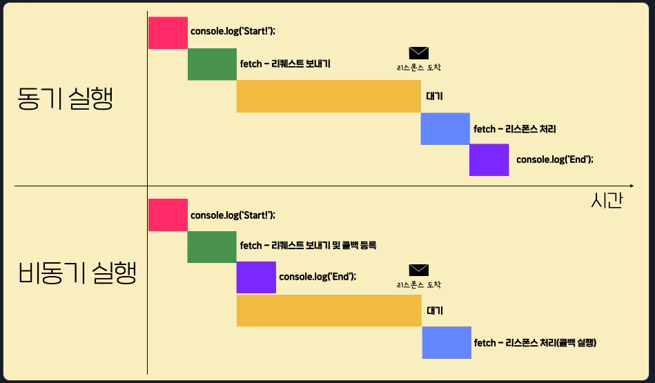

# 🍝 비동기 실행과 promise 객체 🍝

#### Week5 모던 자바스크립트 / Topic 2 JS와 웹 / 3. 비동기 실행과 promise 객체

> 목차
>
> > 1. fetch 함수와 비동기 실행
> > 2. 비동기 실행 함수
> > 3. promise 객체란?
> > 4. promise chaining이란
> > 5. rejected 상태의 콜백
> > 6. then 메소드 심화
> > 7. catch 메소드
> > 8. finally
> > 9. promise 객체
> > 10. promisify
> > 11. 이미 상태가 결정된 promise 객체
> > 12. 여러 promise 객체를 다루는 방법
> > 13. axios

<br><br>

## 1. fetch 함수와 비동기 실행

웹 통신은 비동기적으로 실행된다. 즉, 순차적으로 실행되는 게 아니라 console에서 작동하는 와중에 request와 response가 와리가리하는 것이다.

```js
// 1번 실행
console.log("start");

// 리스폰스 받아야 실행되므로 기다림... 그 와중에 밑에 console end가 먼저 실행되고, 그 이후 리스폰스 받아서 then 내부 콜백함수가 실행됨.
fetch("https://www.google.com")
  .then((response) => response.text())
  .then((result) => {
    console.log(result);
  });

// 2번 실행
console.log("end");
```

즉, then 키워드는 콜백 함수를 등록만 하고 정작 실행은 reponse가 와야 그 후에 실행된다.

**비동기 실행에서의 실행 순서...**

1. console.log('Start');
2. fetch 함수(리퀘스트 보내기 및 콜백 등록)
3. console.log('End');
4. 리스폰스가 오면 2. 에서 then 메소드로 등록해뒀던 콜백 실행

이런 것을 비동기 실행이라 하는 반면, 동기 실행은 한 번 시작한 작업을 다 처리하고 나서야 다음 코드로 넘어가는 방식이다.

**동기 실행에서의 실행 순서...**

1. console.log('Start');
2. fetch 함수(리퀘스트 보내기)
3. 리스폰스가 올 때까지 코드 실행이 잠시 '정지'되고,
4. 리스폰스가 오면 필요한 처리 수행
5. console.log('End');

비동기 실행은 일단 리퀘스트를 보내고 콜백 등록까지 하기 때문에 시간이 절약된다.



<br>

## 2. 비동기 실행 함수 종류

fetch 말고도 비동기적으로 실행되는 함수들이 있다.

1. setTimeout 함수

- 특정 함수의 실행을 원하는 시간만큼 뒤로 미룰 때 사용하는 함수.

```js
// 콜백 함수의 실행을 2초 미룬다.
// a c ... 2초 후 b 가 출력됨.
console.log("a");
setTimeout(() => {
  console.log("b");
}, 2000);
console.log("c");
```

2. setInterval 함수

- 특정 콜백을 일정 시간 간격으로 실행하도록 등록하는 함수.

```js
// a c, ... 2초후 b 2초후 b 2초후 b...
console.log("a");
setInterval(() => {
  console.log("b");
}, 2000);
console.log("c");
```

3. addEventListener 함수

- addEventListener 함수는 DOM 객체의 메소드이다.
- 사용자가 웹페이지에서 어떤 이벤트를 발생시킬 때 함수가 호출되게 하려면, 해당 DOM 객체의 onclick 속성에 함수를 설정하거나, 해당 DOM 객체의 addEventListener 메소드의 파라미터로 전달하면 된다.
- 파라미터로 전달된 콜백 함수가 바로 실행되는 게 아니라, 특정 조건(이벤트)가 만족할 때마다 실행되기 때문에 비동기적 함수이다!

```js
// onclick 속성에 함수 설정하는 법
btn.onclick = function (e) {
  console.log("Hello Codeit!");
};

btn.onclick = (e) => {
  console.log("Hello Codeit!");
};

// addEventListener 메소드 파라미터로 콜백함수 넘겨주는 법
btn.addEventListener("click", function (e) {
  console.log("Hello Codeit!");
});

btn.addEventListener("click", (e) => {
  console.log("Hello Codeit!");
});
```

4. fetch 함수?

- setTime(콜백함수, 시간), setInterval(콜백함수, 시간), addEventListener(이벤트, 콜백함수) 형식인 반면에 fetch 함수는 .then 메소드를 통해 콜백을 등록한다.
- 사실 fetch는 앞서 배운 저 함수들과는 다른 방식의 비동기 실행이기 때문에 문법이 다르게 생긴 것이다!!
- **fetch 함수는 promise 객체라는 것을 리턴하고, 이 promise 객체는 비동기 실행을 지원하는 또다른 문법에 해당하는데 이 속성 때문에 특이하게 생겼다.**

<br>

## 3. promise 객체란?

fetch 함수는 promise 객체를 리턴하는 비동기적 함수이다!!

```js
fetch("https://www.google.com").then(/*콜백함수*/);

// 위와 아래는 의미상 같은 맥락.

promise.then(/*콜백함수*/);
```

promise 객체가 뭘까?

- promise 객체는 어떤 작업에 대한 상태 정보를 갖고 있는 객체이다.
- fetch 함수가 성공하든, 인터넷이 끊겨서 등등의 문제로 실패하든, 하여간 작업이 어떤 상태인지를 나타내는 게 promise 객체!

#### promise 객체의 3가지 상태

1. pending: 진행중
2. fulfilled: 성공
3. rejected: 실패

즉, fetch 함수가 실행되는 동안 작업이 어떤 상태인지에 따라 promise 객체도 상태를 가진다!! 만약 작업이 진행 중이라면 promise 객체는 pending 상태이다가 작업이 성공하면 fulfilled 상태, 그렇지 못하면 rejected 상태가 된다.

그리고 fulfilled 상태가 되면 작업한 결과도 promise 객체에 저장해준다!! 여기서는 서버가 보내준 response가 작업 결과이다.

반대로 rejected 상태가 되면 작업이 왜 실패했는지, 작업 실패 이유에 관한 정보를 갖게 된다.

즉!!!
promise 객체가 가지고 있는 것

1. pending 상태
2. fulfilled 상태 + 작업 성공 결과
3. rejected 상태 + 작업 실패 정보


자, 그럼 다시 코드를 보자!!

```js
console.log("start!");

fetch("https://www.google.com")
  .then((response) => response.text())
  .then((result) => {
    console.log(result);
  });

console.log("end!");
```

- 사실 then 메소드는 promise 객체의 메소드이다.
- 그리고 이 then 메소드는 콜백 함수를 등록해주고, promise 객체가 fulfilled 상태가 될때에만 콜백 함수가 호출되게 해준다. (콜백 실행은 프로미스 객체가 pending 상태에서 fullfilled 상태가 될 때 일어난다! 지금은 콜백 등록만.)
- 프로미스 객체는 작업이 성공하면, 여기서는 response를 받으면 fulfilled 상태가 된다!
- 즉, fetch 함수가 response를 정상적으로 받으면 fulfilled 상태가 되면서 콜백 함수들이 실행된다.
- 이 때 받은 리스폰스는 첫번째 콜백 함수의 파라미터인 response로 넘어간다.
- 그리고 then 메소드는 한 줄이 아니라, 여러 중 이어서 쓸 수 있다. 이것을 promise chaining이라 한다!

### promise chaining이란

아래 코드처럼 then 을 줄줄이 연결한 것. 이게 가능한 이유는 then 메소드가 새로운 프로미스 객체를 리턴하기 때문이다!!

fetch에서 리턴한 프로미스 객체를 첫 번째 then 메소드가 받아 처리하고, 그 then 메소드가 새로운 프로미스 객체를 그다음 then 메소드의 파라미터로 넘겨준다.

then 메소드가 처음 프로미스 객체를 return할 때엔 아직은 pending 상태이다. 그런데 then 내부 콜백 함수가 실행되고, 그 콜백 함수에서 실행을 완료하여 값을 리턴하면 then 메소드의 promise 객체의 상태가 바뀌게 된다. 이 때 콜백함수가 어떤 값을 리턴하는지에 따라 경우가 다른데...

1. 콜백 함수가 프로미스 객체를 리턴한 경우: 콜백이 리턴한 프로미스 객체와 then 함수가 리턴한 프로미스 객체의 상태가 같아진다. 예를 들어 콜백이 리턴한 프로미스 객체가 fulfilled 상태라면 그 콜백 함수를 파라미터로 갖고 있던 then 메소드가 리턴한 프로미스 객체도 fulfilled 상태가 되고, 만약 콜백이 리턴한 게 rejected 상태 프로미스 객체라면 그 then 메소드의 프로미스 객체도 rejected 상태가 된다.
2. 만약 콜백에서 리턴한 값이 promise 객체가 아니라면, then 메소드가 리턴한 프로미스 객체는 자동으로 그냥 fulfilled 상태가 되고 작업 성공 결과로는 콜백 함수가 반환해준 값(문자열, 일반 객체, 숫자 등...)을 가지게 된다.

```js
fetch("https://www.google.com")
  .then((response) => response.text())
  .then((result) => {
    const users = JSON.parse(result);
    return user[0];
  })
  .then((user) => {
    console.log(user);
    const { address } = user;
    return address;
  })
  .then((address) => {
    console.log(address);
    const { geo } = address;
    return geo;
  })
  .then((geo) => {
    console.log(geo);
    const { lat } = geo;
    return lat;
  })
  .then((lat) => {
    console.log(lat);
  });
```

참고로 response.text() 함수나, JSON.parse() 함수도 promise 객체를 리턴하는 함수이다.

1. response.text()

- fetch 함수로 리스폰스를 받으면, reponse 객체의 text 메소드는 fulfilled 상태이면서 reponse의 바디에 있는 내용을 string 타입으로 변환한 값을 작업 성공 결과로 가진 promise 객체를 리턴한다. 그래서 response.text로 받은 객체의 값은 string형이기 때문에 json 객체의 parse 메소드로 객체화시켜야 하는 것이다.

2. json 메소드

- json 메소드는 fulfilled 상태이면서 response의 바디에 있는 json 데이터를 js 객체로 바꿔주어 생겨난 객체를 작업 성공 결과로 가진 promise 객체를 리턴한다. 즉, reponse의 바디에 있는 내용이 json 타입이 아니라면 에러가 발생하면서 rejected 상태의 promise 객체를 반환하는 것이다!!

이런 promise chaining이 왜 필요한 걸까?

사실 그냥 then 메소드 안에 콜백 함수 하나로 몰아서 작성해도 되지만, then 을 써서 더 가독성있게 코드를 작성할 수 있다.

```js
fetch("url")
    .then(/*콜백함수*/)
    .then(
        /* id 값을 알아내는 콜백함수*/
        return fetch(`url=${id}`);
    )
    .then(
        /*위의 fetch가 반환한 promise 객체를 바로 연달아서 then 메소드에게 넘겨준다!!*/
    )
```

예시

````js
fetch('https://learn.codeit.kr/api/interviews/summer')
  .then((response) => response.json())
  .then((interviewResult) => {
    const { interviewees } = interviewResult;
    const newMembers = interviewees.filter((interviewee) => interviewee.result === 'pass');
    return newMembers;
  })
  .then((newMembers) => fetch('https://learn.codeit.kr/api/members', {
    method: 'POST',
    body: JSON.stringify(newMembers),
  }))
  .then((response) => {
    if (response.status === 200) {
      return fetch('https://learn.codeit.kr/api/members');
    } else {
      throw new Error('New members not added');
    }
  })
  .then((response) => response.json())
  .then((members) => {
    console.log(`총 직원 수: ${members.length}`);
    console.log(members);
  });
  ```

<br>

## 4. rejected 상태의 콜백

<br>

## 5. then 메소드 심화

<br>

## 7. catch 메소드

<br>

## 8. finally

<br>

## 9. promise 객체

<br>

## 10. promisify

<br>

## 11. 이미 상태가 결정된 promise 객체

<br>

## 12. 여러 promise 객체를 다루는 방법

<br>

## 13. axios

<br>
````
