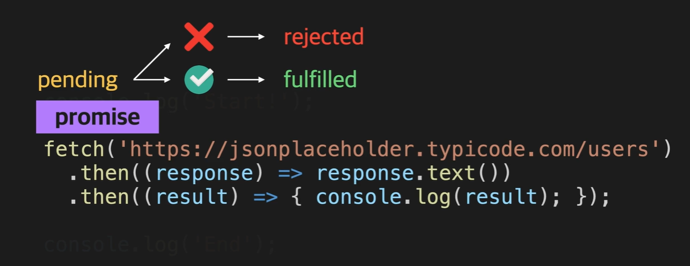

# 🍝 비동기 실행과 promise 객체 🍝

#### Week5 모던 자바스크립트 / Topic 2 JS와 웹 / 3. 비동기 실행과 promise 객체

> 목차
>
> > 1. fetch 함수와 비동기 실행
> > 2. 비동기 실행 함수
> > 3. promise 객체란?
> > 4. promise chaining이란
> > 5. rejected 상태의 콜백
> > 6. then 메소드 심화
> > 7. catch 메소드
> > 8. finally
> > 9. promise 객체
> > 10. promisify
> > 11. 이미 상태가 결정된 promise 객체
> > 12. 여러 promise 객체를 다루는 방법
> > 13. axios

<br><br>

## 1. fetch 함수와 비동기 실행

웹 통신은 비동기적으로 실행된다. 즉, 순차적으로 실행되는 게 아니라 console에서 작동하는 와중에 request와 response가 와리가리하는 것이다.

```js
// 1번 실행
console.log("start");

// 리스폰스 받아야 실행되므로 기다림... 그 와중에 밑에 console end가 먼저 실행되고, 그 이후 리스폰스 받아서 then 내부 콜백함수가 실행됨.
fetch("https://www.google.com")
  .then((response) => response.text())
  .then((result) => {
    console.log(result);
  });

// 2번 실행
console.log("end");
```

즉, then 키워드는 콜백 함수를 등록만 하고 정작 실행은 reponse가 와야 그 후에 실행된다.

**비동기 실행에서의 실행 순서...**

1. console.log('Start');
2. fetch 함수(리퀘스트 보내기 및 콜백 등록)
3. console.log('End');
4. 리스폰스가 오면 2. 에서 then 메소드로 등록해뒀던 콜백 실행

이런 것을 비동기 실행이라 하는 반면, 동기 실행은 한 번 시작한 작업을 다 처리하고 나서야 다음 코드로 넘어가는 방식이다.

**동기 실행에서의 실행 순서...**

1. console.log('Start');
2. fetch 함수(리퀘스트 보내기)
3. 리스폰스가 올 때까지 코드 실행이 잠시 '정지'되고,
4. 리스폰스가 오면 필요한 처리 수행
5. console.log('End');

비동기 실행은 일단 리퀘스트를 보내고 콜백 등록까지 하기 때문에 시간이 절약된다.


<br>

## 2. 비동기 실행 함수 종류

fetch 말고도 비동기적으로 실행되는 함수들이 있다.

1. setTimeout 함수

- 특정 함수의 실행을 원하는 시간만큼 뒤로 미룰 때 사용하는 함수.

```js
// 콜백 함수의 실행을 2초 미룬다.
// a c ... 2초 후 b 가 출력됨.
console.log("a");
setTimeout(() => {
  console.log("b");
}, 2000);
console.log("c");
```

2. setInterval 함수

- 특정 콜백을 일정 시간 간격으로 실행하도록 등록하는 함수.

```js
// a c, ... 2초후 b 2초후 b 2초후 b...
console.log("a");
setInterval(() => {
  console.log("b");
}, 2000);
console.log("c");
```

3. addEventListener 함수

- addEventListener 함수는 DOM 객체의 메소드이다.
- 사용자가 웹페이지에서 어떤 이벤트를 발생시킬 때 함수가 호출되게 하려면, 해당 DOM 객체의 onclick 속성에 함수를 설정하거나, 해당 DOM 객체의 addEventListener 메소드의 파라미터로 전달하면 된다.
- 파라미터로 전달된 콜백 함수가 바로 실행되는 게 아니라, 특정 조건(이벤트)가 만족할 때마다 실행되기 때문에 비동기적 함수이다!

```js
// onclick 속성에 함수 설정하는 법
btn.onclick = function (e) {
  console.log("Hello Codeit!");
};

btn.onclick = (e) => {
  console.log("Hello Codeit!");
};

// addEventListener 메소드 파라미터로 콜백함수 넘겨주는 법
btn.addEventListener("click", function (e) {
  console.log("Hello Codeit!");
});

btn.addEventListener("click", (e) => {
  console.log("Hello Codeit!");
});
```

4. fetch 함수?

- setTime(콜백함수, 시간), setInterval(콜백함수, 시간), addEventListener(이벤트, 콜백함수) 형식인 반면에 fetch 함수는 .then 메소드를 통해 콜백을 등록한다.
- 사실 fetch는 앞서 배운 저 함수들과는 다른 방식의 비동기 실행이기 때문에 문법이 다르게 생긴 것이다!!
- **fetch 함수는 promise 객체라는 것을 리턴하고, 이 promise 객체는 비동기 실행을 지원하는 또다른 문법에 해당하는데 이 속성 때문에 특이하게 생겼다.**

<br>

## 3. promise 객체란?

fetch 함수는 promise 객체를 리턴하는 비동기적 함수이다!!

```js
fetch("https://www.google.com").then(/*콜백함수*/);

// 위와 아래는 의미상 같은 맥락.

promise.then(/*콜백함수*/);
```

#### promise 객체가 뭘까?

- promise 객체는 어떤 작업에 대한 상태 정보를 갖고 있는 객체이다.
- fetch 함수가 성공하든, 인터넷이 끊겨서 등등의 문제로 실패하든, 하여간 작업이 어떤 상태인지를 나타내는 게 promise 객체!

#### promise 객체의 3가지 상태

1. pending: 진행중
2. fulfilled: 성공
3. rejected: 실패

즉, fetch 함수가 실행되는 동안 작업이 어떤 상태인지에 따라 promise 객체도 상태를 가진다!! 만약 작업이 진행 중이라면 promise 객체는 pending 상태이다가 작업이 성공하면 fulfilled 상태, 그렇지 못하면 rejected 상태가 된다.

그리고 fulfilled 상태가 되면 작업한 결과도 promise 객체에 저장해준다!! 여기서는 서버가 보내준 response가 작업 결과이다.

반대로 rejected 상태가 되면 작업이 왜 실패했는지, 작업 실패 이유에 관한 정보를 갖게 된다. 보통 인터넷이 끊기거나, 존재하지 않은 url로 접근하려 할 때 fetch가 실패한다!

즉!!!
promise 객체가 가지고 있는 것

1. pending 상태
2. fulfilled 상태 + 작업 성공 결과
3. rejected 상태 + 작업 실패 정보



자, 그럼 다시 코드를 보자!!

```js
console.log("start!");

fetch("https://www.google.com")
  .then((response) => response.text())
  .then((result) => {
    console.log(result);
  });

console.log("end!");
```

- 사실 then 메소드는 promise 객체의 메소드이다.
- 그리고 이 then 메소드는 콜백 함수를 등록해주고, promise 객체가 fulfilled 상태가 될때에만 콜백 함수가 호출되게 해준다. (콜백 실행은 프로미스 객체가 pending 상태에서 fullfilled 상태가 될 때 일어난다! 지금은 콜백 등록만.)
- 프로미스 객체는 작업이 성공하면, 여기서는 response를 받으면 fulfilled 상태가 된다!
- 즉, fetch 함수가 response를 정상적으로 받으면 fulfilled 상태가 되면서 콜백 함수들이 실행된다.
- 이 때 fetch 함수가 실행되면서 반환된 promise 객체에는 작업 성공 결과로 response 를 가지게 되는데, 이 작업성공 결과(리스폰스)가 첫번째 콜백 함수의 파라미터인 response로 들어감!!!
- 그리고 then 메소드는 한 줄이 아니라, 여러 중 이어서 쓸 수 있다. 이것을 promise chaining이라 한다!

### promise chaining이란

아래 코드처럼 then 을 줄줄이 연결한 것. 이게 가능한 이유는 then 메소드가 새로운 프로미스 객체를 리턴하기 때문이다!!

fetch에서 리턴한 프로미스 객체를 첫 번째 then 메소드가 받아 처리하고, 그 then 메소드가 새로운 프로미스 객체를 그다음 then 메소드의 파라미터로 넘겨준다.

then 메소드가 처음 프로미스 객체를 return할 때엔 아직은 pending 상태이다. 그런데 then 내부 콜백 함수가 실행되고, 그 콜백 함수에서 실행을 완료하여 값을 리턴하면 then 메소드의 promise 객체의 상태가 바뀌게 된다. 이 때 콜백함수가 어떤 값을 리턴하는지에 따라 경우가 다른데...

1. 콜백 함수가 프로미스 객체를 리턴한 경우: 콜백이 리턴한 프로미스 객체와 then 함수가 리턴한 프로미스 객체의 상태가 같아진다. 예를 들어 콜백이 리턴한 프로미스 객체가 fulfilled 상태라면 그 콜백 함수를 파라미터로 갖고 있던 then 메소드가 리턴한 프로미스 객체도 fulfilled 상태가 되고, 만약 콜백이 리턴한 게 rejected 상태 프로미스 객체라면 그 then 메소드의 프로미스 객체도 rejected 상태가 된다.
2. 만약 콜백에서 리턴한 값이 promise 객체가 아니라면, then 메소드가 리턴한 프로미스 객체는 자동으로 그냥 fulfilled 상태가 되고 작업 성공 결과로는 콜백 함수가 반환해준 값(문자열, 일반 객체, 숫자 등...)을 가지게 된다.

**then 메소드 내부 콜백 함수의 파라미터로 전달되는 값은 그 전에 return 받은 promise 객체의 작업 성공 결과이다!! promise 객체 자체를 인자로 받는 게 아님!!**

```js
fetch("https://www.google.com")
  .then((response) => response.text())
  .then((result) => {
    const users = JSON.parse(result);
    return user[0];
  })
  .then((user) => {
    console.log(user);
    const { address } = user;
    return address;
  })
  .then((address) => {
    console.log(address);
    const { geo } = address;
    return geo;
  })
  .then((geo) => {
    console.log(geo);
    const { lat } = geo;
    return lat;
  })
  .then((lat) => {
    console.log(lat);
  });
```

참고로 response.text() 함수나, JSON.parse() 함수도 promise 객체를 리턴하는 함수이다.

1. response.text()

- fetch 함수로 리스폰스를 받으면, reponse 객체의 text 메소드는 fulfilled 상태이면서 reponse의 바디에 있는 내용을 string 타입으로 변환한 값을 작업 성공 결과로 가진 promise 객체를 리턴한다. 그래서 response.text로 받은 객체의 값은 string형이기 때문에 json 객체의 parse 메소드로 객체화시켜야 하는 것이다.

그래서 const result = response.text() 에서 result를 typeof로 확인하면 string이 확인 되는 거임. response.text 자체는 프로미스 객체를 전달하지만, result에 주어지는 값은 프로미스 객체의 작업 성공 결과니까.

2. json 메소드

- json 메소드는 fulfilled 상태이면서 response의 바디에 있는 json 데이터를 js 객체로 바꿔주어 생겨난 객체를 작업 성공 결과로 가진 promise 객체를 리턴한다. 즉, reponse의 바디에 있는 내용이 json 타입이 아니라면 에러가 발생하면서 rejected 상태의 promise 객체를 반환하는 것이다!!

이런 promise chaining이 왜 필요한 걸까?

사실 그냥 then 메소드 안에 콜백 함수 하나로 몰아서 작성해도 되지만, then 을 써서 더 가독성있게 코드를 작성할 수 있다. 프로미스 객체를 가지고 순차적인 일을 할 때 then 메소드는 빛을 발한다!

```js
fetch("url")
    .then(/*콜백함수*/)
    .then(
        /* id 값을 알아내는 콜백함수*/
        return fetch(`url=${id}`);
    )
    .then(
        /*위의 fetch가 반환한 promise 객체를 바로 연달아서 then 메소드에게 넘겨준다!!*/
    )
```

예시

```js
fetch("https://learn.codeit.kr/api/interviews/summer")
  .then((response) => response.json())
  .then((interviewResult) => {
    const { interviewees } = interviewResult;
    const newMembers = interviewees.filter(
      (interviewee) => interviewee.result === "pass"
    );
    return newMembers;
  })
  .then((newMembers) =>
    fetch("https://learn.codeit.kr/api/members", {
      method: "POST",
      body: JSON.stringify(newMembers),
    })
  )
  .then((response) => {
    if (response.status === 200) {
      return fetch("https://learn.codeit.kr/api/members");
    } else {
      throw new Error("New members not added");
    }
  })
  .then((response) => response.json())
  .then((members) => {
    console.log(`총 직원 수: ${members.length}`);
    console.log(members);
  });
```

<br>

## 4. rejected 상태의 콜백

앞에서는 프로미스 객체의 상태가 fulfilled 라고 가정했는데, 만약 rejected 상태의 객체가 들어오면 어떻게 처리해야 할까?

**이걸 대비하기 위해 then 메소드에 인자를 두 개를 넣는다!!** 첫 인자는 fulfilled 상태일때 실행하는 콜백함수, 두번째 인자는 rejected 상태일 때 실행하는 함수이다.

1번 인자의 파라미터 response로는 앞서 받은 promise 객체의 작업 성공결과가 들어가고, 2번 파라미터 콜백함수의 인자 error에는 promise 객체의 작업 실패 원인이 들어간다!!

```js
fetch("https://www....").then(
  (response) => response.text(),
  (error) => {
    console.log(error);
  }
);
```

이렇게 되면 then 메소드의 두번째 콜백 함수로 에러 객체(=작업실패정보) 가 전달됨.

<br>

## 5. then 메소드 심화

앞에서 콜백함수가 어떤 값을 리턴할 때 그 값이 promise 객체를 반환할 경우, 객체가 아난 것을 반환할 경우를 배웠다.

1. 객체를 반환할 경우: 콜백함수가 리턴한 객체가 해당 then 함수가 리턴하는 프로미스 객체와 상태, 정보 값이 같아짐.
2. 객체가 아닌 문자열 숫자 등을 반환할 경우: then이 리턴하는 객체는 그냥 바로 fulfilled 상태가 되고 작업 성공 결과에는 콜백함수의 리턴값이 들어감.

3. 만약 콜백 함수가 아무것도 리턴하지 않는다면??

그럼 콜백 함수는 undefined를 리턴했다고 간주됨!! 2번 규칙에 따라 객체가 아닌 undefined 값이 리턴되면서 해당 then 메소드의 프로미스 객체는 fulfilled 상태가 되고 작업성공결과에 undefined 값이 들어감.

4. 만약 콜백 함수에서 에러가 발생하면?? 이 때는 then 메소드의 객체가 rejected 상태가 되고 해당 에러 객체를 작업 실패 정보로 가진다.

하나 더!!

만약 then 함수에 두 번째 인자가 없는데 (error가 날 경우 실행할 콜백 함수가 없는데) 에러가 났다면? 해당 then 문은 앞에서 에러 난 코드의 promise 객체를 이어 받아 똑같이 rejected 상태, 작업 실패 정보를 가진다. 따라서!! 두 번째 인자가 없는 then 문을 쓴다고 해도 rejected 객체가 내려오면 거기서 코드 작동이 멈추는 게 아니라 콜백 아무것도 실행 안된채로 쭉쭉 내려오다가, 2번째 인자가 있는 then 함수를 만나면 그 때서야 그 2번째 콜백함수의 인자로 전달되는 것.

<br>

## 7. catch 메소드

rejected 객체를 다루는 방법

1. 앞에서 배운 대로 then 메소드의 두번째 인자에 error 객체 처리 함수를 넣는다.

2. catch 라는 메소드를 사용한다!!! catch는 rejected 상태의 promise 객체를 만날 때 실행될 콜백 함수를 등록해주는 메소드이다.

```js
fetch("url")
  .then((response) => response.text())
  .catch((error) => {
    console.log(error);
  })
  .then((result) => {
    console.log(result);
  });
```

사실 catch() ㅣ는 then(undefined, 두번째인자) 와 같은 의미이다. 근데 이제 가독성을 높이기 위해 catch로 error를 처리하는 것!! 그리고 위에서 catch 메소드를 실행하고 catch 메소드 내부 콜백함수가 반환하는 값이 아예 없으니 catch 문이 반환하는 promise 객체는 fulfilled 상태, undefined 값을 가진다. 따라서 catch 문 이후 then 메소드는 undefined 값을 가진 promise 객체를 받기에, result에는 response.text가 아니라 undefined를 출력한다.

그래서!!! catch 문은 꼭 코드의 마지막으로 내려줘야 한다. undefined 객체 전달 뿐만 아니라, catch 이후의 then 메소드에서 발생한 에러를 잡기 위해선 catch는 반드시 아래에 존재해야 한다.

그런데 catch 문을 마지막에 써주면, 어디서 에러가 발생했는지 잘 알지 못하는 문제가 있다.

그래서 필요한 게 throw new Error("type error: too long!!"); 같은 거다!! if 에러 발생 시, error 객체를 throw 하면 바로 catch 문으로 넘어가 error 객체를 받는다. 그리고 어떤 에러 객체인지 확인하여 어디서 문제가 발생했는지 알 수 있다ㅓ.

```js
...
  .then((result) => {
    ...
    if(에러 발생 시){
      throw new Error('no required field');}
  })
  .catch((error) => {
    if(error instanceof TypeError){

    }else if(error instanceof CustomErrorType_A){

    }else if(error instanceof CustomErrorType_B){

    }else{

    }
  });
```

가끔, 중간에 에러가 발생할 때 대체 값을 그 다음으로 넘겨줄 수 있게 catch 문을 중간에 쓰기도 한다. 그리고 catch 문 내부에 return 대체 작업물 값을 해주면 된다!!

<br>

## 8. finally

finally 메소드는 catch 보다 더 뒤에 쓴다. 콜백이 rejected든 fulfilled이든 상관 없기 때문에, 파라미터를 받지 않는다.

```js
...
  .then()
  .catch()
  .finally(() => {console.log("EXIT");})
```

finally는 무조건 해야 하는 작업에 쓰는 문이다. 프로미스 체이닝에서 작업을 수행하기 위해 사용했던 자원을 정리한다든가, 로그 기록을 남겨야 한다든가 등에 쓰인다.

<br>

## 9. promise 객체는 왜 있는 걸까?

fetch 함수에 그냥 바로 콜백 함수를 인자로 주면 안되는 걸까?

함수에 콜백을 직접 넣는 방식은 콜백 헬 callback hell이라는 문제를 일으킬 수 있다. 지옥의 피라미드라고도 불리는 콜백 헬은 코드 가독성이 겁나 떨어지는 현상을 말한다.

promise 객체를 활용하면 가독성이 좋아지고 여러 비동기 작업을 순차적으로 처리하면서 callback hell 문제를 해결할 수 있다

뿐만 아니라 promise 객체에는 비동기 작업에 관한 세밀한 개념들이 반영되어있다. pending, fulfilled, rejected 상태 등과 then, catch, finally 메소드들이 있어 더욱 정교한 설계가 가능한 것이다!!

<br>

## 10. 프로미스 객체 만들어보기

이때껏 한 건 fetch 나 then 등 메소드들이 반환하는 promise 객체를 활용했던 것. 이제는 객체를 만들어보자!!

아래 코드에서 new 키워드로 프로미스 객체를 생성하고, 그 안에 생성자로 함수를 주었다. 그걸 executor 함수라고 하는데, 이건 객체가 생성될 때 자동으로 실행되는 함수이다.

```js
const p = new Promise((resolve, reject) => {});
```

1. resolve 인자는 promise 객체를 fulfilled 상태로 만들어준다.
2. reject 인자는 promise 객체를 rejected 상태로 만들어준다.

한 번 resolve, reject를 써보자.

```js
// 2초 후에 p는 fulfilled 상태가 되면서 작업성공 결과로 success라는 문자열을 가진다.
const p = new Promise((resolve, reject) => {
  setTimeOut(() => {
    resolve("success");
  }, 2000);
});

p.then((result) => {
  console.log(result);
});

// 이번엔 2초 후에 rejected 객체가 생성된다. 작업 실패 원인에는 new Error('fail') 객체가 들어간다.
const p = new Promise((resolve, reject) => {
  setTimeOut(() => {
    reject(new Error("fail"));
  }, 2000);
});

p.catch((error) => {
  console.log(error);
});
```

이렇게 객체를 직접 만드는 건 실무에서 자주 쓰이진 않고 promisify 라는 경우에나 좀 사용된다.

#### promisify 란?

전통적인 형식의 비동기 실행 함수 코드를 promise 기반 코드로 변환하는 것.

1. setTimeout 함수를 promise 기반으로 바꾸기

예를 들어 다음과 같은 함수가 있다고 하자.

```js
// wait 함수는 milliseconds 만큼 시간이 지난 후에야 text 값을 리턴하는 함수이다.
function wait(text, milliseconds) {
  setTimeout(() => text, milliseconds);
}
```

위의 wait 함수를 promise chaining 코드에서 사용할 때 바로 then 사이에 함수를 호출하면 제대로 작동되지 않는다. 왜냐면 여기서 setTime함수가 리턴한 text 값을, 함수 wait은 리턴해주지 않기 떄문이다!!

```js
// 2초 후에 response by hongjw 이라 출력되게 하고 싶은데
// 이렇게 하면 제대로 result가 출력되지 않음.

function wait(text, milliseconds) {
  setTimeout(() => text, milliseconds);
}
fetch("url")
  .then((response) => response.text())
  .then((result) => wait(`${result} by hongjw`, 2000))
  .then((result) => {
    console.log(result);
  });
```

따라서 비동기 함수를 promise chaining 안에서 사용하려면, 나중에 실행되는 부분을 promise chaining에서 사용할 수 없기 때문에 직접 객체를 생성해 return해야 한다.

```js
// 이렇게 쓰자...
function wait(text, milliseconds) {
  const p = new Promise((resolve, reject) => {
    setTimeout(() => {
      resolve(text);
    }, 2000);
  });
  return p;
}
fetch("url")
  .then((response) => response.text())
  .then((result) => wait(`${result} by hongjw`, 2000))
  .then((result) => {
    console.log(result);
  });
```

위의 코드처럼 작성하면 executor 함수 안에서 setTimeout. 함수를 호출하고, 작업이 성공하면 promise 객체는 fulfilled 상태에 작업 성공 결과로 text 값을 가진다.

이렇게 전통적인 형식의 비동기 함수를 promise 객체로 감싸서 그 promise 객체를 리턴하는 형식으로 만드는 작업을 promisify, 프로미스화 한다고 한다!!

2. node.js 에서 promisify 하기.

여기서는 자쳇 callback hell문제가 생길 수 있다. 이걸 막기 위해 promisify를 하는 것이다.

**그런데 promisify를 하면 안되는 함수도 있다!!**

비동기 실행 함수 중 콜백을 한 번만 실행하는 setTimeOut, readFile 같은 건 되지만, 조건에 따라 콜백을 여러 번 실행하는 setInterval, addEventListener 은 안된다. 왜냐면 한 번 promise 객체가 pendding에서 fulfilled나 rejected 상태가 되면 그 뒤로는 상태나 그 내부 작업 결과물이 바뀌지 않기 때문이다!!

만약 addEventListener로 버튼을 누를 때마다 count 되는 코드를 짰다면, 객체 내부 count 변수 값이 바뀌어야 하는데 이걸 못 한다는 뜻.

<br>

## 11. 이미 상태가 결정된 promise 객체

우리는 promise 객체가 pending 상태일 때만 만들었는데, 처음부터 아예 fulfilled 상태나 rejected 상태인 객체를 만들 수도 있다.

```js
// 이전에 배운 방식
const p = new Promise((resolve, reject) => {
  //코드 내용...
});

// fulfilled 상태 객체 만들기
const p1 = Promise.resolve("success");

// rejected 상태 객체 만들기
const p2 = Promise.reject(new Error("fail"));
```

이렇게 미리 상태가 정해진 객체들은, 보통 함수 안에서 리턴하는 값이 여러 개인데 모든 리턴 값을 promise 객체로 통일할 경우에 종종 쓴다.

예를 들면 아래 코드와 같다.

```js
function doSomething(a, b) {
  //...
  if (problem) {
    // 이렇게 에러 객체를 바로 throw할 수도 있지만.
    // throw new Error("failed due to ..");
    //
    // 이렇게 promise 객체를 리턴하는 식도 가능!
    return Promise.reject(new Error("failed due to .."));
  } else {
    return fetch("url");
  }
}
```

### 하나 짚고 넘어가야 할 점!!

then 메소드는 promise 객체가 pending 상태일 때만 가능하고, 객체가 fulfilled, rejected 상태가 되는 순간 결과를 콜백의 파라미터로 넘어간다고 오해할 수 있다.

그런데 사실 위에서 봤듯이 이미 fulfilled, rejected 상태가 된 promise 객체에서도 then 을 붙이면 작업 결과를 받을 수 있다!!!!

<br>

## 12. 여러 promise 객체를 다루는 방법

앞에서는 promise 객체 한 개씩만 다뤘지만, 사실 여러 개 를 동시에 다룰 수도 있다.

1. all 메소드 쓰기.

all 메소드는 인자로 배열을 받는다. 그 배열 안의 요소들은 각각 promise 객체이다. all 메소드는 이 배열 내부 객체들이 모두 pending에서 fulfilled 상태가 될 때까지 기다리고, fulfilled 상태가 되면 all 메소드는 인자로 받은 객체들의 작업 성공 결과들을 배열에 넣는다.

그리고 이 all 메소드가 리턴하는 객체도 fulfilled 상태가 되고 작업 성공 결과로는 위에서 만든 배열을 갖는다!!

**그래서 all 메소드는 여러 객체의 작업 성공 결과를 모두 한 번에 취합할 때 사용한다.**

만약 객체들 중 하나라도 rejected 상태가 되면 all 메소드가 리턴할 promise 객체도 rejected 상태가 된다. 그래서 하나라도 에러가 날 경우를 대비해 try catch 문을 쓴다.

```js
// 1번 직원 정보
const p1 = fetch("https://learn.codeit.kr/api/members/1").then((res) =>
  res.json()
);
// 2번 직원 정보
const p2 = fetch("https://learn.codeit.kr/api/members/2").then((res) =>
  res.json()
);
// 3번 직원 정보
const p3 = fetch("https://learn.codeit.kr/api/members/3").then((res) =>
  res.json()
);

Promise.all([p1, p2, p3])
  .then((results) => {
    console.log(results); // Array : [1번 직원 정보, 2번 직원 정보, 3번 직원 정보]
  })
  .catch((error) => {
    console.log(error);
  });
```

2. race 메소드 쓰기.

race 메소드도 promise 객체 여러 개가 묶인 배열을 아규먼트로 받는다. 그리고 그 객체들 중 가장 먼저 fulfilled 상태가 되거나 rejected 상태가 된 promise 객체와 동일한 상태, 결과를 가진다!!

아래 코드에서 가장 먼저 상태가 결정되는 p1 객체에 따라 race 메소드가 반환하는 객체의 상태, 값이 달라진다.

```js
const p1 = new Promise((resolve, reject) => {
  setTimeout(() => resolve("Success"), 1000);
});
const p2 = new Promise((resolve, reject) => {
  setTimeout(() => reject(new Error("fail")), 2000);
});
const p3 = new Promise((resolve, reject) => {
  setTimeout(() => reject(new Error("fail2")), 4000);
});

Promise.race([p1, p2, p3])
  .then((result) => {
    console.log(result); // hello 출력
  })
  .catch((value) => {
    console.log(value);
  });
```

3. allSettled 메소드도 있다.

allSettled가 객체들이 담긴 배열을 받을 때, 객체들 상태가 하나도 빠짐없이 pendding 상태에서 rejected든 fulfilled든 일단 다 결정이 나면 allSettled의 객체가 그제야 fulfilled 상태가 되고, 작업 성공 결과로는 파라미터로 받은 객체들의 각 status, value(작업 성공 결과), reasone(작업 실패 결과) 를 담은 객체들의 모음 배열을 가진다.

rejected, fulfilled 상태를 묶어서 settled 상태라고 하기 때문에, 뭐로 결정 나든간에 allSettled 라고 불리는 것!

4. any 메소드도 있다.

객체들 중 가장 먼저 fulfilled 상태가 되는 객체의 상태와 결과를 반환하는데, 만약 아무것도 fulfilled 되지 않고 싹 다 rejected가 된다면 AggregateError 에러를 작업 실패 정보로 갖고 rejected 상태인 객체를 반환한다. 즉, 파라미터로 받은 배열 내 객체 중 하나라도 fulfilled 상태가 되면 된다는 것!

<br>

## 13. axios

axios 활용 예시

```js
axios
  .get("https://jsonplaceholder.typicode.com/users")
  .then((response) => {
    console.log(response);
  })
  .catch((error) => {
    console.log(error);
  });
```

axios 객체도 fetch 함수처럼 promise 객체를 리턴하기 때문에 사용법이 비슷하다.

근데 axios 에만 있는 장점이 있다!!

1. 모든 request, response에 공통 설정이나 공통 함수 삽입 가능.
2. serialization, deserialization 자동 수행
3. 특정 리퀘스트에 대한 리스폰스가 얼마나 오랫동안 오지 않으면 리퀘를 취소할지 설정 가능. 이걸 request timeout이라 한다.
4. 업로드 시 진행 상태 정보를 얻을 수 있음.
5. 리퀘스트 취소 가능.

axios는 기능이 다양하지만 설치가 필요한 외부 패키지기때문에, 기능이 더 필요할 경우에 axios를 쓰며 실무에선 axios도 많이 쓰인다.

<br>
````
