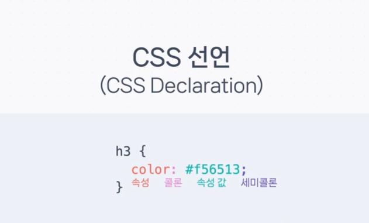

# 🍔 CSS 기본 개념 🍔
#### Week1 html css 기초 / Topic 2 CSS 핵심 / 1. css 기본 개념

>목차 
>>[1. css 규칙](#1-css-규칙)<br>
[2. 아이디](#2-아이디)<br>
[3. 클래스](#3-클래스)<br>
[4. css 파일](#4-css-파일)<br>
[5. 색상 단위](#5-색상-단위)<br>
[6. 크기 단위](#6-크기-단위)<br>
[7. 코맨트](#7-코맨트)<br>

<br><br>

## 0. css의 기본 개념.

html이 너무 길어지면 하나하나에 style을 넣는 건 너무 번거로워진다. 때문에 css 규칙을 정해야 한다!!
```html
<style>
    h1{ color: #ff33f3; }
</style>
```
바로 이렇게 h1에 대한 규칙을 세우듯 태그들의 규칙을 세워 style을 적용하는 게 좋다. 즉, css를 개발한다는 것은 css 규칙을 만든다는 것이다.


<br>
<br>


 ## 1. css 규칙
html 의 내용과 그에 대한 css를 분리하는 것을 **관심사의 분리, seperation of concern** 이라고 한다.

* 관심사 분리의 장점: 내용과 스타일을 고치기 편하다.

css 규칙은 선택자와 선언의 짝으로 이루어졌다. 
* 선택자란 어떤 요소에 규칙을 적용할지 선택하는 것.
* 선언이란 어떤 스타일을 적용할지 선언하는 것이다. 선언에는 속성, 콜론, 속성값, 세미콜론으로 이루어졌다.

```html
<style>
    h1 /* h1은 선택자!! */
    { 
        color: #ff33f3; /* 선언!! */
    }
</style>
```


## 2. 아이디
선택자에 쓸 수 있는 것에는 태그 말고도 아이디가 있다. 

아이디는 하나의 태그에 고유하게 주어지는 이름으로, 중복해서 쓸 수 없다. 때문에 딱 하나!! 의 태그에 스타일을 적용할 때 사용하자!

css 스타일에선 #아이디이름 으로 선택자를 지정한다.
```html
<html>
    <head></head>
    <body>
        <div id = "mydiv"></div>
        <div></div>
    </body>
</html>
<style>
    #mydiv{color: #f5f5f5;}
    /* mydiv 아이디를 가진 영역에만 적용. */
</style>
```


## 3. 클래스
선택자에 쓰는 것으로는 클래스가 있다. 아이디는 딱 하나에만 적용하는 반면, 클래스는 여러 개에 적용할 수 있다.

css 스타일에선 .클래스이름 으로 선택자를 지정한다.
```html
<html>
    <head></head>
    <body>
        <div class = "mydiv"></div>
        <div class = "mydiv"></div>
        <div></div>
    </body>
</html>
<style>
    .mydiv{color: #f5f5f5;}
    /* mydiv 클래스를 가진 영역에만 적용. */
</style>
```


## 4. css 파일
css파일은 보통 html과 분리해서 만든다. 

하나의 폴더 안에 index.html과 style.css 파일이 있다고 한다면, html파일에서 아래와 같이 외부 css 파일을 불러오자.
```html
<html>
    <head>
        <link rel="stylesheet" href="style.css">
    </head>
</html>
```


## 5. 색상 단위
색상을 나타내는 방법에는 4가지가 있다.
1. red, blue, 등 색상에 붙은 고유 이름. 세세한 색을 나타내기 힘들어서 잘 쓰지 않는다.
2. **색상코드.** 16진법으로 색상을 나타냄. 
3. **RGB.** 10진수로 빨, 초, 파 빛 세기를 0~255 사이 값으로 나타낸다. 예를 들어 rgb(255,255,255)는 하얀색. 
4. **RGBA. rgb에 불투명도 alpha를 추가.** 여기서 alpha는 0~1 사이 실수이며, 예를 들어 rgba(255,0,0,1)은 완전불투명 빨간색, rgba(255,0,0,0)은 완전 투명이다. 


## 6. 크기 단위
크기 단위에는 절대적인 단위와 상대적인 단위로 나뉜다. 절대 단위는 대표적으로 px, 상대 단위에는 퍼센트나 em, rem, vw 등이 있다. 
1. px. 화면을 표시하는 기준이 되는 가장 작은 정사각형을 기준으로, 표시. 
2. 퍼센트: 부모태그에 대해 상대적인 크기로, 부모가 100px이면 자식이 50%일 때 50픽셀이 된다.
3. em: 부모 태그의 font-size를 1em으로 두는 것. 예를 들어 부모가 16px이라면 2em = 32px이다.
4. rem: 최상위 태그의 font-size를 1rem으로 두는 것. 


## 7. 코맨트
코드에 설명을 적어두는 것을 코멘트라고 한다. 코멘트는 부가 설명이 필요할 때 달아주는 것이 좋다.