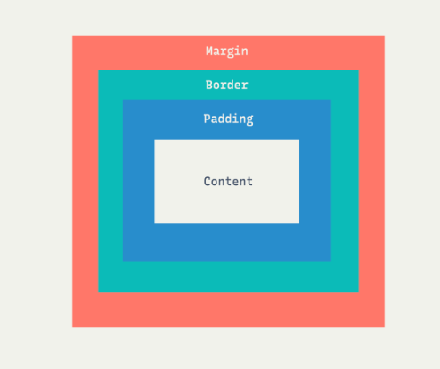

# 🍩 CSS 기본 개념 🍩
#### Week1 html css 기초 / Topic 2 CSS 핵심 / 2. css 속성

>목차 
>>
[1. 박스모델](#1-박스모델)<br>
[2. border과 border-radius](#2-border과-border-radius)<br>
[3. box-sizing](#3-box-sizing)<br>
[4. overflow](#4-overflow)<br>
[5. 마진 상쇄](#5-마진-상쇄)<br>

<br><br>


## 1. 박스모델
요소의 영역을 하나의 박스로 지정하는 것. 각 박스는 margin, border, padding, 그리고 내부 content 영역이 있다. 



## 2. border과 border-radius
border은 박스모델 요소들의 가장자리 테두리이다.

이 border에 여러 속성을 줘보자.
```css
.div{
    border: 3px solid #ff3f3f;
    /* 테두리는 3픽셀 두께에 실선으로, ff3f3f색으로. */
    border-radius: 8px;
    /* 각 모서리를 8px만큼 둥글게. */
}
```


## 3. box-sizing
박스모델에서 크기는 어떻게 정할까? width=400px 이라 속성 값을 부여해도 실제로 개발자도구로 살펴보면 440px이라든가, 다른 값이 나온다. 왜 이런 것일까?

일반적으로 width: 400px 이라 한다면

안의 content만 딱 400px 너비가 된다. 따라서 양 옆의 padding, border 두께까지 모두 합해서 계산한 게 실제 너비가 된다.

계산이 너무 짜증나서 컴퓨터에게 width 값을 주면 알아서 content와 border, padding을 계산해 너비를 지정하게 하는 게 바로 **box-sizing** 이다. 
```css
*{
    box-sizing: border-box;
}
```

## 4. overflow
한 박스 안에 글자가 너무 많아서 넘치면 어떻게 할까? >> 일반적으로는 글자가 삐져나와 못생겨진다.

따라서 overflow 속성을 부여하자.
```css
.div{
    overflow: hidden;
    /* 넘치는 글은 안보이게 잘라버림. */
    overflow:scroll;
    /* 스크롤이 생성됨 */
}
```
overflow scroll 속성에  만약 div에다가 white-space: nowrap; 속성을 주면 줄바꿈이 사라져서 가로 스크롤도 생김! 


## 5. 마진 상쇄

margin collapsing, A 와 B 요소가 둘이 붙어있을 떄, 둘의 마진이 서로 상쇄됨!!

이 마진은 부모 자식간에서도 상쇄될 수 있다.

단, padding은 상쇄되지 않으므로 마진 말고 패딩 값을 넣든가 마진 사이에 다른 공백 요소를 끼워넣는 식으로 상쇄를 막을 수 있다. 
```css
.A{margin: 32px;}
.B{margin: 16px;}
/* 이 경우 A와 B 중 더 큰 32px 마진만 적용된다. 둘이 겹치기 때문이다!! 이게 바로 마진 상쇄 */
```