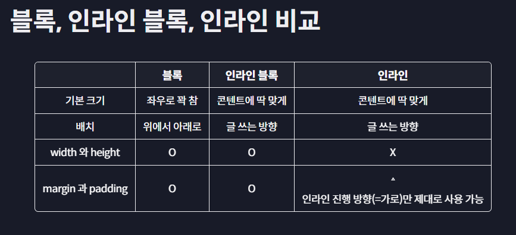

# 🧀 Display 개념 🧀
#### Week1 html css 기초 / Topic 2 CSS 핵심 / 4. display

>목차 
>>[1. 블록과 인라인](#1-블록과-인라인)<br>
[2. 인라인 블록](#2-인라인-블록)<br>
[3. float](#3-float)<br>

<br><br>


## 1. 블록과 인라인
태그마다 배치되는 방식이 다르다. 각 태그마다 기본적으로 갖는 display 값이 다르기 때문!!

* **display: block;** div, h1, li, p 등 위에서 아래로 배치되며 너비와 높이를 지정할 수 있는 요소. 
* **display: inline;** span, a, img, label, input 등 평소 글을 쓰는 방향으로 배치되며 화면이 꽉 차면 다음줄로 넘어가서 배치된다. 너비와 높이를 지정할 수 없으나 예외적으로 img는 지정 가능!! 


## 2. 인라인 블록
앞에서 공부했듯 인라인은 크기가 없다. 그래서 width, height를 주고 스타일을 주면 다른 옆의 요소들에게 스타일이 침범당할 수 있어서 안 이쁨!!

만약 인라인처럼 글 쓰는 방향으로 배치하면서 크기를 정하고 싶다면 inline-block으로 설정하자. 

+ **display: none;** 태그를 감출 대 사용하는 값이다. 




## 3. float
원래 요소들은 display 속성에 의해 위에서 아래로, 좌에서 우로 배치된다.

이 흐름에서 벗어나게 해주는 게 바로 float 속성이다. float는 해당 요소가 공중에 떠있는 것처럼 배치한다.

```html

<div>
    글자를 적어보자 가나다라
</div>
```
```css
.img{
    float: right;
}
```
float 속성이 없을 때엔 이미지 아래에 div 태그가 배치되지만, img에  float 속성을 주면 div 위에 img가 떠있고, img의 주변에 다른 태그들이 배치된다.