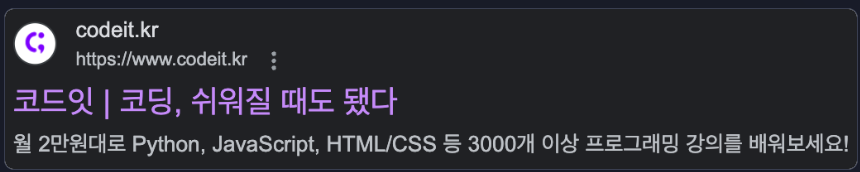
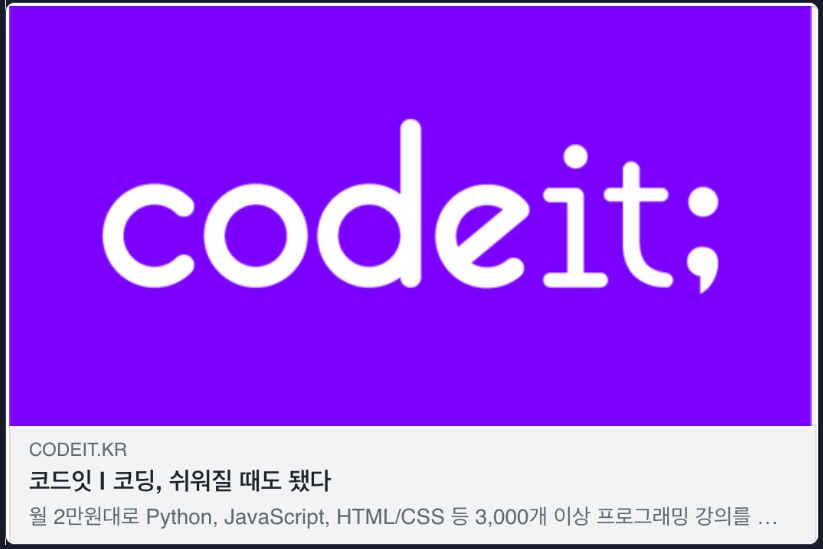

# 🥟 메타태그 🥟
#### Week1 html css 기초 / Topic 4 메타태그 / 1. 메타태그

>목차 
>>[1. 메타태그란](#1-메타태그란)<br>
[2. 메타태그 사용 예시](#2-메타태그-사용-예시)<br>
[3. 메타태그 활용](#3-메타태그-활용)<br>
[4. 메타태그 주의 사항](#4-메타태그-주의-사항)<br>

<br><br>

## 1. 메타태그란
메타 데이터를 나타내기 위해 작성하는 태그이다.

종료태그가 없다!! 


## 2. 메타태그 사용 예시
아래는 거의 설정 건드릴 게 없다. 그냥 한 번 읽어보고 써보자.

```html
<meta charset="utf-8">
HTML 문서의 문자 인코딩을 utf-8로 지정.

<meta name="viewport" content="width=device-width, initial-scale=1, minimum-scale=1, maximum-scale, user-scalable=no">
name="viewport" 설정으로 반응형 웹 사이트를 제작할 수 있어요.
width=device-width: 장치의 화면 너비를 따르도록 페이지 너비를 설정해요.
initial-scale=1: 브라우저에서 페이지를 처음 로드할 때 배율을 1로 설정해요.
minimum-scale=1: 최소사이즈를 1배로 처리해서 축소를 못하게 막아요.
maximum-scale=1: 최대사이즈를 1배로 처리해서 확대를 못하게 막아요.
user-scalable=no: 사용자크기변화를 no로 처리해서 크기변화를 못하게 막아요.

<meta http-equiv="X-UA-Compatible" content="IE=edge">
인터넷 익스플로러에서 최신 표준 모드로 보여주는 코드에요.

<meta name="robots" content="noindex">
name="robots" 설정으로 크롤러의 동작에 대해 규칙을 정할 수 있어요.
검색결과에 이 페이지, 미디어 또는 리소스를 표시하지 않아요. 이 규칙을 지정하지 않으면 페이지, 미디어 또는 리소스가 색인 생성되어 검색결과에 표시될 수 있어요.

```

## 3. 메타태그 활용
* 구글 검색 결과에 사이트 미리보기 띄울 때 쓰는 태그

```html
<title>코드잇 | 코딩, 쉬워질 때도 됐다</title>
<meta
    name="description"
    content="월 2만원대로 Python, JavaScript, HTML/CSS 등 3,000개 이상 프로그래밍 강의를 배워보세요!"
>
```

* sns 공유할 때 링크 미리보기 띄울 때 쓰는 태그

```html
<meta property="og:image" content="/static/images/brand/og_tag.png">
<meta property="og:title" content="코드잇 | 코딩, 쉬워질 때도 됐다">
<meta
    property="og:description"
    content="월 2만원대로 Python, JavaScript, HTML/CSS 등 3,000개 이상 프로그래밍 강의를 배워보세요!"
>
<meta property="og:url" content="https://www.codeit.kr">

```