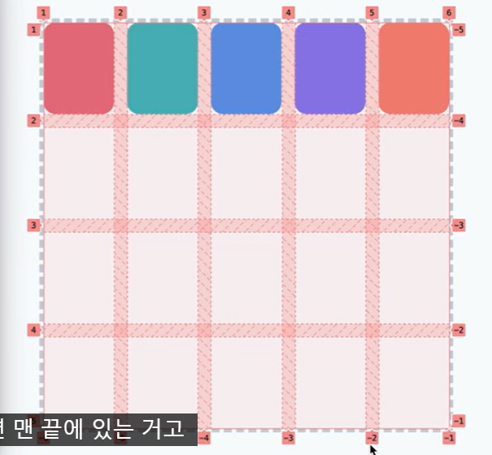

# 🥞 Grid 🥞
#### Week1 html css 기초 / Topic 5 css 레이아웃 / 3. Grid

>목차 
>>[1. 그리드 나누기](#1-그리드-나누기)<br>
[2. 유연한 크기와 유용한 함수](#2-유연한-크기와-유용한-함수)<br>
[3. 간격 넣기](#3-간격-넣기)<br>
[4. 크기 미리 정하기](#4-크기-미리-정하기)<br>
[5. 원하는 위치에 요소 배치하기](#5-원하는-위치에-요소-배치하기)<br>
[6. 이름으로 배치하기](#6-이름으로-배치하기)<br>


<br><br>

## 0. Grid
flex는 1차원적으로 한 방향으로 요소를 배치한다면, grid는 2차원적으로 바둑판처럼 요소를 배치한다. 

* 이 때 각 칸을 나누는 줄을 그리드 라인이라 한다.
* 그리고 각 칸을 그리드 셀이라고 한다.


## 1. 그리드 나누기
먼저 요소를 담을 컨테이너를 grid 형식으로 만들어보자.

주의할 점!!! 여기서 픽셀은 **너비** 를 말한다.

- 즉 아래 코드는 각 세로줄의 너비가 100, 300, 200px이라는 것.
- 각 가로줄의 너비는 50, 60px이다

그니까 2행 3열로 나뉘었음... 그리고 세로를 50, 60px로 가로를 100, 300, 200px로 정함.
```css
.container{
    display: grid;  
    grid-template-columns: 100px 300px 200px;
    grid-template-rows: 50px 60px;
}
```

만약 요소가 3개 뿐이라면 위에서 2행 3열의 그리드 셀은 6개니까 남은 3칸은 빈칸으로 놔둔다. 

이렇게도 표현할 수 있다. **row, column 순이다 잊지 마!!!**
```css
.container{
    display: grid;  
    grid-template: 
        50px 60px /
        100px 300px 200px;
     
}
```


## 2. 유연한 크기와 유용한 함수
위에서처럼 grid의 각 너비를 px로 지정하면 브라우저 창 크기가 늘어날 때 늘어난만큼의 공간은 빈공간이 된다.

따라서 크기를 유연하게 지정할 수 있게 fr 단위를 쓰자.
```css
.container{
    display: grid;  
    grid-template-columns: 1fr 1fr 1fr;
}
```
그리드 속성의 부모 요소를 비율로 나눠서 배치한다.

만약 브라우저 창 크기를 아주 작게 만들어도 셀의 크기가 어느 정도 줄어들다가 최소 200px까지만 줄어들게 하려면, minmax 함수를 쓰자.

아래 코드는 창이 작아지면 셀의 크기는 최소 200px이 되고, 창이 커지면 1대 1대 1비율로 공간을 나눠갖는다는 뜻.
```css
.container{
    display: grid;  
    grid-template-columns: minmax(200px, 1fr) minmax(200px, 1fr) minmax(200px, 1fr);
}
```
**주의할 점!! 최솟값에는 fr 단위를 쓰지 못한다. 최댓값에만 사용할 수 있다.**


만약 그리드 행렬이 많다면? 함수로 반복시키자.
```css
.container{
    display: grid;  
    grid-template-columns: repeat(4, 1fr);
}
```
이렇게 하면 1:1:1:1 비율로 만들어진다. 


## 3. 간격 넣기
각 그리드 셀에 간격을 넣어보자. gap이라는 속성을 쓴다!!

```css
.container{
    display: grid;  
    grid-template-columns: repeat(4, 1fr);
    gap: 10px 30px;
}
```
여기도 마찬가지로 세로 가로 순서로 간격을 준다.


## 4. 크기 미리 정하기
만약 내가 2행 3열 그리드를 만들었다고 하자.

근데 이 안에 7개, 8개... 하여간 셀보다 더 많은 요소를 넣는다면 어떻게 될까?

각 셀에는 요소가 잘 배치되지만, 그 이후에는 기본 크기의 요소들이 들쭉날쭉 배치된다.

따라서 column 크기만 정하고  row 크기는 알아서 정해지며 배치되는 식으로 구현하자!!


아래 코드에선 요소가 추가되면 아래로 계속 추가되는데, 각 요소의 로우 너비가 200px로 고정된다. 
```css
.container{
    display: grid;  
    grid-template-columns: repeat(4, 1fr);
    grid-auto-rows: 200px;
}
```
auto 속성에 여러 값을 주면, 각 row 너비가 200 100 300 200 100 300 ... 이렇게 반복된다. 
```css
.container{
    display: grid;  
    grid-template-columns: repeat(4, 1fr);
    grid-auto-rows: 200px 100px 300px;
}
```

## 5. 원하는 위치에 요소 배치하기
기본적으로 요소는 그리드라인에 따라 배치된다.


**주의할 점!!! 사진에 보이듯이 1번 라인은 가장자리의 라인이다. 1열 2열 사이가 1번라인이 아님!!!!**

그리드 라인은 음수 값도 쓸 수 있으며, -1이라면 맨 끝에 있는 라인이다. 사진에서 행 라인은 1~5가 있고, 5를 -1로도 쓸 수 있다는 것.


이제 요소를 옮겨보자.
 
```css
/* div는 3번 가로줄 아래, 2번 세로줄 오른쪽에 붙는다. */
.div{
    grid-row: 3;
    grid-column: 2;
}
```

```css
/* div는 3번 가로줄 아래 ~ 5번 가로줄 위, 2번 세로줄 오른쪽에 붙는다. 즉 두 칸을 사용한다! */
.div{
    grid-row: 3/5;
    grid-column: 2;
}
```

```css
/* div는 3번 가로줄 아래 ~ 5번 가로줄 위, 2번 세로줄 오른쪽~5번 세로줄 왼쪽에 붙는다. 즉 6 칸을 사용한다! */
.div{
    grid-row: 3/5;
    grid-column: 2/-2;
}
```

```css
/* div는 3번 가로줄 아래 ~ 2칸 차지, 2번 세로줄 오른쪽~ 3칸 차지. 즉 6칸을 쓴다. */
.div{
    grid-row: 3/span 2;
    grid-column: 2/span 3 ;
}
```

* 참고로, span으로 배치할 때엔 grid 줄 수보다 더 많은 칸을 쓰려고 span 7 이렇게 쓰면 오류가 뜬다.


## 6. 이름으로 배치하기
컨테이너 내부 각 요소에 이름을 붙이고 그리드 안에 배치할 수 있다.

먼저 각 요소에 이름을 붙일 때엔 grid-area 속성을 쓴다.
```css
.div1{
    grid-area: d1;
}
.div2{
    grid-area: d2;
}
.div3{
    grid-area: d3;
}
```
그 후 컨테이너에 각 이름을 배치한다
```css
.container{
    display: grid;
    grid-template-columns: 1fr 1fr;
    grid-auto-rows: 200px;
    grid-template-areas: 
    "d1 d2"
    "d1 d3";
}
```
만약 비우고 싶은 칸이 있다면 마침표를 쓴다.
```css
.container{
    display: grid;
    grid-template-columns: 1fr 1fr;
    grid-auto-rows: 200px;
    grid-template-areas: 
    ". d2"
    "d1 d3";
}
```